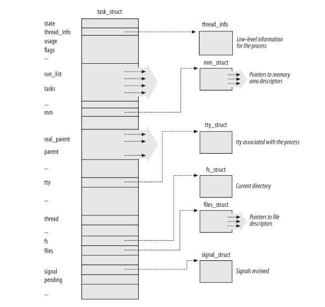

# 3.2. Process Descriptor

To manage processes, the kernel must have a clear picture of what each process is doing. It must
know, for instance, the process's priority（调度的优先级）, whether it is running on a CPU or blocked on an event, what **address space** has been assigned to it, which files it is allowed to address, and so on. This is
the role of the *process descriptor* a  `task_struct` type structure whose fields contain all the
information related to **a single process**. [`*`] As the repository of so much information, the **process
descriptor** is rather complex. In addition to a large number of fields containing process attributes,
the process descriptor contains several pointers to other data structures that, in turn, contain
pointers to other structures. Figure 3-1 describes the Linux process descriptor schematically（按照图式）.

> [`*`] The kernel also defines the  `task_t` data type to be equivalent to  `struct task_struct` 

> NOTE :  `task_struct` 的源代码参见：
>
> - https://elixir.bootlin.com/linux/latest/ident/task_struct
> - https://github.com/torvalds/linux/blob/master/include/linux/sched.h
> 
> 关于`task_struct`和process，thread之间的对应关系，在Chapter 3. Processes中进行了细致的分析；此处不再赘述；

The six data structures on the right side of the figure refer to specific resources owned by the
process. Most of these resources will be covered in future chapters. This chapter focuses on two
types of fields that refer to the **process state** and to **process parent/child relationships**.

Figure 3-1. The Linux process descriptor

## task_structure的成员变量

| name                                                         | type | note                         |                                      |
| ------------------------------------------------------------ | ---- | ---------------------------- | ------------------------------------ |
| `pid`                                                        |      | lightweight process ID，私有 | chapter 3.2.2. Identifying a Process |
| `tgid`                                                       |      | 标准process id，共享         | chapter 3.2.2. Identifying a Process |
| [`thread_info`](https://elixir.bootlin.com/linux/latest/ident/thread_info) |      | 私有                         |                                      |
| [`mm_struct`](https://elixir.bootlin.com/linux/latest/ident/mm_struct) |      | process address space，共享  | 9.2. The Memory Descriptor           |
|                                                              |      |                              |                                      |
|                                                              |      |                              |                                      |
|                                                              |      |                              |                                      |
|                                                              |      |                              |                                      |
|                                                              |      |                              |                                      |
|                                                              |      |                              |                                      |
|                                                              |      |                              |                                      |

