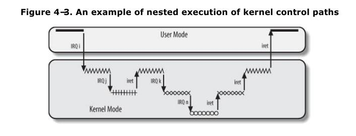

# 4.3. Nested Execution of Exception and Interrupt Handlers

Every interrupt or exception gives rise to a *kernel control path* or separate sequence of instructions that execute in **Kernel Mode** on behalf of the **current process**. For instance, when an I/O device raises an interrupt, the first instructions of the corresponding **kernel control path** are those that save the contents of the CPU registers in the **Kernel Mode stack**, while the last are those that restore the contents of the registers.

**Kernel control paths** may be arbitrarily nested; an **interrupt handler** may be interrupted by another **interrupt handler**, thus giving rise to a nested execution of **kernel control paths** , as shown in Figure 4-3. As a result, the last instructions of a **kernel control path** that is taking care of an interrupt do not always put the current process back into User Mode: if the level of nesting is greater than 1, these instructions will put into execution the kernel control path that was interrupted last, and the CPU will continue to run in Kernel Mode.

The price to pay for allowing nested kernel control paths is that an **interrupt handler** must never block, that is, no process switch can take place until an **interrupt handler** is running. In fact, all the data needed to resume a nested kernel control path is stored in the Kernel Mode stack, which is tightly bound to the current process.

Assuming that the kernel is bug free, most **exceptions** can occur only while the CPU is in **User Mode**. Indeed, they are either caused by programming errors or triggered by debuggers. However, the "Page Fault " exception may occur in Kernel Mode. This happens when the process attempts to address a page that belongs to its address space but is not currently in RAM. While handling such an exception, the kernel may suspend the current process and replace it with another one until the requested page is available. The kernel control path that handles the "Page Fault" exception resumes execution as soon as the process gets the processor again.

Because the "Page Fault" exception handler never gives rise to further exceptions, at most two kernel control paths associated with exceptions (the first one caused by a system call invocation, the second one caused by a Page Fault) may be stacked, one on top of the other.

In contrast to exceptions, **interrupts** issued by I/O devices do not refer to data structures specific to the **current process**, although the kernel control paths that handle them run on behalf of that process. As a matter of fact, it is impossible to predict which process will be running when a given interrupt occurs.

An **interrupt handler** may preempt both other **interrupt handlers** and **exception handlers**. Conversely, an **exception handler** never preempts an **interrupt handler**. The only **exception** that can be triggered in Kernel Mode is "Page Fault," which we just described. But **interrupt handlers** never perform operations that can induce page faults, and thus, potentially, a process switch.

Linux interleaves **kernel control paths** for two major reasons:

1、To improve the throughput of **programmable interrupt controllers** and **device controllers**. Assume that a **device controller** issues a signal on an IRQ line: the PIC transforms it into an external interrupt, and then both the PIC and the device controller remain blocked until the PIC receives an acknowledgment from the CPU. Thanks to kernel control path interleaving, the kernel is able to send the acknowledgment even when it is handling a previous interrupt.

2、To implement an interrupt model without priority levels. Because each **interrupt handler** may be deferred by another one, there is no need to establish predefined priorities among hardware devices. This simplifies the kernel code and improves its portability.

On multiprocessor systems, several kernel control paths may execute concurrently. Moreover, a kernel control path associated with an exception may start executing on a CPU and, due to a process switch, migrate to another CPU.