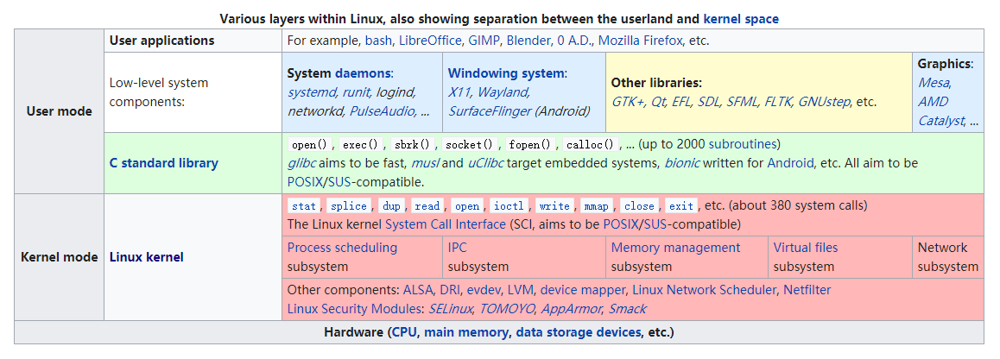

# Architecture

本章以“结构化思维”对Linux OS进行总结。

## The Process/Kernel Model

在[Understanding.The.Linux.kernel.3rd.Edition](https://www.oreilly.com/library/view/understanding-the-linux/0596005652/)的chapter 1.6.1. The Process/Kernel Model中所描述Process/Kernel Model与上面所描述的architecture相同，这个名称更加精简，便于表达。对于一个linux OS programmer，心中应该牢记这个model。

### Interface: system call

本节标题的含义是: system call是process和kernel之间的interface。

Linux采用的是monolithic kernel，这就使得Linux OS的”Process/Kernel Model“更加地简化: 

> process的所有请求都是通过system call来向kernel发起的

### Control

从**控制论**的角度来看，process的执行收scheduler（位于kernel中）的控制，即process受控于kernel。

关于控制论，参见工程software-engineering的`Software-design\Control-theory`章节。

## Kernel space and user space

Kernel space 和 user space 能够将Linux OS进一步进行划分。下面这篇文章还描述了这种划分的意义。

### wikipedia [User space](https://en.wikipedia.org/wiki/User_space)

A modern computer [operating system](https://en.wikipedia.org/wiki/Operating_system) usually segregates [virtual memory](https://en.wikipedia.org/wiki/Virtual_memory) into **kernel space** and **user space**.[[a\]](https://en.wikipedia.org/wiki/User_space#cite_note-1) Primarily, this separation serves to provide [memory protection](https://en.wikipedia.org/wiki/Memory_protection) and hardware protection from malicious or errant software behaviour.

Kernel space is strictly reserved for running a privileged [operating system kernel](https://en.wikipedia.org/wiki/Operating_system_kernel), kernel extensions, and most [device drivers](https://en.wikipedia.org/wiki/Device_driver). In contrast, user space is the memory area where [application software](https://en.wikipedia.org/wiki/Application_software) and some drivers execute.

#### Overview 

The term **userland** (or user space) refers to all code that runs outside the operating system's **kernel**.[[1\]](https://en.wikipedia.org/wiki/User_space#cite_note-1) Userland usually refers to the various programs and [libraries](https://en.wikipedia.org/wiki/Library_(computing)) that the operating system uses to interact with the **kernel**: software that performs [input/output](https://en.wikipedia.org/wiki/Input/output), manipulates [file system](https://en.wikipedia.org/wiki/File_system) objects, [application software](https://en.wikipedia.org/wiki/Application_software), etc.

> NOTE: 下面对user space process的总结非常好，可以看到Linux OS的很多特性都是在此基础上建立起来的。

Each user space [process](https://en.wikipedia.org/wiki/Process_(computing)) normally runs in its own [virtual memory](https://en.wikipedia.org/wiki/Virtual_memory) space, and, unless explicitly allowed, cannot access the memory of other processes. This is the basis for [memory protection](https://en.wikipedia.org/wiki/Memory_protection) in today's mainstream operating systems, and a building block for [privilege separation](https://en.wikipedia.org/wiki/Privilege_separation). 

> NOTE: separation

A **separate user mode** can also be used to build efficient virtual machines – see [Popek and Goldberg virtualization requirements](https://en.wikipedia.org/wiki/Popek_and_Goldberg_virtualization_requirements). 

> NOTE: virtual machine

With enough privileges, processes can request the kernel to map part of another process's memory space to its own, as is the case for [debuggers](https://en.wikipedia.org/wiki/Debugger). 

> NOTE: debugger

Programs can also request [shared memory](https://en.wikipedia.org/wiki/Shared_memory_(interprocess_communication)) regions with other processes, although other techniques are also available to allow [inter-process communication](https://en.wikipedia.org/wiki/Inter-process_communication).

> NOTE: shared memory

> NOTE: 原文的这张图总结的非常好；它是对`Architecture-of-computing-system`中的图的扩充。

> NOTE: 需要注意的是，systemd是运行在user mode，而不是kernel mode；

#### Implementation

The most common way of implementing a **user mode** separate from [kernel mode](https://en.wikipedia.org/wiki/Supervisor_mode) involves operating system [protection rings](https://en.wikipedia.org/wiki/Protection_ring).

> NOTE: 后面会讲解Linux kernel的实现

