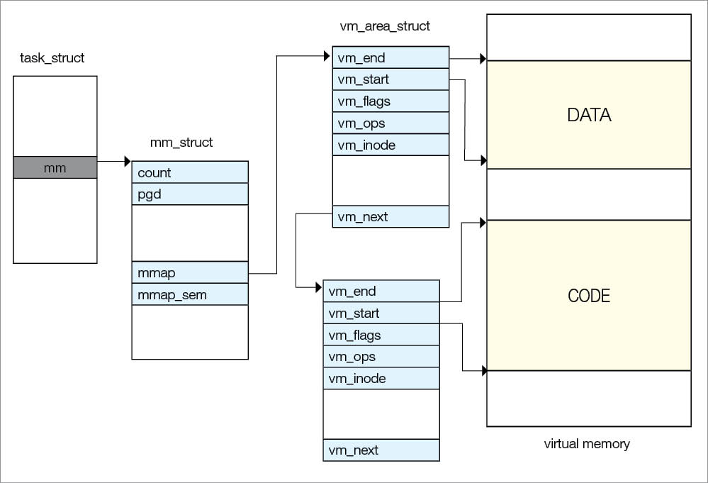

# opensourceforu [The Life of a Process](https://opensourceforu.com/2016/03/the-life-of-a-process/)

*Just as organisms have a life cycle, so do processes. They are born, they carry out assigned tasks, they go to sleep and, finally, die or are killed. In the course of its life cycle, a process goes through various stages. This article outlines the life of a process in Linux.*

A process is the running entity of a program, which has various information like the process’s **address space**, **pending signals**, **open files**, etc. So there must be one structure to store this information. Linux provides a structure called `task_struct`, which is used to store process information. This is called the **process descriptor**. This structure is defined in the `<linux/sched.h>` header file. This is a large data structure that has a size of 1.7KB.
**Note:** *Linux stores all task_structs in a circular doubly-linked list and not in a static array. This is called the task list.*（此处的task list就是在APUE中提及的process table）

## **Birth of a process**

The life of a process is created by another process, which means a process must have its **parent process**. A `fork` API is used to create a process from the **user space**. The API gives a clone system call, which calls the `do_fork` function, which in turn calls the `copy_process` function, inside which is the `dup_task_struct` that creates the new process. Creating a new process means creating a new kernel stack, new `task_struct` and new `thread_info`.

Linux does not create a copy of the **parent process** in order to create a child but follows the [copy on write](https://en.wikipedia.org/wiki/Copy-on-write) (COW) concept. That means Linux creates a new address space for newer processes only when the current address space goes through the **write operation**. Before that, they share common resources in a read-only condition. A new process or child has a new PID, created by the `alloc_pid()` function called from the `copy_process()`, and all pointers point to parent structures.

If the purpose of creating a process is not to clone the parent process, then a process will run a different entity of the program that is assigned by `exec` API.

**Note:** *After successful execution of copy_process(), the kernel runs the child process first and calls exec() immediately thereafter to avoid a COW overhead because, if the parent starts writing on the address space, the kernel has to create a separate copy for the child.*

> NOTE: 上面这段话解释清楚了copy on write。

Before kernel 2.6, `task_struct` was created statically and the kernel stack had a pointer to this structure. Now `task_struct` is created by the slab allocator and the kernel stack has a pointer to the `thread_info` structure, which points to the `task_struct` structure.




Figure 1: Virtual memory


## **Process virtual memory**

Every process has its executable code and data, which is contained by the virtual memory of the process. A process also has libraries which are shared between various processes; however, the kernel does not provide a **copy** of the shared library to the process but gives a **link** to that shared library.

The kernel does not copy all code into memory but loads it on demand, i.e., demand paging. In this concept, virtual memory is loaded into the physical memory only when the process attempts to access virtual memory. Initially, all pages in the page table are marked as available in virtual memory but not in physical memory.

When a process attempts to access virtual memory, the processor tries to decode the physical address but, at that time, the page entry for that virtual address is invalid with respect to the physical address. This is because it is not loaded into the physical memory yet ­— which is why it raises a page fault. Now it’s the responsibility of the kernel to create the physical page of the memory for that code or data, and bring this code and data from the swap area or file system into physical memory, and correct or update the ‘page table entry’.

**Note:** *Bringing the page from the virtual memory (swap area or hard disk) is a time consuming process. A context switch will take place and another process will be loaded into the processor.*

`task_struct` has a pointer `mm`, which points to the `mm_struct` structure. `mm_struct` is used to maintain all the virtual memory of the process; it has a pointer `mmap` that points to the `vm_area_struct` structure, which represents the virtual memory area of the process. `vm_area_struct` has a pointer to `vm_ops` that has a set of virtual memory handling routines, which are used for various operations on the virtual memory of the process. If the process tries to access virtual memory and if it is not valid, then a page fault will occur and to handle this, one of the routines will be called by the kernel. `vm_area_struct` also has a pointer `vm_next`, which points to the next `vm_area_struct` data structure. `vm_area_struct`data structures are arranged in an AVL tree (see Figure 1).

## **Files**

Open files of processes are maintained by `fs_struct` and `files_struct` structures, which are pointed by `fs` and `files` pointers in the `task_struct` structure, respectively. `fs_struct` contains **file system information** of the process. `files_struct` contains **open file objects**. It has a pointer `fd` to each opened file, which is defined by the `file` structure. This `file` structure has a pointer `f_ops`, which points to the file operation handlers or routines to operate file operations like read, write, open and close.

## **Threads**

Linux does not have threads. Linux treats threads as processes, which means that threads are processes that share the memory address space. If a process has two threads, it means two processes are sharing resources.
Threads are created by the clone system call with the following flags:

```
>> CLONE_VM: Parent and child share address space
>>CLONE_FS: Parent and child share file system info
>>CLONE_FILES: Parent and child share open files
>>CLONE_SIGHAND: Parent and child share signal handlers and blocked signals
clone(CLONE_VM | CLONE_FS | CLONE_FILES | CLONE_SIGHAND, 0);
```

For the process, it will be:

```c++
clone(SICHLD,0);
```

### **Kernel threads**

Linux also has kernel threads that are used for kernel related background operations because normal threads are switched between the kernel space and user space, and this is not safe for kernel tasks like flush tasks, *ksoftirqd* tasks, etc. Kernel threads don’t have address space, which means the `mm` pointer points to NULL.
Kernel threads are created by the *kthread_create* API and declared in *<linux/kthread.h>-*

```c++
`struct task_struct *kthread_create(int (*threadfn)(void *data), void *data, const char namefmt[], …);`
```

## **Process states**

Processes go through some states based on scheduling.

1、*Running state:* In this state, the process is in a runnable state or in a run queue, waiting to run. The TASK_RUNNING flag is used for this state.

2、*Interruptible state:* Here, the process is in sleep mode and waiting for some task to finish, but it can also be invoked prematurely by a signal. The TASK_INTERRUPTIBLE flag is used for this state.

3、*Uninterruptible state:* The process is in sleep mode and waiting for some task to finish but it cannot be invoked prematurely by a signal. The TASK_UNINTERRUPTIBLE flag is used for this state.
So processes can be in the running, waiting or stopped state. There is one more state – the zombie state – which will be described later.

## **Death of a process**

It’s nature’s rule that no one can live forever. So, unfortunately, processes also have to die. A process dies by itself by calling `exit()` system call. This is how it self-destructs. Processes can also die from a received signal or exception, which they cannot handle. `Exit()` then calls `do_exit()`, which calls `exit_mm()`, `exit_sem()`, `exit_files()` and `exit_fs()`, to release `mm_struct`, to de-queue processes waiting for the semaphore, to decrement count of usage of file descriptors and file system data, respectively. It also calls *schedule()* so that the next process can be scheduled.

With this, all resources are released except the kernel stack, `task_struct` and *thread_info*. That means the process is in the zombie state. Now it’s the responsibility of the parent process to inform the kernel that its child is not required; then the kernel removes the process completely by calling *release_task()*, which again calls *put_task_struct()* to free the pages containing the process’ kernel stack and *thread_info* structure and de-allocate the slab cache containing the *task_struct.*

