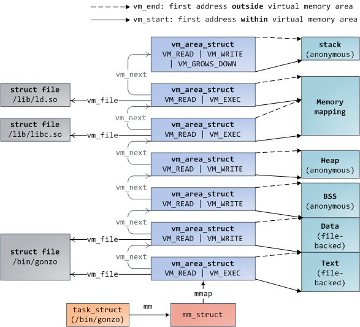

# Linux virtual memory area(VMA)

本章首先给出Linux virtual memory area(VMA)的layout，这是结论，然后描述如何编写程序来进行验证(在`./Verification`章节进行描述)或者说如何得出这个结论。

## cnblogs [Linux进程虚拟地址空间布局](http://www.cnblogs.com/fellow1988/p/6220710.html)

在32 bit系统中，内核分配1GB，而各个用户空间进程可用的部分为3GB。

下图展示了一个32位系统的进程虚拟地址空间的布局：


进程虚拟地址空间由若干个区域组成：

1.当前运行代码的二进制代码.text段。

2.程序使用的动态库代码。

3.存储**区局变量**和**静态变量**的数据段，bss,data段

4.保存动态分配数据的堆

5.保存局部变量和实现**函数调用**的栈

6.环境变量和命令行参数。

7.文件内容映射到虚拟地址空间的内存映射。

如果全局变量`randomize_va_space`设置为`1`，那么启用地址**空间随机化机制**（上图的`ramdom xxx offset`）。用户可以通过`/proc/sys/kernel/randomize_va_space`停用该特性。

每个进程都有`mm_struct`(linux/mm_types.h)的实例，保存**进程虚拟内存管理信息**。

```c
struct mm_struct {
struct vm_area_struct *mmap;	/* list of VMAs */
struct rb_root mm_rb;
#ifdef CONFIG_MMU
unsigned long (*get_unmapped_area) (struct file *filp,unsigned long addr, unsigned long len,unsigned long pgoff, unsigned long flags);
#endif
unsigned long mmap_base;	/* base of mmap area */虚拟地址空间中用于内存映射的起始地址。
unsigned long mmap_legacy_base; /* base of mmap area in bottom-up allocations */
unsigned long task_size;	/* size of task vm space */进程地址空间的size.

struct list_head mmlist;	/* List of maybe swapped mm's.	These are globally strung

unsigned long start_code, end_code, start_data, end_data;//text段，数据段的起始地址和终止地址
unsigned long start_brk, brk, start_stack;//堆首地址，堆尾地址，栈首地址。
unsigned long arg_start, arg_end, env_start, env_end;//命令行参数，环境变量的起始地址和终止地址

....

};
```

**进程虚拟地址空间**由多个`VMA`组成（`struct mm_struct`中`struct vm_area_struct \*mmap;/* list of VMAs */`成员）。有两种组织`VMA`的方式，链表（`mmap`）和红黑树（`mm_rb`）

VMA结构体如下：

```c
struct vm_area_struct {
　　/* The first cache line has the info for VMA tree walking. */

　　unsigned long vm_start;	/* Our start address within vm_mm. */
　　unsigned long vm_end;	/* The first byte after our end address within vm_mm. */

　　/* linked list of VM areas per task, sorted by address */
　　struct vm_area_struct *vm_next, *vm_prev;

　　struct rb_node vm_rb;

　　struct mm_struct *vm_mm;	/* The address space we belong to. */

　　/* Function pointers to deal with this struct. */
　　const struct vm_operations_struct *vm_ops;

　　struct file * vm_file;	/* File we map to (can be NULL). */
　　void * vm_private_data;	/* was vm_pte (shared mem) */

};
```

VMA链表组织形式如下图：



 VMA红黑树组织形式如下：


## geeksforgeeks [Memory Layout of C Programs](https://www.geeksforgeeks.org/memory-layout-of-c-program/)

A typical memory representation of C program consists of following sections.

\1. Text segment
\2. Initialized data segment (usually called simply the **Data Segment**)
\3. Uninitialized data segment (often called the “**bss**” segment)
\4. Stack
\5. Heap

[](https://media.geeksforgeeks.org/wp-content/uploads/memoryLayoutC.jpg)


## gnu libc [3.1 Process Memory Concepts](https://www.gnu.org/software/libc/manual/html_node/Memory-Concepts.html)

A process’ virtual address space is divided into segments. A segment is a contiguous range of virtual addresses. Three important segments are:

1、The *text segment* contains a program’s instructions and literals and static constants. It is allocated by exec and stays the same size for the life of the virtual address space.

2、The *data segment* is working storage for the program. It can be preallocated and preloaded by exec and the process can extend or shrink it by calling functions as described in See [Resizing the Data Segment](https://www.gnu.org/software/libc/manual/html_node/Resizing-the-Data-Segment.html). Its lower end is fixed.

3、The *stack segment* contains a program stack. It grows as the stack grows, but doesn’t shrink when the stack shrinks.


## TODO

https://blog.csdn.net/feilengcui008/article/details/44141495

https://www.cnblogs.com/dyllove98/archive/2013/07/05/3174341.html


https://inst.eecs.berkeley.edu/~cs161/sp15/slides/lec3-sw-vulns.pdf

https://inst.eecs.berkeley.edu/

https://cpp.tech-academy.co.uk/memory-layout/

https://cpp.tech-academy.co.uk/

https://stackoverflow.com/questions/3080375/how-is-the-memory-layout-of-a-c-c-program

