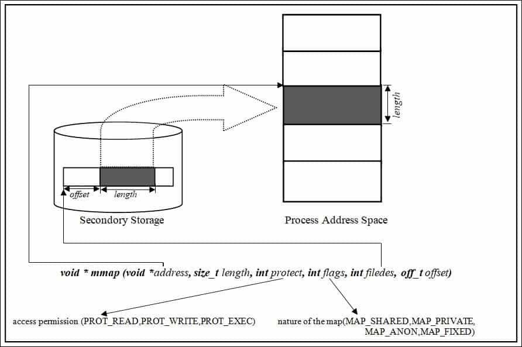

# linuxhint [How to use mmap function in C language?](https://linuxhint.com/using_mmap_function_linux/)

The ***mmap()*** function is used for mapping between a process address space and either files or devices. When a file is mapped to a process address space, the file can be accessed like an array in the program. This is one of the most efficient ways to access data in the file and provides a seamless coding interface that is natural for a data structure that can be assessed without he abstraction of reading and writing from files. In this article, we are going to discuss how to use the ***mmap()*** function in Linux. So, let’s get started.




## Examples:

Now we will see an example program for each of the following using mmap() system call:

1、Memory allocation (`Example1.c`)

2、Reading file (`Example2.c`)

3、Writing file (`Example3.c`)

4、Interprocess communication (`Example4.c`)

### Example1.c

```C
#include <stdio.h>
#include <sys/mman.h>

int main()
{

	int N = 5;
	int *ptr = mmap( NULL, N * sizeof(int), PROT_READ | PROT_WRITE, MAP_PRIVATE | MAP_ANONYMOUS, 0, 0);

	if (ptr == MAP_FAILED)
	{
		printf("Mapping Failed\n");
		return 1;
	}

	for (int i = 0; i < N; i++)
		ptr[i] = i * 10;

	for (int i = 0; i < N; i++)
		printf("[%d] ", ptr[i]);

	printf("\n");
	int err = munmap(ptr, 10 * sizeof(int));
	if (err != 0)
	{
		printf("UnMapping Failed\n");
		return 1;
	}

	return 0;
}
// gcc test.c

```

In `Example1.c` we allocate memory using `mmap`. Here we used `PROT_READ | PROT_WRITE` protection for reading and writing to the mapped region. We used the `MAP_PRIVATE | MAP_ANONYMOUS` flag. `MAP_PRIVATE` is used because the mapping region is not shared with other processes, and `MAP_ANONYMOUS` is used because here, we have not mapped any file. For the same reason, the *file descriptor* and the *offset* value is set to 0.


### Example2.c


```C
#include <stdio.h>
#include <sys/mman.h>
#include <stdlib.h>
#include <sys/stat.h>
#include <fcntl.h>
#include <unistd.h>

int main(int argc, char *argv[])
{

	if (argc < 2)
	{
		printf("File path not mentioned\n");
		exit(0);
	}

	const char *filepath = argv[1];
	int fd = open(filepath, O_RDONLY);
	if (fd < 0)
	{
		printf("\n\"%s \" could not open\n", filepath);
		exit(1);
	}

	struct stat statbuf;
	int err = fstat(fd, &statbuf);
	if (err < 0)
	{
		printf("\n\"%s \" could not open\n", filepath);
		exit(2);
	}

	char *ptr = mmap(NULL, statbuf.st_size, PROT_READ | PROT_WRITE, MAP_SHARED, fd, 0);
	if (ptr == MAP_FAILED)
	{
		printf("Mapping Failed\n");
		return 1;
	}
	close(fd);

	ssize_t n = write(1, ptr, statbuf.st_size);
	if (n != statbuf.st_size)
	{
		printf("Write failed");
	}

	err = munmap(ptr, statbuf.st_size);

	if (err != 0)
	{
		printf("UnMapping Failed\n");
		return 1;
	}
	return 0;
}
// gcc test.c

```


In `Example2.c` we have mapped the file “file1.txt”. First, we have created the file, then mapped the file with the process. We open the file in `O_RDONLY` mode because here, we only want to read the file.


### Example3.c

```C
#include <stdio.h>
#include <sys/mman.h>
#include <stdlib.h>
#include <sys/stat.h>
#include <fcntl.h>
#include <unistd.h>

int main(int argc, char *argv[])
{

	if (argc < 2)
	{
		printf("File path not mentioned\n");
		exit(0);
	}

	const char *filepath = argv[1];
	int fd = open(filepath, O_RDWR);
	if (fd < 0)
	{
		printf("\n\"%s \" could not open\n", filepath);
		exit(1);
	}

	struct stat statbuf;
	int err = fstat(fd, &statbuf);
	if (err < 0)
	{
		printf("\n\"%s \" could not open\n", filepath);
		exit(2);
	}

	char *ptr = mmap(NULL, statbuf.st_size, PROT_READ | PROT_WRITE, MAP_SHARED, fd, 0);
	if (ptr == MAP_FAILED)
	{
		printf("Mapping Failed\n");
		return 1;
	}
	close(fd);

	ssize_t n = write(1, ptr, statbuf.st_size);
	if (n != statbuf.st_size)
	{
		printf("Write failed\n");
	}

	// Reverse the file contents
	// for(size_t i=0; i \n");
	n = write(1, ptr, statbuf.st_size);
	if (n != statbuf.st_size)
	{
		printf("Write failed\n");
	}

	err = munmap(ptr, statbuf.st_size);
	if (err != 0)
	{
		printf("UnMapping Failed\n");
		return 1;
	}
}
// gcc test.c

```

In Example3.c we have read and then write to the file.

### Example4.c

```C
#include <stdio.h>
#include <unistd.h>
#include <sys/wait.h>
#include <sys/mman.h>

int main()
{

	int N = 5; // Number of elements for the array

	int *ptr = mmap(NULL, N * sizeof(int), PROT_READ | PROT_WRITE, MAP_SHARED | MAP_ANONYMOUS, 0, 0);

	if (ptr == MAP_FAILED)
	{
		printf("Mapping Failed\n");
		return 1;
	}

	for (int i = 0; i < N; i++)
	{
		ptr[i] = i + 1;
	}

	printf("Initial values of the array elements :\n");
	for (int i = 0; i < N; i++)
	{
		printf(" %d", ptr[i]);
	}
	printf("\n");

	pid_t child_pid = fork();

	if (child_pid == 0)
	{
		//child
		for (int i = 0; i < N; i++)
		{
			ptr[i] = ptr[i] * 10;
		}
	}
	else
	{
		//parent
		waitpid(child_pid, NULL, 0);
		printf("\nParent:\n");

		printf("Updated values of the array elements :\n");
		for (int i = 0; i < N; i++)
		{
			printf(" %d", ptr[i]);
		}
		printf("\n");
	}

	int err = munmap(ptr, N * sizeof(int));

	if (err != 0)
	{
		printf("UnMapping Failed\n");
		return 1;
	}
	return 0;
}
// gcc test.c

```

In `Example4.c` first the array is initialized with some values, then the child process updates the values. The parent process reads the values updated by the child because the mapped memory is shared by both processes.