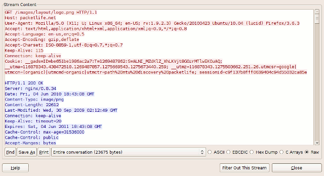

# packetlife [Understanding TCP Sequence and Acknowledgment Numbers](https://packetlife.net/blog/2010/jun/7/understanding-tcp-sequence-acknowledgment-numbers/)

> NOTE: 这篇文章，结合[Wireshark](http://www.wireshark.org/)、具体案例来讲解，非常值得阅读

This article aims to help you become more comfortable examining TCP sequence and acknowledgement numbers in the [Wireshark](http://www.wireshark.org/) packet analyzer.

Before we start, be sure to open [the example capture](https://packetlife.net/media/blog/attachments/424/TCP_example.cap) in Wireshark and play along.

The example capture contains a single HTTP request to a web server, in which the client web browser requests a single image file, and the server returns an HTTP/1.1 200 (OK) response which includes the file requested. You can right-click on any of the TCP packets within this capture and select **Follow TCP Stream** to open the raw contents of the TCP stream in a separate window for inspection. Traffic from the client is shown in red, and traffic from the server in blue.

> NOTE: 从上述图可以看出，它仅仅展示了HTTP的请求、响应，并没有展示TCP的细节。

## The Three-Way Handshake

TCP utilizes a number of flags, or 1-bit boolean fields, in its header to control the state of a connection. The three we're most interested in here are:

- **SYN** - (Synchronize) Initiates a connection
- **FIN** - (Final) Cleanly terminates a connection
- **ACK** - Acknowledges received data

As we'll see, a packet can have multiple flags set.

> NOTE: 典型的例子就是 SYN-ACK

Select `packet #1` in Wireshark and expand the TCP layer analysis in the middle pane, and further expand the "Flags" field within the TCP header. Here we can see all of the TCP flags broken down. Note that the `SYN` flag is on (set to 1).

Now do the same for `packet #2`. Notice that it has two flags set: ACK to acknowledge the receipt of the client's SYN packet, and SYN to indicate that the server also wishes to establish a TCP connection.

`Packet #3`, from the client, has only the ACK flag set. These three packets complete the initial TCP three-way handshake.

## Sequence and Acknowledgment Numbers

The client on either side of a TCP session maintains a 32-bit *sequence number* it uses to keep track of how much data it has sent. This sequence number is included on each transmitted packet, and acknowledged by the opposite host as an *acknowledgement number* to inform the sending host that the transmitted data was received successfully.

> NOTE: 这就是在“What is  SEQ number and ACK number?#Purpose”中所介绍的request-response。

When a host initiates a TCP session, its **initial sequence number** is effectively random; it may be any value between 0 and 4,294,967,295, inclusive. However, protocol analyzers like Wireshark will typically display *relative* sequence and acknowledgement numbers in place of the actual values. These numbers are **relative** to the initial sequence number of that stream. This is handy, as it is much easier to keep track of relatively small, predictable numbers rather than the actual numbers sent on the wire.

For example, the initial relative sequence number shown in `packet #1` is 0 (naturally), while the ASCII decode in the third pane shows that the actual sequence number is `0xf61c6cbe`, or 4129057982 decimal.

The display of relative sequence numbers can optionally be disabled by navigating to **Edit > Preferences...** and un-checking **Relative sequence numbers and window scaling** under TCP protocol preferences. However, be aware that the remainder of this article will reference relative sequence and acknowledgement numbers only.

To better understand how sequence and acknowledgement numbers are used throughout the duration of a TCP session, we can utilize Wireshark's built-in flow graphing ability. Navigate to **Statistics > Flow Graph...**, select **TCP flow** and click **OK**. Wireshark automatically builds a graphical summary of the TCP flow.

Each row represents a single TCP packet. The left column indicates the **direction** of the packet, TCP ports, segment length, and the flag(s) set. The column at right lists the relative sequence and acknowledgement numbers in decimal. Selecting a row in this column also highlights the corresponding packet in the main window.

We can use this flow graph to better understand how sequence and acknowledgement numbers work.

### `Packet #1`

Each side of a TCP session starts out with a (relative) sequence number of zero. Likewise, the acknowledgement number is also zero, as there is not yet a complementary side of the conversation to acknowledge.

(Note: The version of Wireshark used for this demonstration, 1.2.7, shows the acknowledgement number as an apparently random number. This believed to be a software bug; the initial acknowledgement number of a session should always be zero, as you can see from inspecting the hex dump of the packet.)

> NOTE: 从“Sequence and Acknowledgment Numbers”节中的配图是可以看出的，ACK number是紧跟在SEQ number后的4字节，可以看到它是`0x00 00 00 00`

### `Packet #2`

The server responds to the client with a sequence number of zero, as this is its first packet in this TCP session, and a relative acknowledgement number of 1. The acknowledgement number is set to 1 to indicate the receipt of the client's SYN flag in `packet #1`.

Notice that the acknowledgement number has been increased by 1 although no payload data has yet been sent by the client. This is because the presence of the SYN or FIN flag in a received packet triggers an increase of 1 in the sequence. (This does not interfere with the accounting of payload data, because packets with the SYN or FIN flag set do not carry a payload.)

> NOTE: 简而言之，就是在"What is  SEQ number and ACK number?#简介"章节中所述的:
>
> The SYN packets consume one **sequence number**

### `Packet #3`

Like in `packet #2`, the client responds to the server's sequence number of zero with an acknowledgement number of 1. The client includes its own sequence number of 1 (incremented from zero because of the SYN).

At this point, the sequence number for both hosts is 1. This initial increment of 1 on both hosts' sequence numbers occurs during the establishment of all TCP sessions.

### `Packet #4`

This is the first packet in the stream which carries an actual payload (specifically, the client's HTTP request). The sequence number is left at 1, since no data has been transmitted since the last packet in this stream. The acknowledgement number is also left at 1, since no data has been received from the server, either.

Note that this packet's payload is 725 bytes in length.

### `Packet #5`

This packet is sent by the server solely to acknowledge the data sent by the client in `packet #4` while upper layers process the HTTP request. Notice that the acknowledgement number has increased by 725 (the length of the payload in packet #4) to 726; e.g., "I have received 726 bytes so far." The server's sequence number remains at 1.

### `Packet #6`

This packet marks the beginning of the server's HTTP response. Its sequence number is still 1, since none of its packets prior to this one have carried a payload. This packet carries a payload of 1448 bytes.

### `Packet #7`

The sequence number of the client has been increased to 726 because of the last packet it sent. Having received 1448 bytes of data from the server, the client increases its acknowledgement number from 1 to 1449.

For the majority of the capture, we will see this cycle repeat. The client's sequence number will remain steady at 726, because it has no data to transmit beyond the initial 725 byte request. The server's sequence number, in contrast, continues to grow as it sends more segments of the HTTP response.

## Tear-down

### `Packet #38`

After acknowledging the last segment of data from the server, the client processes the HTTP response as a whole and decides no further communication is needed. `Packet #38` is sent by the client with the `FIN` flag set. Its acknowledgement number remains the same as in the prior `packet #37`.

### `Packet #39`

The server acknowledges the client's desire to terminate the connection by increasing the acknowledgement number by one (similar to what was done in `packet #2` to acknowledge the SYN flag) and setting the FIN flag as well.

### `Packet #40`

The client sends its final sequence number of 727, and acknowledges the server's FIN packet by incrementing the acknowledgement number by 1 to 22952.

At this point, both hosts have terminated the session and can release the software resources dedicated to its maintenance.