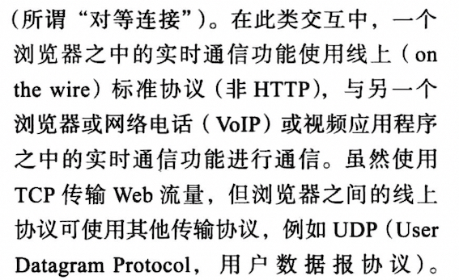

# Wire protocol

在阅读 《WebRTC权威指南》时，其中有这样的描述:

## stackoverflow [Can someone explain what a wire-level protocol is?](https://stackoverflow.com/questions/2324089/can-someone-explain-what-a-wire-level-protocol-is)

I am not very clear about the idea of wire-level protocols. I heard BitTorrent uses it and read that a wirelevel protocol can be considered an opposite of API. I read RMI calls can be considered wirelevel protocols but am still a little confused. Can someone explain this in a better way?

### [A](https://stackoverflow.com/a/2324113)

I wouldn't say that something uses a wire-level protocol or doesn't - I'd talk about *which* wire-level protocol it uses.

> NOTE: 需要知道使用的是哪个wire-level protocol

Basically, if something's communicating with a remote machine (even conceptually) then there's some data going across the network connection (the **wire**). **The description of that data is the "wire-level protocol"**. Even within that, you would often stop short of describing individual network packets - so the wire protocol for a TCP-based protocol would usually be defined in terms of opening a connection, the data *streams* between the two computers, and probably details of when each side would be expected to close the connection.

> NOTE: 上面的解释非常到位: 首先它说明了**wire**的含义: "network connection"。"wire-protocol"的含义就是:
>
> > **The description of that data is the "wire-level protocol"**
>
> 后面内容的翻译如下: 
>
> "即使在其中，您也经常会停止描述单个网络数据包 - 因此基于 TCP 的协议的有线协议通常会根据打开连接、两台计算机之间的数据流以及可能每个时间的详细信息来定义预计将关闭连接。"

## wikipedia [Wire protocol](https://en.wikipedia.org/wiki/Wire_protocol)

In [computer networking](https://en.wikipedia.org/wiki/Computer_networking), a **wire protocol** refers to a way of getting [data](https://en.wikipedia.org/wiki/Data) from point to point: A wire protocol is needed if more than one application has to interoperate. It generally refers to protocols higher than the physical layer.[[1\]](https://en.wikipedia.org/wiki/Wire_protocol#cite_note-Definition-1) In contrast to [transport protocols](https://en.wikipedia.org/wiki/Transport_protocol) at the transport level (like [TCP](https://en.wikipedia.org/wiki/Transmission_Control_Protocol) or [UDP](https://en.wikipedia.org/wiki/User_Datagram_Protocol)), the term "wire protocol" is used to describe a common way to represent information at the **application level**. It refers only to a common [application layer](https://en.wikipedia.org/wiki/Application_layer) protocol and not to a common object semantic[*clarification needed*] of the applications. Such a representation at application level needs a common [infoset](https://en.wikipedia.org/wiki/Infoset) (e.g. [XML](https://en.wikipedia.org/wiki/XML)) and a data binding (using e.g. a common encoding scheme like [XSD](https://en.wikipedia.org/wiki/XSD)).

> NOTE: 
>
> wire protocol是application layer的。

The wire protocol may be either text-based or a [binary protocol](https://en.wikipedia.org/wiki/Binary_protocol). Although an important architectural decision, this is a separate matter from the distinction between wire protocols and programmatic APIs.

In [electronics](https://en.wikipedia.org/wiki/Electronics), a wire protocol is the mechanism used to transmit data from one point to another.

