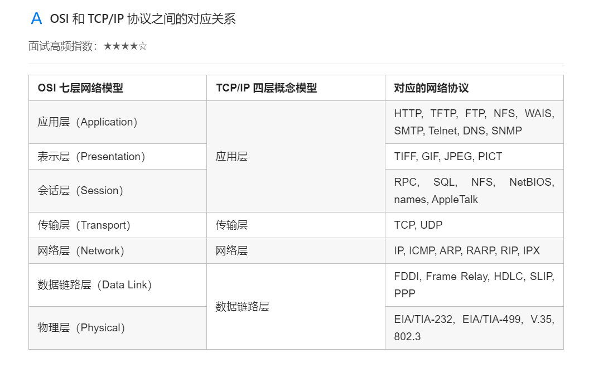

# 第一部分：协议层次以及它们的服务类型

## TCP/IP 参考模型

> NOTE: 
>
> 参见 wikipedia [Internet protocol suite](https://en.wikipedia.org/wiki/Internet_protocol_suite)

OSI 七层模型在提出时的出发点是基于标准化的考虑，而没有考虑到具体的市场需求，使得该模型结构复杂，部分功能冗余，因而完全实现 OSI 参考模型的系统不多。而 TCP/IP 参考模型直接面向市场需求，实现起来也比较容易，因此在一经提出便得到了广泛的应用。基于 TCP/IP 的参考模型将协议分成四个层次，如上图所示，它们分别是：网络访问层、网际互联层、传输层、和应用层。

① 应用层  [application layer](https://en.wikipedia.org/wiki/Application_layer)

TCP/IP 模型将 OSI 参考模型中的会话层、表示层和应用层的功能合并到一个应用层实现，通过不同的应用层协议为不同的应用提供服务。例如：FTP、Telnet、DNS、SMTP 等。

② 传输层  [transport layer](https://en.wikipedia.org/wiki/Transport_layer) 

该层对应于 OSI 参考模型的传输层，为上层实体提供源端到对端主机的通信功能。传输层定义了两个主要协议：传输控制协议（TCP）和用户数据报协议（UDP）。其中面向连接的 TCP 协议保证了数据的传输可靠性，面向无连接的 UDP 协议能够实现数据包简单、快速地传输。

③ 网际互联层  [internet layer](https://en.wikipedia.org/wiki/Internet_layer) 

网际互联层对应 OSI 参考模型的网络层，主要负责相同或不同网络中计算机之间的通信。在网际互联层， IP 协议提供的是一个不可靠、无连接的数据报传递服务。该协议实现两个基本功能：寻址和分段。根据数据报报头中的目的地址将数据传送到目的地址，在这个过程中 IP 负责选择传送路线。除了 IP 协议外，该层另外两个主要协议是互联网组管理协议（IGMP）和互联网控制报文协议（ICMP）。

④ 网络接入层  [link layer](https://en.wikipedia.org/wiki/Link_layer) 

网络接入层的功能对应于 OSI 参考模型中的物理层和数据链路层，它负责监视数据在主机和网络之间的交换。事实上，TCP/IP 并未真正描述这一层的实现，而由参与互连的各网络使用自己的物理层和数据链路层协议，然后与 TCP/IP 的网络接入层进行连接，因此具体的实现方法将随着网络类型的不同而有所差异。

## OSI 和 TCP/IP 协议之间的对应关系

## 为什么 TCP/IP 去除了表示层和会话层

OSI 参考模型在提出时，他们的理想是非常好的，但实际上，由于**会话层**、**表示层**、**应用层**都是在**应用程序**内部实现的，最终产出的是一个**应用数据包**(通过**传输层**进行发送)，而应用程序之间是几乎无法实现代码的抽象**共享**的，这也就造成 OSI 设想中的**应用程序维度**的分层是无法实现的，例如，我们几乎不会认为数据的压缩、加密算法算是一种协议，而会话的概念则更为抽象，难以用协议来进行描述，所以在后来的 TCP/IP 协议框架的设计中，便将表示层和会话层与应用层整合在一起，让整个过程更为清晰明了。

> NOTE: 
>
> 应用层、表示层、会话层 都是在 **应用程序** 内部实现的；

## 数据如何在各层之间传输【数据的封装过程】

> NOTE: 
>
> 一、参见 `Network-protocol-model` 章节
>
> bottom-up、top-down
>
> end-to-end

在发送主机端，一个应用层报文被传送到运输层。在最简单的情况下，**运输层(  [transport layer](https://en.wikipedia.org/wiki/Transport_layer) )**收取到报文并附上附加信息，该首部将被**接收端**的运输层使用。应用层报文和运输层首部信息一道构成了**运输层报文段**(TCP segment报文段)。附加的信息可能包括：允许接收端运输层向上向适当的应用程序交付报文的信息以及**差错检测位信息**(checksum)。该信息让接收端能够判断报文中的比特是否在途中已被改变。运输层则向**网络层** (   [internet layer](https://en.wikipedia.org/wiki/Internet_layer)  )传递该报文段，网络层增加了如源和目的端系统**地址**( IP )等网络层首部信息，生成了网络层数据报( IP datagram )。该数据报接下来被传递给**链路层 (  [link layer](https://en.wikipedia.org/wiki/Link_layer)  )**，在数据链路层数据包添加发送端 MAC 地址和接收端 MAC 地址后被封装成数据帧，在物理层数据帧被封装成**比特流**，之后通过传输介质传送到对端。

