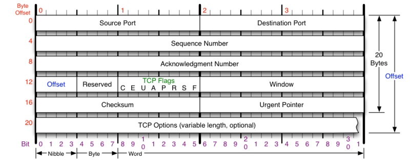
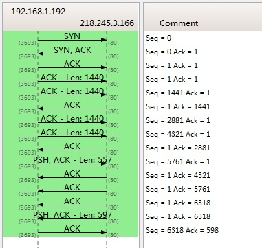
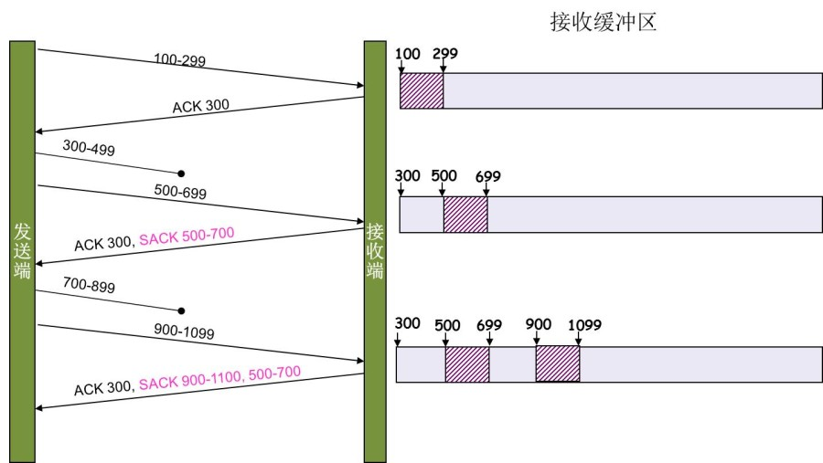

# coolshell [TCP 的那些事儿（上）](https://coolshell.cn/articles/11564.html)

TCP是一个巨复杂的协议，因为他要解决很多问题，而这些问题又带出了很多子问题和阴暗面。所以学习TCP本身是个比较痛苦的过程，但对于学习的过程却能让人有很多收获。关于TCP这个协议的细节，我还是推荐你去看[W.Richard Stevens](http://www.kohala.com/start/)的《[TCP/IP 详解 卷1：协议](http://book.douban.com/subject/1088054/)》（当然，你也可以去读一下[RFC793](http://tools.ietf.org/html/rfc793)以及后面N多的RFC）。另外，本文我会使用英文术语，这样方便你通过这些英文关键词来查找相关的技术文档。

我本来只想写一个篇幅的文章的，但是TCP真TMD的复杂，比C++复杂多了，这30多年来，各种优化变种争论和修改。所以，写着写着就发现只有砍成两篇。

1、上篇中，主要向你介绍TCP协议的定义和丢包时的重传机制。

2、下篇中，重点介绍TCP的流迭、拥塞处理。

废话少说，首先，我们需要知道TCP在网络OSI的七层模型中的第四层——Transport层，IP在第三层——Network层，ARP在第二层——Data Link层，在第二层上的数据，我们叫Frame，在第三层上的数据叫Packet，第四层的数据叫Segment。

> NOTE: 
>
> 参见 `Layered-network-protocol-model` 章节

首先，我们需要知道，我们程序的数据首先会打到TCP的Segment中，然后TCP的Segment会打到IP的Packet中，然后再打到以太网Ethernet的Frame中，传到对端后，各个层解析自己的协议，然后把数据交给更高层的协议处理。

## TCP头格式

接下来，我们来看一下TCP头的格式

> TCP头格式（[图片来源](http://nmap.org/book/tcpip-ref.html)）

你需要注意这么几点：

一、TCP的包是没有IP地址的，那是IP层上的事。但是有源端口和目标端口。

二、一个TCP连接需要四个元组来表示是同一个连接（`src_ip`, `src_port`, `dst_ip`, `dst_port`）准确说是五元组，还有一个是协议。但因为这里只是说TCP协议，所以，这里我只说四元组。

三、注意上图中的四个非常重要的东西：

- **Sequence Number**是包的序号，**用来解决网络包乱序（reordering）问题。**
- **Acknowledgement Number**就是ACK——用于确认收到，**用来解决不丢包的问题**。
- **Window又叫Advertised-Window**，也就是著名的滑动窗口（Sliding Window），**用于解决流控的**。
- **TCP Flag** ，也就是包的类型，**主要是用于操控TCP的状态机的**。

关于其它的东西，可以参看下面的图示

> （[图片来源](http://nmap.org/book/tcpip-ref.html)）

## TCP的状态机

其实，**网络上的传输是没有连接的，包括TCP也是一样的**。而TCP所谓的“连接”，其实只不过是在通讯的双方维护一个“连接状态”，让它看上去好像有连接一样。所以，TCP的状态变换是非常重要的。

下面是：“**TCP协议的状态机**”（[图片来源](http://www.tcpipguide.com/free/t_TCPOperationalOverviewandtheTCPFiniteStateMachineF-2.htm)） 和 “**TCP建链接**”、“**TCP断链接**”、“**传数据**” 的对照图，我把两个图并排放在一起，这样方便在你对照着看。另外，下面这两个图非常非常的重要，你一定要记牢。（吐个槽：看到这样复杂的状态机，就知道这个协议有多复杂，复杂的东西总是有很多坑爹的事情，所以TCP协议其实也挺坑爹的）

> NOTE: 
>
> 一、上图中，"方框"表示的是状态，连接线上表示的是操作
>
> 二、上图中，所展示的close的过程是比较复杂的，需要结合后面的内容来进行理解

> NOTE: 
>
> 一、调用 `close` 后，就进入了 `FIN-WAIT-1` 状态，之后就存在两种可能性:
>
> 1、先收到了对端的FIN，然后收到对端的ACK
>
> 这就是下面所说的"两端同时断连接"，后续的状态变化为:
>
> `CLOSING` -> `TIME-WAIT`
>
> 2、先收到对端的ACK，然后收到对端的FIN(就是上图展示的)
>
> 这就是上图所展示的流程，后续的状态变化为:
>
> `FIN-WAIT-2` -> `TIME-WAIT`
>
> `CLOSE-WAIT` -> `LAST-ACK`
>
> 二、如何来记忆？
>
> 1、如何记忆`FIN-WAIT-1` -> `FIN-WAIT-2` -> `TIME_WAIT`？
>
> 发送`FIN`，则立即进入到`FIN-WAIT-1`；接收到ACK，则进入到`FIN-WAIT-2`；接收到`FIN`，则进入`TIME_WAIT`
>
> 

很多人会问，为什么建链接要3次握手，断链接需要4次挥手？

1、**对于建链接的3次握手，**主要是要初始化Sequence Number 的初始值。通信的双方要互相通知对方自己的初始化的Sequence Number（缩写为ISN：Inital Sequence Number）——所以叫SYN，全称Synchronize Sequence Numbers。也就上图中的 x 和 y。这个号要作为以后的数据通信的序号，以保证应用层接收到的数据不会因为网络上的传输的问题而乱序（TCP会用这个序号来拼接数据）。

2、**对于4次挥手，**其实你仔细看是2次，因为TCP是全双工的，所以，发送方和接收方都需要Fin和Ack。只不过，有一方是被动的，所以看上去就成了所谓的4次挥手。如果两边同时断连接，那就会就进入到`CLOSING`状态，然后到达`TIME_WAIT`状态。下图是双方同时断连接的示意图（你同样可以对照着TCP状态机看）：

> 两端同时断连接（[图片来源](http://www.tcpipguide.com/free/t_TCPConnectionTermination-4.htm)）

另外，有几个事情需要注意一下：

### 关于建连接时SYN超时

**关于建连接时SYN超时**。试想一下，如果server端接到了clien发的SYN后回了SYN-ACK后client掉线了，server端没有收到client回来的ACK，那么，这个连接处于一个中间状态，即没成功，也没失败。于是，server端如果在一定时间内没有收到的TCP会重发SYN-ACK。在Linux下，默认重试次数为5次，重试的间隔时间从1s开始每次都翻售，5次的重试时间间隔为1s, 2s, 4s, 8s, 16s，总共31s，第5次发出后还要等32s都知道第5次也超时了，所以，总共需要 1s + 2s + 4s+ 8s+ 16s + 32s = 2^6 -1 = 63s，TCP才会把断开这个连接。

### 关于SYN Flood攻击

**关于SYN Flood攻击**。一些恶意的人就为此制造了SYN Flood攻击——给服务器发了一个SYN后，就下线了，于是服务器需要默认等63s才会断开连接，这样，攻击者就可以把服务器的syn连接的队列耗尽，让正常的连接请求不能处理。于是，Linux下给了一个叫**tcp_syncookies**的参数来应对这个事——当SYN队列满了后，TCP会通过源地址端口、目标地址端口和时间戳打造出一个特别的Sequence Number发回去（又叫cookie），如果是攻击者则不会有响应，如果是正常连接，则会把这个 SYN Cookie发回来，然后服务端可以通过cookie建连接（即使你不在SYN队列中）。请注意，**请先千万别用tcp_syncookies来处理正常的大负载的连接的情况**。因为，synccookies是妥协版的TCP协议，并不严谨。对于正常的请求，你应该调整三个TCP参数可供你选择: 

第一个是：tcp_synack_retries 可以用他来减少重试次数；

第二个是：tcp_max_syn_backlog，可以增大SYN连接数；

第三个是：tcp_abort_on_overflow 处理不过来干脆就直接拒绝连接了。

### 关于ISN的初始化

**关于ISN的初始化**。ISN是不能hard code的，不然会出问题的——比如：如果连接建好后始终用1来做ISN，如果client发了30个segment过去，但是网络断了，于是 client重连，又用了1做ISN，但是之前连接的那些包到了，于是就被当成了新连接的包，此时，client的Sequence Number 可能是3，而Server端认为client端的这个号是30了。全乱了。[RFC793](http://tools.ietf.org/html/rfc793)中说，ISN会和一个假的时钟绑在一起，这个时钟会在每4微秒对ISN做加一操作，直到超过2^32，又从0开始。这样，一个ISN的周期大约是4.55个小时。因为，我们假设我们的TCP Segment在网络上的存活时间不会超过Maximum Segment Lifetime（缩写为MSL – [Wikipedia语条](http://en.wikipedia.org/wiki/Maximum_Segment_Lifetime)），所以，只要MSL的值小于4.55小时，那么，我们就不会重用到ISN。

> NOTE: 
>
> 一、TCP能够保证ISN在一定的时间范围内是单调递增的
>
> 二、读完，我对上面这段话还是存在疑问:
>
> 从它列举的反例来看: "但是网络断了，于是 client重连，又用了1做ISN，但是之前连接的那些包到了，于是就被当成了新连接的包"，简而言之是: 两次TCP连接，上一次的segment 和 下一次的segment的sequence number串号了。这就是在 miami [TCP in a nutshell](https://www.cs.miami.edu/home/burt/learning/Csc524.032/notes/tcp_nutshell.html) 中所述的:
>
> "After full closure, a TCP connection is required to wait for twice the maximum segment lifetime, called the 2MSL wait. This prevents old packets confusing new connections, if a new connection is immediately created using old port and IP numbers"
>
> 这种情况是实际中会出现吗？
>
> 并且如果这种情况会出现，仅仅依靠ISN是无法解决的: 
>
> 第二次连接的segment的sequence number只要比上一次的小，那么就会出现串号
>
> 三、我觉得主要原因是: 减少串号的可能性
>
> 四、在sequence number乱序的情况下，会进入TCP RST 流程

### 关于 MSL 和 TIME_WAIT

**关于 MSL 和 TIME_WAIT**。通过上面的ISN的描述，相信你也知道MSL是怎么来的了。我们注意到，在TCP的状态图中，从`TIME_WAIT`状态到`CLOSED`状态，有一个超时设置，这个超时设置是 2*MSL（[RFC793](http://tools.ietf.org/html/rfc793)定义了MSL为2分钟，Linux设置成了30s）为什么要这有`TIME_WAIT`？为什么不直接给转成`CLOSED`状态呢？主要有两个原因：

1）TIME_WAIT确保有足够的时间让对端收到了ACK，如果被动关闭的那方没有收到Ack，就会触发被动端重发Fin，一来一去正好2个MSL，

> NOTE: 
>
> 上面这段话的解释是不清晰的，在 miami [TCP in a nutshell](https://www.cs.miami.edu/home/burt/learning/Csc524.032/notes/tcp_nutshell.html) 中，有着更加清晰的解释:
>
> "The sender of the last ACK does not know if the ACK was recieved. The last ACK is not ACK'ed, by definition of being last. If a re-FIN is not received in 2MSL, it can be assumed that the last ACK was heard and accepted."
>
> 结合"TCP的状态机"章节中的第二张图来进行理解: 
>
> server发送了FIN，此时client会回发ACK，这就可以理解上面这段话 "`TIME_WAIT`确保有足够的时间让对端收到了ACK，如果被动关闭的那方没有收到Ack，就会触发被动端重发Fin，一来一去正好2个MSL"
>
> 

2）有足够的时间让这个连接不会跟后面的连接混在一起（你要知道，有些自做主张的路由器会缓存IP数据包，如果连接被重用了，那么这些延迟收到的包就有可能会跟新连接混在一起）。你可以看看这篇文章《[TIME_WAIT and its design implications for protocols and scalable client server systems](http://www.serverframework.com/asynchronousevents/2011/01/time-wait-and-its-design-implications-for-protocols-and-scalable-servers.html)》

> NOTE: 
>
> "TCP 2MSL time wait-prevent old packet confuse new connection if new connection immediat created using old port IP number"

### 关于TIME_WAIT数量太多

**关于TIME_WAIT数量太多**。从上面的描述我们可以知道，TIME_WAIT是个很重要的状态，但是如果在大并发的短链接下，TIME_WAIT 就会太多，这也会消耗很多系统资源。只要搜一下，你就会发现，十有八九的处理方式都是教你设置两个参数，一个叫**tcp_tw_reuse**，另一个叫**tcp_tw_recycle**的参数，这两个参数默认值都是被关闭的，后者recyle比前者resue更为激进，resue要温柔一些。另外，如果使用tcp_tw_reuse，必需设置tcp_timestamps=1，否则无效。这里，你一定要注意，**打开这两个参数会有比较大的坑——可能会让TCP连接出一些诡异的问题**（因为如上述一样，如果不等待超时重用连接的话，新的连接可能会建不上。正如[官方文档](https://www.kernel.org/doc/Documentation/networking/ip-sysctl.txt)上说的一样“**It should not be changed without advice/request of technical experts**”）。

1、**关于tcp_tw_reuse**。官方文档上说tcp_tw_reuse 加上tcp_timestamps（又叫PAWS, for Protection Against Wrapped Sequence Numbers）可以保证协议的角度上的安全，但是你需要tcp_timestamps在两边都被打开（你可以读一下[tcp_twsk_unique](http://lxr.free-electrons.com/ident?i=tcp_twsk_unique)的源码 ）。我个人估计还是有一些场景会有问题。

2、**关于tcp_tw_recycle**。如果是tcp_tw_recycle被打开了话，会假设对端开启了tcp_timestamps，然后会去比较时间戳，如果时间戳变大了，就可以重用。但是，如果对端是一个NAT网络的话（如：一个公司只用一个IP出公网）或是对端的IP被另一台重用了，这个事就复杂了。建链接的SYN可能就被直接丢掉了（你可能会看到connection time out的错误）（如果你想观摩一下Linux的内核代码，请参看源码[ tcp_timewait_state_process](http://lxr.free-electrons.com/ident?i=tcp_timewait_state_process)）。

3、**关于tcp_max_tw_buckets**。这个是控制并发的TIME_WAIT的数量，默认值是180000，如果超限，那么，系统会把多的给destory掉，然后在日志里打一个警告（如：time wait bucket table overflow），官网文档说这个参数是用来对抗DDoS攻击的。也说的默认值180000并不小。这个还是需要根据实际情况考虑。

**Again，使用tcp_tw_reuse和tcp_tw_recycle来解决TIME_WAIT的问题是非常非常危险的，因为这两个参数违反了TCP协议（[RFC 1122](http://tools.ietf.org/html/rfc1122)）** 

其实，TIME_WAIT表示的是你主动断连接，所以，这就是所谓的“不作死不会死”。试想，如果让对端断连接，那么这个破问题就是对方的了，呵呵。另外，如果你的服务器是于HTTP服务器，那么设置一个[HTTP的KeepAlive](http://en.wikipedia.org/wiki/HTTP_persistent_connection)有多重要（浏览器会重用一个TCP连接来处理多个HTTP请求），然后让客户端去断链接（你要小心，浏览器可能会非常贪婪，他们不到万不得已不会主动断连接）。

## 数据传输中的Sequence Number

下图是我从Wireshark中截了个我在访问coolshell.cn时的有数据传输的图给你看一下，SeqNum是怎么变的。（使用Wireshark菜单中的Statistics ->Flow Graph… ）

你可以看到，**SeqNum的增加是和传输的字节数相关的**。上图中，三次握手后，来了两个Len:1440的包，而第二个包的SeqNum就成了1441。然后第一个ACK回的是1441，表示第一个1440收到了。

**注意**：如果你用Wireshark抓包程序看3次握手，你会发现SeqNum总是为0，不是这样的，Wireshark为了显示更友好，使用了Relative SeqNum——相对序号，你只要在右键菜单中的protocol preference 中取消掉就可以看到“Absolute SeqNum”了

## TCP重传机制

TCP要保证所有的数据包都可以到达，所以，必需要有重传机制。

注意，接收端给发送端的Ack确认只会确认最后一个连续的包，比如，发送端发了1,2,3,4,5一共五份数据，接收端收到了1，2，于是回ack 3，然后收到了4（注意此时3没收到），此时的TCP会怎么办？我们要知道，因为正如前面所说的，**SeqNum和Ack是以字节数为单位，所以ack的时候，不能跳着确认，只能确认最大的连续收到的包**，不然，发送端就以为之前的都收到了。

### 超时重传机制

一种是不回ack，死等3，当发送方发现收不到3的ack超时后，会重传3。一旦接收方收到3后，会ack 回 4——意味着3和4都收到了。

但是，这种方式会有比较严重的问题，那就是因为要死等3，所以会导致4和5即便已经收到了，而发送方也完全不知道发生了什么事，因为没有收到Ack，所以，发送方可能会悲观地认为也丢了，所以有可能也会导致4和5的重传。

对此有两种选择：

1、一种是仅重传timeout的包。也就是第3份数据。

2、另一种是重传timeout后所有的数据，也就是第3，4，5这三份数据。

这两种方式有好也有不好。第一种会节省带宽，但是慢，第二种会快一点，但是会浪费带宽，也可能会有无用功。但总体来说都不好。因为都在等timeout，timeout可能会很长（在下篇会说TCP是怎么动态地计算出timeout的）

### 快速重传机制

于是，TCP引入了一种叫**Fast Retransmit** 的算法，**不以时间驱动，而以数据驱动重传**。也就是说，如果，包没有连续到达，就ack最后那个可能被丢了的包，如果发送方连续收到3次相同的ack，就重传。Fast Retransmit的好处是不用等timeout了再重传。

比如：如果发送方发出了1，2，3，4，5份数据，第一份先到送了，于是就ack回2，结果2因为某些原因没收到，3到达了，于是还是ack回2，后面的4和5都到了，但是还是ack回2，因为2还是没有收到，于是发送端收到了三个ack=2的确认，知道了2还没有到，于是就马上重转2。然后，接收端收到了2，此时因为3，4，5都收到了，于是ack回6。示意图如下：

Fast Retransmit只解决了一个问题，就是timeout的问题，它依然面临一个艰难的选择，就是，是重传之前的一个还是重传所有的问题。对于上面的示例来说，是重传#2呢还是重传#2，#3，#4，#5呢？因为发送端并不清楚这连续的3个ack(2)是谁传回来的？也许发送端发了20份数据，是#6，#10，#20传来的呢。这样，发送端很有可能要重传从2到20的这堆数据（这就是某些TCP的实际的实现）。可见，这是一把双刃剑。

### SACK 方法

另外一种更好的方式叫：**Selective Acknowledgment (SACK)**（参看[RFC 2018](http://tools.ietf.org/html/rfc2018)），这种方式需要在TCP头里加一个SACK的东西，ACK还是Fast Retransmit的ACK，SACK则是汇报收到的数据碎版。参看下图：

这样，在发送端就可以根据回传的SACK来知道哪些数据到了，哪些没有到。于是就优化了Fast Retransmit的算法。当然，这个协议需要两边都支持。在 Linux下，可以通过**tcp_sack**参数打开这个功能（Linux 2.4后默认打开）。

这里还需要注意一个问题——**接收方Reneging，所谓Reneging的意思就是接收方有权把已经报给发送端SACK里的数据给丢了**。这样干是不被鼓励的，因为这个事会把问题复杂化了，但是，接收方这么做可能会有些极端情况，比如要把内存给别的更重要的东西。**所以，发送方也不能完全依赖SACK，还是要依赖ACK，并维护Time-Out，如果后续的ACK没有增长，那么还是要把SACK的东西重传，另外，接收端这边永远不能把SACK的包标记为Ack。**

注意：SACK会消费发送方的资源，试想，如果一个攻击者给数据发送方发一堆SACK的选项，这会导致发送方开始要重传甚至遍历已经发出的数据，这会消耗很多发送端的资源。详细的东西请参看《[TCP SACK的性能权衡](http://www.ibm.com/developerworks/cn/linux/l-tcp-sack/)》

### Duplicate SACK – 重复收到数据的问题
