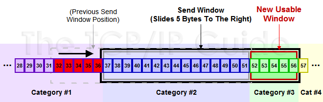

# coolshell [TCP 的那些事儿（下）](https://coolshell.cn/articles/11609.html)

## TCP的RTT算法

从前面的TCP重传机制我们知道Timeout的设置对于重传非常重要。

1、设长了，重发就慢，丢了老半天才重发，没有效率，性能差；

2、设短了，会导致可能并没有丢就重发。于是重发的就快，会增加网络拥塞，导致更多的超时，更多的超时导致更多的重发。

而且，这个超时时间在不同的网络的情况下，根本没有办法设置一个死的值。只能动态地设置。 为了动态地设置，TCP引入了RTT——**Round Trip Time**，也就是一个数据包从发出去到回来的时间。这样发送端就大约知道需要多少的时间，从而可以方便地设置Timeout——RTO（Retransmission TimeOut），以让我们的重传机制更高效。 听起来似乎很简单，好像就是在发送端发包时记下t0，然后接收端再把这个ack回来时再记一个t1，于是RTT = t1 – t0。没那么简单，这只是一个采样，不能代表普遍情况。

### 经典算法

[RFC793](http://tools.ietf.org/html/rfc793) 中定义的经典算法是这样的：

1）首先，先采样RTT，记下最近好几次的RTT值。

2）然后做平滑计算SRTT（ Smoothed RTT）。公式为：（其中的 α 取值在0.8 到 0.9之间，这个算法英文叫Exponential weighted moving average，中文叫：加权移动平均）

**SRTT = ( α \* SRTT ) + ((1- α) \* RTT)**

3）开始计算RTO。公式如下：

**RTO = min [ UBOUND,  max [ LBOUND,  (β \* SRTT) ]  ]**

其中：

1、UBOUND是最大的timeout时间，上限值

2、LBOUND是最小的timeout时间，下限值

3、β 值一般在1.3到2.0之间。

### Karn / Partridge 算法


### Jacobson / Karels 算法


## TCP滑动窗口

需要说明一下，如果你不了解TCP的滑动窗口这个事，你等于不了解TCP协议。我们都知道，**TCP必需要解决的可靠传输以及包乱序（reordering）的问题**，所以，TCP必需要知道网络实际的数据处理带宽或是数据处理速度，这样才不会引起网络拥塞，导致丢包。

> NOTE: 
>
> 

所以，TCP引入了一些技术和设计来做网络流控，Sliding Window是其中一个技术。 前面我们说过，**TCP头里有一个字段叫Window，又叫Advertised-Window，这个字段是接收端告诉发送端自己还有多少缓冲区可以接收数据**。**于是发送端就可以根据这个接收端的处理能力来发送数据，而不会导致接收端处理不过来**。 为了说明滑动窗口，我们需要先看一下TCP缓冲区的一些数据结构：


上图中，我们可以看到：

1、接收端`LastByteRead`指向了TCP缓冲区中读到的位置，`NextByteExpected`指向的地方是收到的连续包的最后一个位置，`LastByteRcved`指向的是收到的包的最后一个位置，我们可以看到中间有些数据还没有到达，所以有数据空白区。

2、发送端的`LastByteAcked`指向了被接收端Ack过的位置（表示成功发送确认），`LastByteSent`表示发出去了，但还没有收到成功确认的Ack，`LastByteWritten`指向的是上层应用正在写的地方。

于是：

1、接收端在给发送端回ACK中会汇报自己的AdvertisedWindow = MaxRcvBuffer – LastByteRcvd – 1;

2、而发送方会根据这个窗口来控制发送数据的大小，以保证接收方可以处理。

下面我们来看一下发送方的滑动窗口示意图：


> （[图片来源](http://www.tcpipguide.com/free/t_TCPSlidingWindowAcknowledgmentSystemForDataTranspo-6.htm)）

上图中分成了四个部分，分别是：（其中那个黑模型就是滑动窗口）

1、\#1已收到ack确认的数据。

2、\#2发还没收到ack的。

3、\#3在窗口中还没有发出的（接收方还有空间）。

4、\#4窗口以外的数据（接收方没空间）

下面是个滑动后的示意图（收到36的ack，并发出了46-51的字节）：



下面我们来看一个**接受端**控制**发送端**的图示：


> NOTE: 
>
> 上述是client向server发送数据，因此是server为receiver，client为sender，server(receiver)会报告window给client(sender)

### Zero Window

上图，我们可以看到一个处理缓慢的Server（接收端）是怎么把Client（发送端）的TCP Sliding Window给降成0的。此时，你一定会问，如果Window变成0了，TCP会怎么样？是不是发送端就不发数据了？是的，发送端就不发数据了，你可以想像成“Window Closed”，那你一定还会问，如果发送端不发数据了，接收方一会儿Window size 可用了，怎么通知发送端呢？

解决这个问题，TCP使用了Zero Window Probe技术，缩写为ZWP，也就是说，发送端在窗口变成0后，会发ZWP的包给接收方，让接收方来ack他的Window尺寸，一般这个值会设置成3次，第次大约30-60秒（不同的实现可能会不一样）。如果3次过后还是0的话，有的TCP实现就会发RST把链接断了。

**注意**：只要有等待的地方都可能出现DDoS攻击，Zero Window也不例外，一些攻击者会在和HTTP建好链发完GET请求后，就把Window设置为0，然后服务端就只能等待进行ZWP，于是攻击者会并发大量的这样的请求，把服务器端的资源耗尽。（关于这方面的攻击，大家可以移步看一下[Wikipedia的SockStress词条](http://en.wikipedia.org/wiki/Sockstress)）

另外，Wireshark中，你可以使用tcp.analysis.zero_window来过滤包，然后使用右键菜单里的follow TCP stream，你可以看到ZeroWindowProbe及ZeroWindowProbeAck的包。

### Silly Window Syndrome

Silly Window Syndrome翻译成中文就是“糊涂窗口综合症”。正如你上面看到的一样，如果我们的接收方太忙了，来不及取走Receive Windows里的数据，那么，就会导致发送方越来越小。到最后，如果接收方腾出几个字节并告诉发送方现在有几个字节的window，而我们的发送方会义无反顾地发送这几个字节。

要知道，我们的TCP+IP头有40个字节，为了几个字节，要达上这么大的开销，这太不经济了。

另外，你需要知道网络上有个MTU，对于以太网来说，MTU是1500字节，除去TCP+IP头的40个字节，真正的数据传输可以有1460，这就是所谓的MSS（Max Segment Size）注意，TCP的RFC定义这个MSS的默认值是536，这是因为 [RFC 791](http://tools.ietf.org/html/rfc791)里说了任何一个IP设备都得最少接收576尺寸的大小（实际上来说576是拨号的网络的MTU，而576减去IP头的20个字节就是536）。

**如果你的网络包可以塞满MTU，那么你可以用满整个带宽，如果不能，那么你就会浪费带宽**。（大于MTU的包有两种结局，一种是直接被丢了，另一种是会被重新分块打包发送） 你可以想像成一个MTU就相当于一个飞机的最多可以装的人，如果这飞机里满载的话，带宽最高，如果一个飞机只运一个人的话，无疑成本增加了，也而相当二。

所以，**Silly Windows Syndrome这个现像就像是你本来可以坐200人的飞机里只做了一两个人**。 要解决这个问题也不难，就是避免对小的window size做出响应，直到有足够大的window size再响应，这个思路可以同时实现在sender和receiver两端。

> NOTE: 
>
> 下面的两段话是难以理解的，需要结合上面这段话的内容来进行理解: "要解决这个问题也不难，就是避免对小的window size做出响应，直到有足够大的window size再响应，这个思路可以同时实现在sender和receiver两端"
>
> 下面的`1`所讨论的是在"Receiver端"解决这个问题的思路
>
> 下面的`2`所讨论的是在"Sender端"解决这问题的思路
>
> 开头第一句"如果这个问题是由Receiver端引起的"、开头第一句"如果这个问题是由Sender端引起的" 是容易让人混淆的: "Silly Window Syndrome"的确可能由于sender端、receiver端而引起的，它的解决需要依赖于sender、receiver共同协作解决
>
> 

1、如果这个问题是由Receiver端引起的，那么就会使用 David D Clark’s 方案。在receiver端，如果收到的数据导致window size小于某个值，可以直接ack(0)回sender，这样就把window给关闭了，也阻止了sender再发数据过来，等到receiver端处理了一些数据后windows size 大于等于了MSS，或者，receiver buffer有一半为空，就可以把window打开让send 发送数据过来。

> NOTE: 
>
> 一、"如果这个问题是由Receiver端引起的"这段话要如何理解？
>
> Receiver端处理不过来，导致sender端的window减小

2、如果这个问题是由Sender端引起的，那么就会使用著名的 [Nagle’s algorithm](http://en.wikipedia.org/wiki/Nagle's_algorithm)。这个算法的思路也是延时处理，他有两个主要的条件：1）要等到 Window Size>=MSS 或是 Data Size >=MSS，2）收到之前发送数据的ack回包，他才会发数据，否则就是在攒数据。

> NOTE: 
>
> 一、关于 [Nagle’s algorithm](http://en.wikipedia.org/wiki/Nagle's_algorithm)，参见 `Nagle's-algorithm` 章节
>
> 

另外，Nagle算法默认是打开的，所以，对于一些需要小包场景的程序——**比如像telnet或ssh这样的交互性比较强的程序，你需要关闭这个算法**。你可以在Socket设置`TCP_NODELAY`选项来关闭这个算法（关闭Nagle算法没有全局参数，需要根据每个应用自己的特点来关闭）

```c++
setsockopt(sock_fd, IPPROTO_TCP, TCP_NODELAY, (char *)&value,sizeof(int));
```

另外，网上有些文章说`TCP_CORK`的socket option是也关闭Nagle算法，这不对。**TCP_CORK其实是更新激进的Nagle算法，完全禁止小包发送，而Nagle算法没有禁止小包发送，只是禁止了大量的小包发送**。最好不要两个选项都设置。


## TCP的拥塞处理 – Congestion Handling

上面我们知道了，TCP通过Sliding Window来做流控（Flow Control），但是TCP觉得这还不够，因为Sliding Window需要依赖于连接的发送端和接收端，其并不知道网络中间发生了什么。TCP的设计者觉得，一个伟大而牛逼的协议仅仅做到流控并不够，因为流控只是网络模型4层以上的事，TCP的还应该更聪明地知道整个网络上的事。

具体一点，我们知道TCP通过一个timer采样了RTT并计算RTO，但是，**如果网络上的延时突然增加，那么，TCP对这个事做出的应对只有重传数据，但是，重传会导致网络的负担更重，于是会导致更大的延迟以及更多的丢包，于是，这个情况就会进入恶性循环被不断地放大。试想一下，如果一个网络内有成千上万的TCP连接都这么行事，那么马上就会形成“网络风暴”，TCP这个协议就会拖垮整个网络。**这是一个灾难。

所以，TCP不能忽略网络上发生的事情，而无脑地一个劲地重发数据，对网络造成更大的伤害。对此TCP的设计理念是：**TCP不是一个自私的协议，当拥塞发生的时候，要做自我牺牲。就像交通阻塞一样，每个车都应该把路让出来，而不要再去抢路了。**

关于拥塞控制的论文请参看《[Congestion Avoidance and Control](http://ee.lbl.gov/papers/congavoid.pdf)》(PDF)

拥塞控制主要是四个算法：**1）慢启动**，**2）拥塞避免**，**3）拥塞发生**，**4）快速恢复**。这四个算法不是一天都搞出来的，这个四算法的发展经历了很多时间，到今天都还在优化中。 备注:

1、1988年，TCP-Tahoe 提出了1）慢启动，2）拥塞避免，3）拥塞发生时的快速重传

2、1990年，TCP Reno 在Tahoe的基础上增加了4）快速恢复

### 慢热启动算法 – Slow Start

首先，我们来看一下TCP的慢热启动。慢启动的意思是，刚刚加入网络的连接，一点一点地提速，不要一上来就像那些特权车一样霸道地把路占满。新同学上高速还是要慢一点，不要把已经在高速上的秩序给搞乱了。

慢启动的算法如下(cwnd全称Congestion Window)：

1）连接建好的开始先初始化cwnd = 1，表明可以传一个MSS大小的数据。

2）每当收到一个ACK，cwnd++; 呈线性上升

3）每当过了一个RTT，cwnd = cwnd*2; 呈指数让升

4）还有一个ssthresh（slow start threshold），是一个上限，当cwnd >= ssthresh时，就会进入“拥塞避免算法”（后面会说这个算法）

所以，我们可以看到，如果网速很快的话，ACK也会返回得快，RTT也会短，那么，这个慢启动就一点也不慢。下图说明了这个过程。


### 拥塞避免算法 – Congestion Avoidance

前面说过，还有一个ssthresh（slow start threshold），是一个上限，当cwnd >= ssthresh时，就会进入“拥塞避免算法”。一般来说ssthresh的值是65535，单位是字节，当cwnd达到这个值时后，算法如下：

1）收到一个ACK时，cwnd = cwnd + 1/cwnd

2）当每过一个RTT时，cwnd = cwnd + 1

这样就可以避免增长过快导致网络拥塞，慢慢的增加调整到网络的最佳值。很明显，是一个线性上升的算法。
