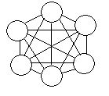

# mesh

## webopedia [mesh](https://www.webopedia.com/TERM/M/mesh.html)

Also called *mesh topology* or a *mesh network*, mesh is a [network](https://www.webopedia.com/definitions/network/) [topology](https://www.webopedia.com/definitions/topology/) in which devices are connected with many redundant interconnections between network [nodes](https://www.webopedia.com/definitions/node/). In a true mesh topology every [node ](https://www.webopedia.com/definitions/node/)has a connection to every other node in the network.

There are two types of mesh topologies: full mesh and partial mesh.

### Full mesh topology 

**Full mesh topology** occurs when every node has a circuit connecting it to every other node in a network. Full mesh is very expensive to implement but yields the greatest amount of redundancy, so in the event that one of those nodes fails, network traffic can be directed to any of the other nodes. Full mesh is usually reserved for [backbone ](https://www.webopedia.com/definitions/backbone/)networks.

### Partial mesh topology 

Partial mesh topology is less expensive to implement and yields less redundancy than full mesh topology. With partial mesh, some nodes are organized in a full mesh scheme but others are only connected to one or two in the network. Partial mesh topology is commonly found in peripheral networks connected to a full meshed backbone.

## wikipedia [Mesh networking](https://en.wikipedia.org/wiki/Mesh_networking)