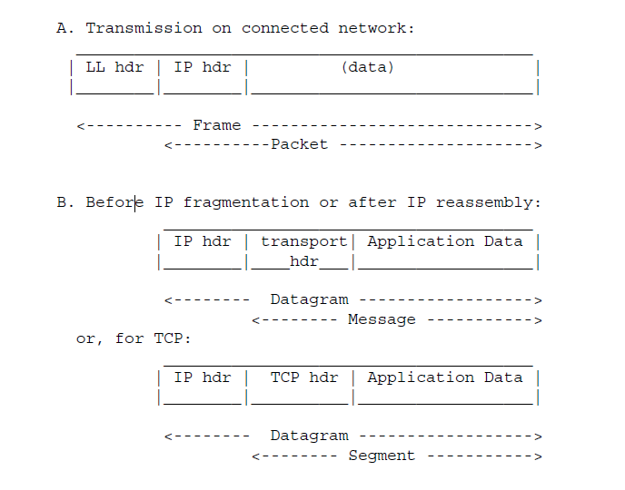

# PDU、MTU、SDU

## Protocol data unit/PDU

一个非常重要的概念就是protocol data unit，PDU，即“协议数据单元”，它是描述下一节Mechanism的前提。它符合在文章《Unit》中提出的思想的。

### wikipedia [Protocol data unit](https://en.wikipedia.org/wiki/Protocol_data_unit)

#### Example: PDU of layer of OSI model

| layer | name                                                         | PDU                                                          |
| ----- | ------------------------------------------------------------ | ------------------------------------------------------------ |
| 4     | [transport layer](https://en.wikipedia.org/wiki/Transport_layer) | TCP [segment](https://en.wikipedia.org/wiki/Packet_segment) or UDP datagram |
| 3     | [network layer](https://en.wikipedia.org/wiki/Network_layer) | [packet](https://en.wikipedia.org/wiki/Network_packet)       |
| 2     | [data link layer](https://en.wikipedia.org/wiki/Data_link_layer) | [frame](https://en.wikipedia.org/wiki/Frame_(networking))    |
| 1     | [physical layer](https://en.wikipedia.org/wiki/Physical_layer) | [bit](https://en.wikipedia.org/wiki/Bit) or, more generally, [symbol](https://en.wikipedia.org/wiki/Symbol_(data)). |

### [RFC 1122](https://tools.ietf.org/html/rfc1122)

下面是[RFC 1122](https://tools.ietf.org/html/rfc1122)中给出的描述

| terminology | explanation                                                  |
| ----------- | ------------------------------------------------------------ |
| Segment     | A **segment** is the unit of end-to-end transmission in the **TCP protocol**. A segment consists of a **TCP header** followed by **application data**. A segment is transmitted by encapsulation inside an **IP datagram**. |
| Message     | In this description of the lower-layer protocols,  a **message** is the unit of transmission in a **transport layer protocol**.  In particular, a TCP segment is a message.  A message consists of a **transport protocol header** followed by application protocol data. To be transmitted end-to-end through the Internet,  a message must be encapsulated inside a **datagram**. |
| IP Datagram | An IP datagram is the unit of end-to-end transmission in the IP protocol. An IP datagram consists of an IP header followed by transport layer data, i.e., of an IP header followed by a message. |
| Packet      | A packet is the unit of data passed across the interface between the internet layer and the link layer. It includes an IP header and data. A packet may be a complete IP datagram or a fragment of an IP datagram. |
| Frame       | A frame is the unit of transmission in a link layer protocol, and consists of a link-layer header followed by a packet. |

### Max length of PDU

前面介绍了PDU，与它相关的另外一个问题是：它的最大长度；

## MTU

#### Example: PDU of layer of OSI model

| layer | name                                                         | PDU                                                          | max length                                                   |
| ----- | ------------------------------------------------------------ | ------------------------------------------------------------ | ------------------------------------------------------------ |
| 4     | [transport layer](https://en.wikipedia.org/wiki/Transport_layer) | TCP [segment](https://en.wikipedia.org/wiki/Packet_segment) or UDP datagram | [Maximum segment size](https://en.wikipedia.org/wiki/Maximum_segment_size) |
| 3     | [network layer](https://en.wikipedia.org/wiki/Network_layer) | [packet](https://en.wikipedia.org/wiki/Network_packet)       | [Maximum transmission unit](https://en.wikipedia.org/wiki/Maximum_transmission_unit) |
| 2     | [data link layer](https://en.wikipedia.org/wiki/Data_link_layer) | [frame](https://en.wikipedia.org/wiki/Frame_(networking))    |                                                              |
| 1     | [physical layer](https://en.wikipedia.org/wiki/Physical_layer) | [bit](https://en.wikipedia.org/wiki/Bit) or, more generally, [symbol](https://en.wikipedia.org/wiki/Symbol_(data)). |                                                              |

## microsoft [The default MTU sizes for different network topologies](https://support.microsoft.com/en-us/topic/the-default-mtu-sizes-for-different-network-topologies-b25262c5-d90f-456d-7647-e09192eeeef4)

The maximum transfer unit (MTU) specifies the maximum transmission size of an interface. A different MTU value may be specified for each interface that TCP/IP uses. The MTU is usually determined by negotiating with the lower-level driver. However, this value may be overridden.

### More Information

Each media type has a maximum frame size. The **link layer** is responsible for discovering this MTU and reporting the MTU to the protocols above the **link layer**. The protocol stack may query **Network Driver Interface Specification (NDIS) drivers** for the local MTU. Upper-layer protocols such as TCP use an interface's MTU to optimize packet sizes for each medium.

If a network adapter driver, such as an asynchronous transfer mode (ATM) driver, uses local area network (LAN) emulation mode, the driver may report that its MTU is larger than expected for that media type. For example, the network adapter may emulate Ethernet but report an MTU of 9180 bytes. Windows accepts and uses the MTU size that the adapter reports even when the MTU size exceeds the usual MTU size for a particular media type.

The following table summarizes the default MTU sizes for different network media.

Network MTU (bytes)
\-------------------------------
16 Mbps Token Ring 17914
4 Mbps Token Ring 4464
FDDI 4352
**Ethernet 1500**
IEEE 802.3/802.2 1492
PPPoE (WAN Miniport) 1480
X.25 576

