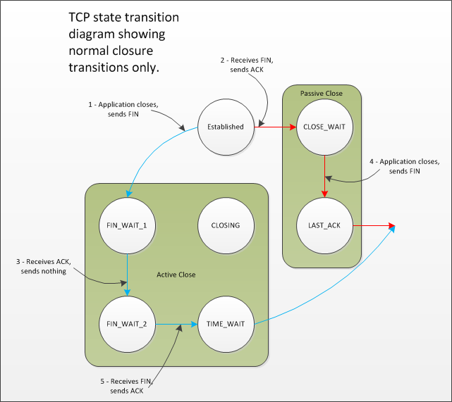

# serverframework [`TIME_WAIT` and its design implications for protocols and scalable client server systems](http://www.serverframework.com/asynchronousevents/2011/01/time-wait-and-its-design-implications-for-protocols-and-scalable-servers.html)

When building TCP client server systems it's easy to make simple mistakes which can severely(严重的) limit **scalability**. One of these mistakes is failing to take into account the `TIME_WAIT` state. In this blog post I'll explain why `TIME_WAIT` exists, the problems that it can cause, how you can work around it, and when you shouldn't.

`TIME_WAIT` is an often misunderstood state in the TCP state transition diagram. It's a state that some sockets can enter and remain in for a relatively long length of time, if you have enough socket's in `TIME_WAIT` then your ability to create new socket connections may be affected and this can affect the scalability of your client server system. There is often some misunderstanding about how and why a socket ends up in `TIME_WAIT` in the first place, there shouldn't be, it's not magical. As can be seen from the TCP state transition diagram below, `TIME_WAIT` is the final state that TCP clients usually end up in.

> NOTE: 
>
> 上面这种图，不好，在 coolshell [TCP 的那些事儿（上）](https://coolshell.cn/articles/11564.html) 中，有着更好的图示

