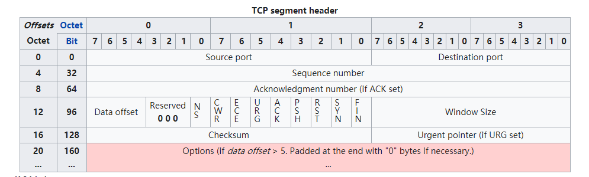

# Transmission Control Protocol

本文讨论TCP协议，以wikipedia [Transmission Control Protocol](https://en.wikipedia.org/wiki/Transmission_Control_Protocol)为主，另外补充了一些内容。

## Guide

在阅读前，需要建立起如下概念/观念，便于理解: 

1) TCP采用的是: **请求-响应** 模型

> 原文中并没有说明此，这是我自己添加的

每个request，都会收到一个response，这个response是用于acknowledge的，即接收方告诉发送方: 收到了request，我们往往将其称之为**ACK response**，这样才算是完成了这个请求；

对于ACK，是不需要再ACK的，否则就会导致无限的递归下去；

2) TCP是全双工通信模式:

参见 "4.1 Connection establishment"节

“全双工”意味着一个TCP session有两个部分组成，意味着存在着half的问题（half close、half open）。

3) 构建TCP的**活动图**(活动图是借用的软件工程中的概念): 

可以采用如下收录来进行构建:

TCP的三个阶段: 这是对TCP的lifetime的划分，参见 "4 Protocol operation";

TCP的操作: 每个阶段的会执行相应的操作，参见 "4 Protocol operation";

TCP的状态: TCP是有一定状态的，TCP操作会触发状态的转换，因此我们可以构建状态转换图，参见"4 Protocol operation";

4) TCP的核心特性以及对应的实现方式

### 入门阅读推荐: miami [TCP in a nutshell](https://www.cs.miami.edu/home/burt/learning/Csc524.032/notes/tcp_nutshell.html)

非常的简练。

## Terminology

endpoint: 一个TCP有两个endpoint

session: 一个TCP session

## wikipedia [Transmission Control Protocol](https://en.wikipedia.org/wiki/Transmission_Control_Protocol)

The **Transmission Control Protocol** (**TCP**) is one of the main [protocols](https://en.wikipedia.org/wiki/Communications_protocol) of the [Internet protocol suite](https://en.wikipedia.org/wiki/Internet_protocol_suite). It originated in the initial network implementation in which it complemented the [Internet Protocol](https://en.wikipedia.org/wiki/Internet_Protocol) (IP). Therefore, the entire suite is commonly referred to as *TCP/IP*. 

TCP provides [reliable](https://en.wikipedia.org/wiki/Reliability_(computer_networking)), ordered, and [error-checked](https://en.wikipedia.org/wiki/Error_detection_and_correction) delivery of a stream of [octets](https://en.wikipedia.org/wiki/Octet_(computing)) (bytes) between applications running on hosts communicating via an IP network. 

TCP is [connection-oriented](https://en.wikipedia.org/wiki/Connection-oriented_communication), and a connection between client and server is established before data can be sent. The server must be listening (passive(被动) open) for connection requests from clients before a connection is established. Three-way handshake (active(主动) open), [retransmission](https://en.wikipedia.org/wiki/Retransmission_(data_networks)), and error-detection adds to reliability but lengthens [latency](https://en.wikipedia.org/wiki/Latency_(engineering)). 

> NOTE: 上面描述了TCP的特性

Major internet applications such as the [World Wide Web](https://en.wikipedia.org/wiki/World_Wide_Web), [email](https://en.wikipedia.org/wiki/Email), [remote administration](https://en.wikipedia.org/wiki/Remote_administration), and [file transfer](https://en.wikipedia.org/wiki/File_transfer) rely on TCP. 

### Network function

> NOTE: 本节讨论的是TCP的功能

**The Transmission Control Protocol** provides a communication service at an intermediate level between an application program and the **Internet Protocol**(即Internet Layer). It provides host-to-host **connectivity** at the [transport layer](https://en.wikipedia.org/wiki/Transport_layer) of the [Internet model](https://en.wikipedia.org/wiki/Internet_model). 

> NOTE: 上面这段话需要结合`Network\Theory\Network-protocol-model.md`中的"Internet protocol suite by layer"章节的内容来进行理解

#### Abstraction

> NOTE: 本节标题的Abstraction有如下两个含义:
>
> 1) 底层对传输细节进行了封装，提供给上层abstraction
>
> 2) TCP network connection is an abstraction

An application does not need to know the particular mechanisms for sending data via a link to another host, such as the required [IP fragmentation](https://en.wikipedia.org/wiki/IP_fragmentation)(分片) to accommodate the [maximum transmission unit](https://en.wikipedia.org/wiki/Maximum_transmission_unit) of the transmission medium. At the transport layer, TCP handles all **handshaking** and **transmission** details and presents an **abstraction** of the **network connection** to the application typically through a [network socket](https://en.wikipedia.org/wiki/Network_socket) interface.

> NOTE: 上面这段话的最后一句描述了TCP connecting的本质，可以认为TCP network connection is an abstraction，关于TCP network connecting的本质，在`./TCP-connection`章节会进行说明。

At the lower levels of the protocol stack, due to [network congestion](https://en.wikipedia.org/wiki/Network_congestion), traffic [load balancing](https://en.wikipedia.org/wiki/Load_balancing_(computing)), or unpredictable network behaviour, IP packets may be [lost](https://en.wikipedia.org/wiki/Packet_loss), duplicated, or [delivered out of order](https://en.wikipedia.org/wiki/Out-of-order_delivery). TCP detects these problems, requests [re-transmission](https://en.wikipedia.org/wiki/Retransmission_(data_networks)) of lost data, rearranges out-of-order data and even helps minimize network congestion to reduce the occurrence of the other problems. If the data still remains undelivered, the source is notified of this failure. Once the TCP receiver has reassembled the sequence of octets originally transmitted, it passes them to the receiving application. Thus, TCP [abstracts](https://en.wikipedia.org/wiki/Abstraction_(computer_science)) the application's communication from the underlying networking details.

#### Positive acknowledgement with re-transmission

> NOTE: TCP采用的"The sender re-transmits a packet if the timer expires before receiving the acknowledgement"。

TCP is a reliable stream delivery service which guarantees that all bytes received will be identical and in the same order as those sent. Since packet transfer by many networks is not reliable, TCP achieves this using a technique known as ***positive acknowledgement with re-transmission***. This requires the **receiver** to respond with an **acknowledgement message** as it receives the data. The sender keeps a record of each packet it sends and maintains a timer from when the packet was sent. **The sender re-transmits a packet if the timer expires before receiving the acknowledgement.** The timer is needed in case a packet gets lost or corrupted.[[6\]](https://en.wikipedia.org/wiki/Transmission_Control_Protocol#cite_note-comer-6)

### TCP segment structure

Transmission Control Protocol accepts data from a data stream, divides it into chunks, and adds a TCP header creating a **TCP segment**. The **TCP segment** is then [encapsulated](https://en.wikipedia.org/wiki/Encapsulation_(networking)) into an **Internet Protocol (IP) datagram**, and exchanged with peers.[[4\]](https://en.wikipedia.org/wiki/Transmission_Control_Protocol#cite_note-4)

> NOTE: 关于TCP segment、IP datagram，参见`Network\Theory\Network-protocol-model.md`的“Unit of layer”章节。

A TCP segment consists of a segment *header* and a *data* section. The TCP header contains 10 mandatory fields, and an optional extension field (*Options*, pink background in table).

The data section follows the header. Its contents are the payload data carried for the application. The length of the data section is **not** specified in the **TCP segment header**. It can be calculated by subtracting the combined length of the **TCP header** and the encapsulating **IP header** from the total IP datagram length (specified in the IP header).

> NOTE: 在IP header中指定了Total IP datagram length，所以:
>
> Length of the TCP segment data section = Total IP datagram length - Length of the **TCP header** - Length of the **IP header** 

> NOTE: 下面逐行介绍各字段

#### Row1

| field                      | explanation                        |
| -------------------------- | ---------------------------------- |
| Source port (16 bits)      | Identifies the **sending port**.   |
| Destination port (16 bits) | Identifies the **receiving port**. |

> NOTE: 需要注意的是在TCP协议的header中仅有port而无IP；IP是在IP协议中需要的；

#### Row2

**Sequence number (32 bits)**

Has a dual role:

1) If the `SYN` flag is set (1), then this is the **initial sequence number**. The sequence number of the actual first data byte and the **acknowledged number** in the corresponding ACK are then this sequence number plus 1.

2) If the `SYN` flag is clear (0), then this is the **accumulated sequence number** of the first data byte of this segment for the current session.

> NOTE: `SYN` flag is clear (0)表示是在*data transfer phase* ？

#### Row3

**Acknowledgment number (32 bits)**

If the `ACK` flag is set then the value of this field is the next sequence number that the sender of the ACK is expecting. This acknowledges receipt（收到） of all prior bytes (if any). The first ACK sent by each end acknowledges the other end's initial sequence number itself, but no data.

> NOTE: Sequence number 和 Acknowledgment number是TCP实现在”4.4 Data transfer“中介绍的“Reliable transmission” 特性的关键。
>
> 关于sequence number和acknowledgment number，在`Network\Theory\TCP\TCP-SEQ-number-and-ACK-number.md`中会进行专门介绍。

#### Row4

**Data offset (4 bits)**

Specifies the size of the TCP header in 32-bit [words](https://en.wikipedia.org/wiki/Word_(computer_architecture)) (4 byte). The minimum size header is 5 words and the maximum is 15 words thus giving the minimum size of 20 bytes and maximum of 60 bytes, allowing for up to 40 bytes of options in the header. This field gets its name from the fact that it is also the offset from the start of the TCP segment to the actual data.

**Reserved (3 bits)**

For future use and should be set to zero.

**Flags (9 bits) (aka Control bits)**

Contains 9 1-bit flags

`NS`	ECN-nonce - concealment（隐藏） protection (experimental: see [RFC 3540](https://tools.ietf.org/html/rfc3540)).

`CWR`	Congestion Window Reduced (CWR) flag is set by the sending host to indicate that it received a TCP segment with the `ECE` flag set and had responded in congestion control mechanism (added to header by [RFC 3168](https://tools.ietf.org/html/rfc3168)).

`ECE`	ECN-Echo has a dual role, depending on the value of the `SYN` flag. It indicates: 

- If the `SYN` flag is set (1), that the TCP peer is [ECN](https://en.wikipedia.org/wiki/Explicit_Congestion_Notification) capable. 
- If the `SYN` flag is clear (0),  that a packet with Congestion Experienced flag set (ECN=11)  in the IP header was received during normal transmission  (added to header by [RFC 3168](https://tools.ietf.org/html/rfc3168)).  This serves as an indication of network congestion (or impending congestion) to the TCP sender.

`URG`	indicates that the Urgent pointer field is significant

`ACK`	indicates that the **Acknowledgment field** is significant. All packets after the initial `SYN` packet sent by the client should have this flag set.

`PSH`	Push function. Asks to push the buffered data to the receiving application.

`RST`	Reset the connection

`SYN`	  **Synchronize sequence numbers**. Only the **first packet** sent from each end should have this flag set.  Some other flags and fields change meaning based on this flag,  and some are only valid when it is set, and others when it is clear.

> NOTE: 标识开始传输

`FIN`	Last packet from sender.

> NOTE: 标识完成了传输

> NOTE: 在packetlife [Understanding TCP Sequence and Acknowledgment Numbers](https://packetlife.net/blog/2010/jun/7/understanding-tcp-sequence-acknowledgment-numbers/) 中对重要字段的解释如下:
>
> - **SYN** - (Synchronize) Initiates a connection
> - **FIN** - (Final) Cleanly terminates a connection
> - **ACK** - Acknowledges received data

**Window size (16 bits)**

The size of the *receive window*, which specifies the number of window size units (by default, bytes) (beyond the segment identified by the sequence number in the acknowledgment field) that the sender of this segment is currently willing to receive (*see Flow control and Window Scaling*).

#### Row5

**Checksum (16 bits)**

The 16-bit [checksum](https://en.wikipedia.org/wiki/Checksum) field is used for error-checking of the header, the Payload and a Pseudo-Header. The Pseudo-Header consists of the [Source IP Address](https://en.wikipedia.org/wiki/IPv4#Source_address), the [Destination IP Address](https://en.wikipedia.org/wiki/IPv4#Destination_address), the [protocol number](https://en.wikipedia.org/wiki/List_of_IP_protocol_numbers) for the TCP-Protocol (0x0006) and the length of the TCP-Headers including Payload (in Bytes).

**Urgent pointer (16 bits)**

if the URG flag is set, then this 16-bit field is an offset from the sequence number indicating the last urgent data byte.

#### Row6~Row20

**Options (Variable 0–320 bits, divisible by 32)**

**Padding**

The TCP header padding is used to ensure that the TCP header ends, and data begins, on a 32 bit boundary. The padding is composed of zeros.[[12\]](https://en.wikipedia.org/wiki/Transmission_Control_Protocol#cite_note-12)

### 4 Protocol operation

**TCP protocol** operations may be divided into three phases. 

| phase                      | explanation                                                  |
| -------------------------- | ------------------------------------------------------------ |
| *connection establishment* | **Connections** must be properly established in a multi-step handshake process (*connection establishment*) before entering the *data transfer* phase. |
| *data transfer*            |                                                              |
| *connection termination*   | After data transmission is completed, the *connection termination* closes(关闭) established virtual circuits and releases all allocated resources. |

> NOTE: 本节基于此来对TCP protocol进行描述、组织内容。

A TCP connection is managed by an **operating system** through a programming interface that represents the **local end-point** for communications, the *Internet socket*. During the lifetime of a TCP connection **the local end-point** undergoes a series of [state](https://en.wikipedia.org/wiki/State_(computer_science)) changes:[[13\]](https://en.wikipedia.org/wiki/Transmission_Control_Protocol#cite_note-13)

#### LISTEN

(server) represents waiting for a **connection request** from any remote TCP and port.

#### SYN-SENT

(client) represents waiting for a **matching connection request** after having sent a **connection request**.

#### SYN-RECEIVED

(server) represents waiting for a confirming connection request acknowledgment after having both received and sent a **connection request**.

#### ESTABLISHED

(both server and client) represents an open connection, data received can be delivered to the user. The normal state for the data transfer phase of the connection.

#### FIN-WAIT-1

(both server and client) represents waiting for a **connection termination request** from the remote TCP, or an **acknowledgment** of the **connection termination request** previously sent.

#### FIN-WAIT-2

(both server and client) represents waiting for a **connection termination request** from the remote TCP.

#### CLOSE-WAIT

(both server and client) represents waiting for a **connection termination request** from the **local user**.

#### CLOSING

(both server and client) represents waiting for a **connection termination request acknowledgment** from the **remote TCP**.

#### LAST-ACK

(both server and client) represents waiting for an acknowledgment of the connection termination request previously sent to the remote TCP (which includes an acknowledgment of its connection termination request).

#### TIME-WAIT

(either server or client) represents waiting for enough time to pass to be sure the remote TCP received **the acknowledgment of its connection termination request**. [According to [RFC 793](https://tools.ietf.org/html/rfc793) a connection can stay in `TIME-WAIT` for a maximum of four minutes known as two [MSL](https://en.wikipedia.org/wiki/Maximum_Segment_Lifetime) (maximum segment lifetime).]

> NOTE: 第一句话的含义是：**本端**等待足够的时间以确保remote TCP(即通信的**对端**)接收到了由**本端**发送给对端的acknowledgment（这个acknowledgment是对对端发送过来的connection termination request的`ACK`)
>
> 在文章`Network\Theory\TCP\TCP-connection-termination.md` 的 “2MSL wait” 段中对[MSL](https://en.wikipedia.org/wiki/Maximum_Segment_Lifetime)、TIME-WAIT进行了说明。

#### CLOSED

(both server and client) represents no connection state at all.

### 4.1 Connection establishment

> NOTE: 参见`./TCP-connection/Connection-establishment.md`。

### 4.2 Connection termination

> NOTE: 参见`./TCP-connection/Connection-termination.md`。

### 4.3 Resource usage

> NOTE: port是一种resource

## [4.4 Data transfer](https://en.wikipedia.org/wiki/Transmission_Control_Protocol#Data_transfer)

> NOTE: 参见`./TCP-data-transfer`。

## 4.5 Maximum segment size

## 4.9 Out-of-band data

## 4.10 Forcing data delivery

