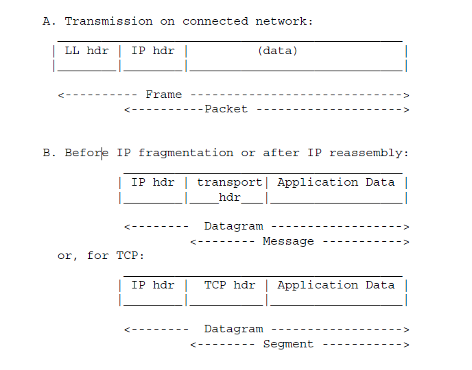

# Network protocol model

本文讨论network protocol model，它是典型的层次化模型/结构；建立起完整的network protocol model非常重要，它让我们完整地认识network。

| model                  | 简介                       |
| ---------------------- | -------------------------- |
| OSI model              | 理论模型，实际并没有采用它 |
| Internet protocol suit | 实际采用的模型             |

## wikipedia [OSI model](https://en.wikipedia.org/wiki/OSI_model)

The **Open Systems Interconnection model** (**OSI model**) is a [conceptual model](https://en.wikipedia.org/wiki/Conceptual_model) that characterizes and standardizes the communication functions of a [telecommunication](https://en.wikipedia.org/wiki/Telecommunication) or computing system without regard to its underlying internal structure and technology. Its goal is the interoperability of diverse communication systems with **standard protocols**. The model partitions a communication system into [abstraction layers](https://en.wikipedia.org/wiki/Abstraction_layer). The **original** version of the model defined seven layers.

> NOTE: 上面这段话中的最后一句中的original让我想起来了在大学的时候学习network的时候，其中说明过**实现**和**理论**之间的差异：即实现可能并不会按照理论中所定义的模型来进行，在实现的时候可能会进行简化。

> NOTE: 需要和[Internet protocol suite](https://en.wikipedia.org/wiki/Internet_protocol_suite)对比着来看。

A layer serves the layer above it and is served by the layer below it. For example, a layer that provides error-free communications across a network provides the **path** needed by applications above it, while it calls the next lower layer to send and receive packets that constitute（组成） the contents of that **path**. Two instances at the same layer are visualized as connected by a *horizontal* connection in that layer.

> NOTE: 这段话从横向和纵向对OSI的各层之间的关系进行了描述。

The model is a product of the [Open Systems Interconnection](https://en.wikipedia.org/wiki/Open_Systems_Interconnection) project at the [International Organization for Standardization](https://en.wikipedia.org/wiki/International_Organization_for_Standardization)(ISO).

> NOTE: 在programmer进行programming的时候，往往是由programmer来自己选择想要使用的protocol；可以看到OSI为我们提供了多种protocol。

Communication in the OSI-Model (example with layers 3 to 5)

### OSI model **by layer**

OSI model by [layer](https://en.wikipedia.org/wiki/Abstraction_layer)

| layer | name                                                         | example                                                      |
| ----- | ------------------------------------------------------------ | ------------------------------------------------------------ |
| 7.    | [Application layer](https://en.wikipedia.org/wiki/Application_layer) | - [FTP](https://en.wikipedia.org/wiki/File_Transfer_Protocol)  - [Gopher](https://en.wikipedia.org/wiki/Gopher_(protocol))  - [HTTP](https://en.wikipedia.org/wiki/Hypertext_Transfer_Protocol) |
| 6.    | [Presentation layer](https://en.wikipedia.org/wiki/Presentation_layer) | - [MIME](https://en.wikipedia.org/wiki/MIME)  - [XDR](https://en.wikipedia.org/wiki/External_Data_Representation) |
| 5.    | [Session layer](https://en.wikipedia.org/wiki/Session_layer) |                                                              |
| 4.    | [Transport layer](https://en.wikipedia.org/wiki/Transport_layer) | - [TCP](https://en.wikipedia.org/wiki/Transmission_Control_Protocol) -  [UDP](https://en.wikipedia.org/wiki/User_Datagram_Protocol) |
| 3.    | [Network layer](https://en.wikipedia.org/wiki/Network_layer) | - [IP](https://en.wikipedia.org/wiki/Internet_Protocol) ([IPv4](https://en.wikipedia.org/wiki/IPv4) [IPv6](https://en.wikipedia.org/wiki/IPv6) )  - [ICMP](https://en.wikipedia.org/wiki/Internet_Control_Message_Protocol) |
| 2.    | [Data link layer](https://en.wikipedia.org/wiki/Data_link_layer) | - [ATM](https://en.wikipedia.org/wiki/Asynchronous_Transfer_Mode)  - [ARP](https://en.wikipedia.org/wiki/Address_Resolution_Protocol) |
| 1.    | [Physical layer](https://en.wikipedia.org/wiki/Physical_layer) |                                                              |

## wikipedia [Internet protocol suite](https://en.wikipedia.org/wiki/Internet_protocol_suite)

The **Internet protocol suite** is the [conceptual model](https://en.wikipedia.org/wiki/Conceptual_model_(computer_science)) and set of [communications protocols](https://en.wikipedia.org/wiki/Communications_protocol) used in the [Internet](https://en.wikipedia.org/wiki/Internet) and similar [computer networks](https://en.wikipedia.org/wiki/Computer_network). It is commonly known as **TCP/IP** because the foundational protocols in the suite are the [Transmission Control Protocol](https://en.wikipedia.org/wiki/Transmission_Control_Protocol) (TCP) and the [Internet Protocol](https://en.wikipedia.org/wiki/Internet_Protocol) (IP). It is occasionally known as the **Department of Defense** (**DoD**) **model** because the development of the networking method was funded by the [United States Department of Defense](https://en.wikipedia.org/wiki/United_States_Department_of_Defense) through [DARPA](https://en.wikipedia.org/wiki/DARPA).

> NOTE: 需要注意的是， **Internet protocol suite**才是真正用于Internet的，而不是[OSI model](https://en.wikipedia.org/wiki/OSI_model) 。

**The Internet protocol suite** provides [end-to-end data communication](https://en.wikipedia.org/wiki/End-to-end_principle) specifying how data should be packetized, addressed, transmitted, [routed](https://en.wikipedia.org/wiki/Routing), and received. This functionality is organized into four [abstraction layers](https://en.wikipedia.org/wiki/Abstraction_layer), which classify all related protocols according to the **scope** of networking involved.[[1\]](https://en.wikipedia.org/wiki/Internet_protocol_suite#cite_note-1)[[2\]](https://en.wikipedia.org/wiki/Internet_protocol_suite#cite_note-2) From lowest to highest, the layers are the [link layer](https://en.wikipedia.org/wiki/Link_layer), containing communication methods for data that remains within a single **network segment** (link); the [internet layer](https://en.wikipedia.org/wiki/Internet_layer), providing [internetworking](https://en.wikipedia.org/wiki/Internetworking) between independent networks; the [transport layer](https://en.wikipedia.org/wiki/Transport_layer), handling **host-to-host communication**; and the [application layer](https://en.wikipedia.org/wiki/Application_layer), providing **process-to-process data exchange** for applications.

The [technical standards](https://en.wikipedia.org/wiki/Technical_standard) underlying the Internet protocol suite and its constituent protocols are maintained by the [Internet Engineering Task Force](https://en.wikipedia.org/wiki/Internet_Engineering_Task_Force) (IETF). The **Internet protocol suite** predates（早于） the [OSI model](https://en.wikipedia.org/wiki/OSI_model), a more comprehensive reference framework for general networking systems.

### Internet protocol suite by layer

| layer | name                                                         | example                                                      |
| ----- | ------------------------------------------------------------ | ------------------------------------------------------------ |
| 4     | [Application layer](https://en.wikipedia.org/wiki/Application_layer) | [FTP](https://en.wikipedia.org/wiki/File_Transfer_Protocol) [HTTP](https://en.wikipedia.org/wiki/Hypertext_Transfer_Protocol) [NFS](https://en.wikipedia.org/wiki/Network_File_System_(protocol)) [SMTP](https://en.wikipedia.org/wiki/Simple_Mail_Transfer_Protocol) [Telnet](https://en.wikipedia.org/wiki/Telnet) |
| 3     | [Transport layer](https://en.wikipedia.org/wiki/Transport_layer) | [TCP](https://en.wikipedia.org/wiki/Transmission_Control_Protocol) [UDP](https://en.wikipedia.org/wiki/User_Datagram_Protocol) [SCTP](https://en.wikipedia.org/wiki/Stream_Control_Transmission_Protocol) [DCCP](https://en.wikipedia.org/wiki/Datagram_Congestion_Control_Protocol) [SPX](https://en.wikipedia.org/wiki/IPX/SPX) |
| 2     | [Network layer](https://en.wikipedia.org/wiki/Network_layer) | [IP](https://en.wikipedia.org/wiki/Internet_Protocol) ([IPv4](https://en.wikipedia.org/wiki/IPv4) [IPv6](https://en.wikipedia.org/wiki/IPv6) ) [ICMP](https://en.wikipedia.org/wiki/Internet_Control_Message_Protocol) [IPsec](https://en.wikipedia.org/wiki/IPsec) [IGMP](https://en.wikipedia.org/wiki/Internet_Group_Management_Protocol) [IPX](https://en.wikipedia.org/wiki/Internetwork_Packet_Exchange) [AppleTalk](https://en.wikipedia.org/wiki/AppleTalk) [X.25](https://en.wikipedia.org/wiki/X.25) [PLP](https://en.wikipedia.org/wiki/Packet_Layer_Protocol) |
| 1     | [Link layer](https://en.wikipedia.org/wiki/Link_layer)       | [ARP](https://en.wikipedia.org/wiki/Address_Resolution_Protocol) [NDP](https://en.wikipedia.org/wiki/Neighbor_Discovery_Protocol) [OSPF](https://en.wikipedia.org/wiki/Open_Shortest_Path_First) Tunnels   [L2TP](https://en.wikipedia.org/wiki/Layer_2_Tunneling_Protocol) [PPP](https://en.wikipedia.org/wiki/Point-to-Point_Protocol) MAC   [Ethernet](https://en.wikipedia.org/wiki/Ethernet) [Wi-Fi](https://en.wikipedia.org/wiki/Wi-Fi) [DSL](https://en.wikipedia.org/wiki/Digital_subscriber_line) [ISDN](https://en.wikipedia.org/wiki/Integrated_Services_Digital_Network) [FDDI](https://en.wikipedia.org/wiki/Fiber_Distributed_Data_Interface) |

> NOTE: 看了上面的Internet protocol suite，我所想到的是在使用socket进行programming的时候，我需要指定的内容包括  [Transport layer](https://en.wikipedia.org/wiki/Transport_layer) （使用哪种transport protocol，是TCP还是UDP，还是其他的）和  [Network layer](https://en.wikipedia.org/wiki/Network_layer) （使用的是IPV4还是IPV6），即socket是建立在  [Transport layer](https://en.wikipedia.org/wiki/Transport_layer)  的；按照OSI model，在  [Transport layer](https://en.wikipedia.org/wiki/Transport_layer) 之上还有layer5和layer6才能够到达 [Application layer](https://en.wikipedia.org/wiki/Application_layer) ，但是在[Internet protocol suite](https://en.wikipedia.org/wiki/Internet_protocol_suite)中， [Transport layer](https://en.wikipedia.org/wiki/Transport_layer) 之上就是 [Application layer](https://en.wikipedia.org/wiki/Application_layer) ，并且在实际中，都是采用的[Internet protocol suite](https://en.wikipedia.org/wiki/Internet_protocol_suite)，所以我也应该按照 [Internet protocol suite](https://en.wikipedia.org/wiki/Internet_protocol_suite) 来进行思考；我们往往是在 [Application layer](https://en.wikipedia.org/wiki/Application_layer) 进行program，在application layer我们使用socket来实现application layer protocol，以满足application的要求；在我们实际进行program的时候，如果要开发一个network application，我们往往是从从顶向下来进行开发设计的，我们往往是首先开发application protocol，比如redis的[RESP](https://redis.io/topics/protocol) 。port是和application layer protocol相关的；

### Formal specification and standards

The characteristic architecture of the Internet Protocol Suite is its broad division into operating scopes for the protocols that constitute its core functionality. The defining specification of the suite is [RFC 1122](https://tools.ietf.org/html/rfc1122), which broadly outlines four [abstraction layers](https://en.wikipedia.org/wiki/Abstraction_layer).[[1]](https://en.wikipedia.org/wiki/Internet_protocol_suite#cite_note-rfc1122-1) These have stood the test of time, as the IETF has never modified this structure. As such a model of networking, the Internet Protocol Suite predates the OSI model, a more comprehensive reference framework for general networking systems.

> NOTE: 摘录原文中的这一段，重要是为了强调 [RFC 1122](https://tools.ietf.org/html/rfc1122), 它是Internet protocol suit的formal description，所以很多关于Internet protocol suit的问题都可以在其中找到答案，并且可以看到原文中，有多处是引用RFC 1122的，我已经将RFC 1122下载了。

## Protocol data unit

一个非常重要的概念就是protocol data unit，PDU，即“协议数据单元”，它是描述下一节Mechanism的前提。它符合在文章《Unit》中提出的思想的。

### wikipedia [Protocol data unit](https://en.wikipedia.org/wiki/Protocol_data_unit)

#### Example: PDU of layer of OSI model

| layer | name                                                         | PDU                                                          |
| ----- | ------------------------------------------------------------ | ------------------------------------------------------------ |
| 4     | [transport layer](https://en.wikipedia.org/wiki/Transport_layer) | TCP [segment](https://en.wikipedia.org/wiki/Packet_segment) or UDP datagram |
| 3     | [network layer](https://en.wikipedia.org/wiki/Network_layer) | [packet](https://en.wikipedia.org/wiki/Network_packet)       |
| 2     | [data link layer](https://en.wikipedia.org/wiki/Data_link_layer) | [frame](https://en.wikipedia.org/wiki/Frame_(networking))    |
| 1     | [physical layer](https://en.wikipedia.org/wiki/Physical_layer) | [bit](https://en.wikipedia.org/wiki/Bit) or, more generally, [symbol](https://en.wikipedia.org/wiki/Symbol_(data)). |

下面是[RFC 1122](https://tools.ietf.org/html/rfc1122)中给出的描述

| terminology | explanation                                                  |
| ----------- | ------------------------------------------------------------ |
| Segment     | A **segment** is the unit of end-to-end transmission in the **TCP protocol**. A segment consists of a **TCP header** followed by **application data**. A segment is transmitted by encapsulation inside an **IP datagram**. |
| Message     | In this description of the lower-layer protocols,  a **message** is the unit of transmission in a **transport layer protocol**.  In particular, a TCP segment is a message.  A message consists of a **transport protocol header** followed by application protocol data. To be transmitted end-to-end through the Internet,  a message must be encapsulated inside a **datagram**. |
| IP Datagram | An IP datagram is the unit of end-to-end transmission in the IP protocol. An IP datagram consists of an IP header followed by transport layer data, i.e., of an IP header followed by a message. |
| Packet      | A packet is the unit of data passed across the interface between the internet layer and the link layer. It includes an IP header and data. A packet may be a complete IP datagram or a fragment of an IP datagram. |
| Frame       | A frame is the unit of transmission in a link layer protocol, and consists of a link-layer header followed by a packet. |

## Max length of PUD

前面介绍了PUC，与它相关的另外一个问题是：它的最大长度；

#### Example: PDU of layer of OSI model

| layer | name                                                         | PDU                                                          | max length                                                   |
| ----- | ------------------------------------------------------------ | ------------------------------------------------------------ | ------------------------------------------------------------ |
| 4     | [transport layer](https://en.wikipedia.org/wiki/Transport_layer) | TCP [segment](https://en.wikipedia.org/wiki/Packet_segment) or UDP datagram | [Maximum segment size](https://en.wikipedia.org/wiki/Maximum_segment_size) |
| 3     | [network layer](https://en.wikipedia.org/wiki/Network_layer) | [packet](https://en.wikipedia.org/wiki/Network_packet)       | [Maximum transmission unit](https://en.wikipedia.org/wiki/Maximum_transmission_unit) |
| 2     | [data link layer](https://en.wikipedia.org/wiki/Data_link_layer) | [frame](https://en.wikipedia.org/wiki/Frame_(networking))    |                                                              |
| 1     | [physical layer](https://en.wikipedia.org/wiki/Physical_layer) | [bit](https://en.wikipedia.org/wiki/Bit) or, more generally, [symbol](https://en.wikipedia.org/wiki/Symbol_(data)). |                                                              |

## TODO: Mechanism

> NOTE: 这是我在阅读wikipedia [Internet protocol suite](https://en.wikipedia.org/wiki/Internet_protocol_suite)的[Key architectural principles](https://en.wikipedia.org/wiki/Internet_protocol_suite#Key_architectural_principles)的插图"Encapsulation of application data descending through the layers described in [RFC 1122](https://tools.ietf.org/html/rfc1122)"时，有感而发。

本文描述protocol stack的运行机制，其实它的运行机制相对是比较简单的，可以看做是两个方向:

- 向下
- 向上

### Disassemble / Reassemble

Disassemble 拆开

Reassemble 重新装配、重新集合

显然两者描述的是相反的过程。

不同PUD的最大长度可能不同，这就导致了Disassemble / Reassemble问题，下面是一些与此相关的内容:

- [IP fragmentation](https://en.wikipedia.org/wiki/IP_fragmentation)
- TCP segment of a reassembled PDU（在`Network\Theory\TCPTCP-segment-of-a-reassembled-PDU.md`中，对这个问题进行了讨论）

### Descend

涉及到的操作有: 

1) Encapsulation of application data

2) Disassemble 

Encapsulation of application data descending through the layers described in [RFC 1122](https://tools.ietf.org/html/rfc1122)

### Ascend: Unpack/Expose

自底向上的过程和自顶向下的过程转换相反，它是涉及到的操作有:

1) Unpack/Expose

2) Reassemble