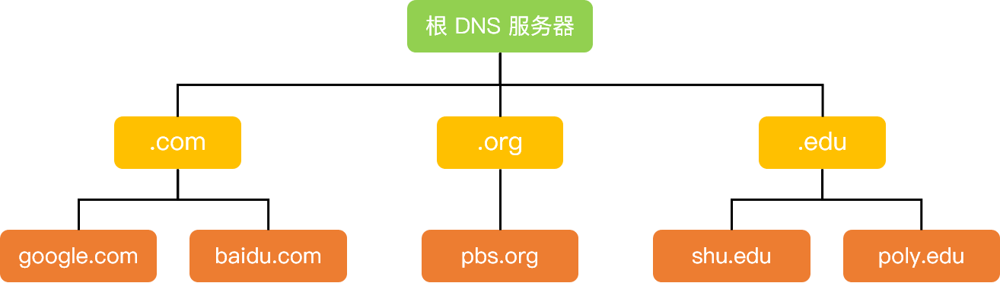

# 第二部分：应用层

## DNS 的作用和原理

### DNS

DNS（Domain Name System）是域名系统的英文缩写，是一种组织成域层次结构的计算机和网络服务命名系统，用于 TCP/IP 网络。

### DNS 的作用

通常我们有两种方式识别主机：通过主机名或者 IP 地址。人们喜欢便于记忆的主机名表示，而路由器则喜欢定长的、有着层次结构的 IP 地址。为了满足这些不同的偏好，我们就需要一种能够进行**主机名**到 **IP 地址**转换的目录服务，域名系统作为将域名和 IP 地址相互映射的一个**分布式数据库**，能够使人更方便地访问互联网。

### DNS 域名解析原理

DNS 采用了分布式的设计方案，其域名空间采用一种树形的层次结构：

上图展示了 DNS 服务器的部分层次结构，从上到下依次为**根域名服务器**、**顶级域名服务器**和**权威域名服务器**。其实**根域名服务器**在因特网上有13个，大部分位于北美洲。第二层为**顶级域服务器**，这些服务器负责**顶级域名**（如 `com`、`org`、`net`、`edu`）和所有国家的顶级域名（如`uk`、`fr`、`ca` 和 `jp`）。在第三层为**权威 DNS 服务器**，因特网上具有公共可访问主机（例如 Web 服务器和邮件服务器）的每个组织机构必须提供公共可访问的 **DNS 记录**，这些记录由**组织机构**的**权威 DNS 服务器**负责保存，这些记录将这些主机的名称映射为 IP 地址。

> NOTE: 
>
> 上述"其实**根域名服务器**在因特网上有13个"是错误的，参见:
>
> zhihu [为什么域名根服务器只能有13台呢？](https://www.zhihu.com/question/22587247)
>
> 其中对这种说法进行了反驳。

除此之外，还有一类重要的 DNS 服务器，叫做**本地 DNS 服务器**。**本地 DNS 服务器**严格来说不在 DNS 服务器的层次结构中，但它对 DNS 层次结构是很重要的。一般来说，每个**网络服务提供商（ISP）** 都有一台**本地 DNS 服务器**。当主机与某个 ISP 相连时，该 ISP 提供一台主机的 IP 地址，该主机具有一台或多台其**本地 DNS 服务器**的 IP 地址。主机的**本地 DNS 服务器**通常和主机距离较近，当主机发起 DNS 请求时，该请求被发送到本地 DNS 服务器，它起着代理的作用，并将该请求转发到 **DNS 服务器**层次结构中。

> NOTE: 
>
> 查询时，key是domain name

#### Example

我们以一个例子来了解 DNS 的工作原理，假设主机 A（IP 地址为 `abc.xyz.edu`） 想知道主机 B 的 IP 地址 （`def.mn.edu`），如下图所示，主机 A 首先向它的**本地 DNS 服务器**发送一个 DNS 查询报文。该查询报文含有被转换的主机名 `def.mn.edu`。本地 DNS 服务器将该报文转发到**根 DNS 服务器**，**根 DNS 服务器**注意到查询的 IP 地址前缀为 `edu` 后向**本地 DNS 服务器**返回负责 `edu` 的**顶级域名服务器**的 **IP 地址列表**。该**本地 DNS 服务器**则再次向这些 顶级域名服务器发送查询报文。该顶级域名服务器注意到 `mn.edu` 的前缀，并用**权威域名服务器**的 IP 地址进行响应。通常情况下，**顶级域名服务器**并不总是知道每台主机的**权威 DNS 服务器**的 IP 地址，而只知道中间的某个服务器，该**中间 DNS 服务器**依次能找到用于相应主机的 IP 地址，我们假设中间经历了权威服务器 ① 和 ②，最后找到了负责 `def.mn.edu` 的**权威 DNS 服务器** ③，之后，本地 DNS 服务器直接向该服务器发送查询报文从而获得主机 B 的IP 地址。

在上图中，IP 地址的查询其实经历了两种查询方式，分别是**递归查询**和**迭代查询**。

拓展：域名解析查询的两种方式

递归查询：如果主机所询问的**本地域名服务器**不知道被查询域名的 IP 地址，那么本地域名服务器就以 DNS 客户端的身份，向其他根域名服务器继续发出查询请求报文，即替主机继续查询，而不是让主机自己进行下一步查询，如上图步骤（1）和（10）。
迭代查询：当根域名服务器收到本地域名服务器发出的迭代查询请求报文时，要么给出所要查询的 IP 地址，要么告诉本地服务器下一步应该找哪个域名服务器进行查询，然后让本地服务器进行后续的查询，如上图步骤（2）~（9）。

## DNS 为什么用 UDP

> NOTE: 
>
> 其实是在比较TCP和UDP，其实是在进行tradeoff

更正确的答案是 DNS 既使用 TCP 又使用 UDP。

当进行区域传送（主域名服务器向辅助域名服务器传送变化的那部分数据）时会使用 TCP，因为数据同步传送的数据量比一个请求和应答的数据量要多，而 TCP 允许的报文长度更长，因此为了保证数据的正确性，会使用基于可靠连接的 TCP。

当客户端向 DNS 服务器查询域名 ( 域名解析) 的时候，一般返回的内容不会超过 UDP 报文的最大长度，即 512 字节。用 UDP 传输时，不需要经过 TCP 三次握手的过程，从而大大提高了响应速度，但这要求域名解析器和域名服务器都必须自己处理超时和重传从而保证可靠性。

> NOTE: 
>
> 域名查询，数据量小 "一般返回的内容不会超过 UDP 报文的最大长度"，对速度要求较高

## 怎么实现 DNS 劫持

**DNS 劫持**即**域名劫持**，是通过将原域名对应的 IP 地址进行替换从而使得用户访问到错误的网站或者使得用户无法正常访问网站的一种攻击方式。域名劫持往往只能在特定的网络范围内进行，范围外的 **DNS 服务器**能够返回正常的 IP 地址。攻击者可以冒充原域名所属机构，通过电子邮件的方式修改组织机构的**域名注册信息**，或者将域名转让给其它组织，并将新的域名信息保存在所指定的 **DNS 服务器**中，从而使得用户无法通过对原域名进行解析来访问目的网址。

> NOTE: 
>
> 这种在源头进行篡改的方式，在现实世界中，发生的可能性并不大。

具体实施步骤如下：

① 获取要劫持的域名信息：攻击者首先会访问域名查询站点查询要劫持的域名信息。

② 控制域名相应的 E-MAIL 账号：在获取到域名信息后，攻击者通过暴力破解或者专门的方法破解公司注册域名时使用的 E-mail 账号所对应的密码。更高级的攻击者甚至能够直接对 E-mail 进行信息窃取。

③ 修改注册信息：当攻击者破解了 E-MAIL 后，会利用相关的更改功能修改该域名的注册信息，包括域名拥有者信息，DNS 服务器信息等。

④ 使用 E-MAIL 收发确认函：在修改完注册信息后，攻击者在 E-mail 真正拥有者之前收到修改域名注册信息的相关确认信息，并回复确认修改文件，待网络公司恢复已成功修改信件后，攻击者便成功完成 DNS 劫持。

用户端的一些预防手段：

1、直接通过 IP 地址访问网站，避开 DNS 劫持。

2、由于域名劫持往往只能在特定的网络范围内进行，因此一些高级用户可以通过网络设置让 DNS 指向正常的域名服务器以实现对目的网址的正常访问，例如将计算机首选 DNS 服务器的地址固定为 8.8.8.8。

## socket() 套接字有哪些

套接字（Socket）是对网络中不同主机上的应用进程之间进行双向通信的端点的抽象，网络进程通信的一端就是一个套接字，不同主机上的进程便是通过套接字发送报文来进行通信。例如 TCP 用主机的 IP 地址 + 端口号作为 TCP 连接的端点，这个端点就叫做套接字。

套接字主要有以下三种类型：

1、流套接字（`SOCK_STREAM`）：流套接字基于 TCP 传输协议，主要用于提供面向连接、可靠的数据传输服务。由于 TCP 协议的特点，使用流套接字进行通信时能够保证数据无差错、无重复传送，并按顺序接收，通信双方不需要在程序中进行相应的处理。

2、数据报套接字（`SOCK_DGRAM`）：和流套接字不同，数据报套接字基于 UDP 传输协议，对应于无连接的 UDP 服务应用。该服务并不能保证数据传输的可靠性，也无法保证对端能够顺序接收到数据。此外，通信两端不需建立长时间的连接关系，当 UDP 客户端发送一个数据给服务器后，其可以通过同一个套接字给另一个服务器发送数据。当用 UDP 套接字时，**丢包**等问题需要在程序中进行处理。

3、原始套接字（`SOCK_RAW`）：由于流套接字和数据报套接字只能读取 TCP 和 UDP 协议的数据，当需要传送非传输层数据包（例如 Ping 命令时用的 ICMP 协议数据包）或者遇到操作系统无法处理的数据包时，此时就需要建立原始套接字来发送。

