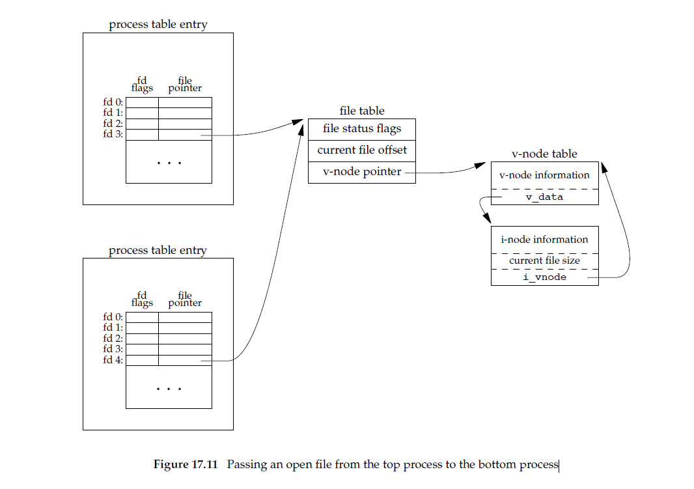

# 17.4 Passing File Descriptors

Passing an open file descriptor between processes is a powerful technique.

We must be more specific about what we mean by ‘‘passing an open file descriptor’’ from one process to another. Recall Figure 3.8, which showed two processes that have opened the same file. Although they share the same v-node, each process has its own **file table entry**.

When we pass an open file descriptor from one process to another, we want the passing process and the receiving process to share the same file table entry. Figure 17.11 shows the desired arrangement.

