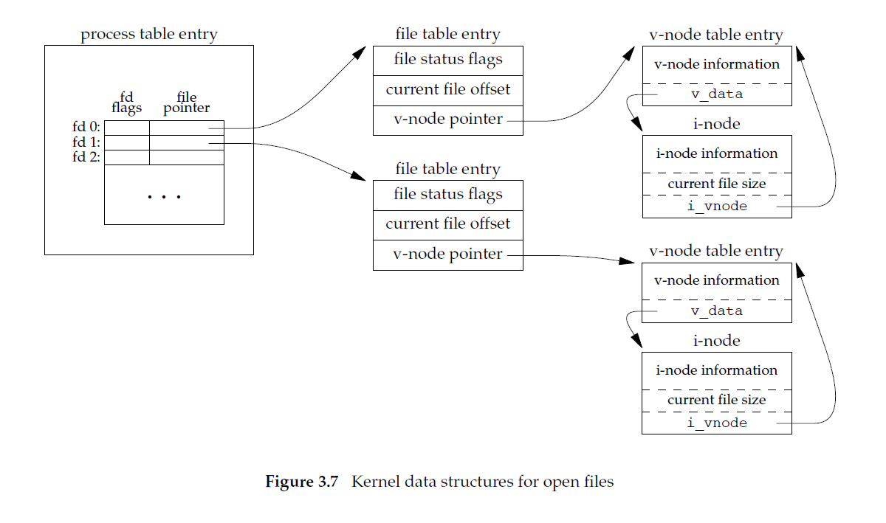
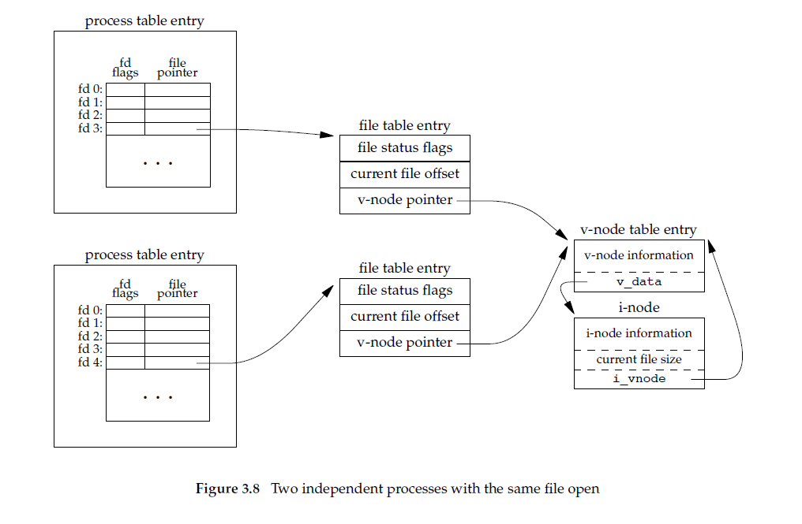

# 3.10 File Sharing

The UNIX System supports the sharing of open files among different processes. Before describing the `dup` function, we need to describe this sharing. To do this, we’ll examine the **data structures** used by the kernel for all I/O.

> The following description is conceptual; it may or may not match a particular implementation.

The kernel uses three data structures to represent an open file, and the relationships among them determine the effect one process has on another with regard to file sharing.

> NOTE: 
>
> 3个data structure

## File descriptors table

1、Every process has an entry in the process table. Within each process table entry is a table of open file descriptors, which we can think of as a vector, with one entry per descriptor. Associated with each file descriptor are

(a) The **file descriptor flags** (**close-on-exec**; refer to Figure 3.7 and Section 3.14)

(b) A pointer to a **file table entry**

## File table 

The kernel maintains a **file table** for all open files. Each file table entry contains

(a) The **file status flags** for the file, such as read, write, append, sync, and nonblocking; more on these in Section 3.14

(b) The **current file offset**

(c) A pointer to the v-node table entry for the file

## v-node table 

Each open file (or device) has a **v-node structure** that contains information about the type of file and pointers to functions that operate on the file. For most files, the v-node also contains the i-node for the file. This information is read from disk when the file is opened, so that all the pertinent information about the file is readily available. For example, the **i-node** contains the owner of the file, the size of the file, pointers to where the actual data blocks for the file are located on disk, and so on. (We talk more about i-nodes in Section 4.14 when we describe the typical UNIX file system in more detail.)

> Linux has no v-node. Instead, a generic i-node structure is used. Although the implementations differ, the v-node is conceptually the same as a generic i-node. Both point to an i-node structure specific to the file system.

> The v-node was invented to provide support for multiple file system types on a single computer system. This work was done independently by Peter Weinberger (Bell Laboratories) and Bill Joy (Sun Microsystems). Sun called this the Virtual File System and called the file system–independent portion of the i-node the v-node [Kleiman 1986]. The v-node propagated through various vendor implementations as support for Sun’s Network File System (NFS) was added. The first release from Berkeley to provide v-nodes was the 4.3BSD Reno release, when NFS was added.
>
> In SVR4, the v-node replaced the file system–independent i-node of SVR3. Solaris is derived from SVR4 and, therefore, uses v-nodes. Instead of splitting the data structures into a v-node and an i-node, Linux uses a file system–independent i-node and a file system–dependent i-node.

We’re ignoring some implementation details that don’t affect our discussion. For example, the table of open file descriptors can be stored in the user area (a separate per-process structure that can be paged out) instead of the process table. Also, these tables can be implemented in numerous ways—they need not be arrays; one alternate implementation is a linked lists of structures. Regardless of the implementation details, the general concepts remain the same.

Figure 3.7 shows a pictorial arrangement of these three tables for a single process that has two different files open: one file is open on standard input (file descriptor 0), and the other is open on standard output (file descriptor 1).

> NOTE: 
>
> "tag-kernel-data-structure-for-IO-three tables"

The arrangement of these three tables has existed since the early versions of the UNIX System [Thompson 1978]. This arrangement is critical to the way files are shared among processes. We’ll return to this figure in later chapters, when we describe additional ways that files are shared.

## Two independent processes with the same file open

If two independent processes have the same file open, we could have the arrangement shown in Figure 3.8.

We assume here that the first process has the file open on descriptor 3 and that the second process has that same file open on descriptor 4. Each process that opens the file gets its own file table entry, but only a single **v-node table entry** is required for a given file. One reason each process gets its own **file table entry** is so that each process has its own **current offset for the file**.

Given these data structures, we now need to be more specific about what happens with certain operations that we’ve already described.

1、After each `write` is complete, the **current file offset** in the **file table entry** is incremented by the number of bytes written. If this causes the **current file offset** to exceed the **current file size**, the **current file size** in the **i-node table entry** is set to the **current file offset** (for example, the file is extended).

2、If a file is opened with the `O_APPEND` flag, a corresponding flag is set in the **file status flags** of the **file table entry**. Each time a `write` is performed for a file with this append flag set, the **current file offset** in the **file table entry** is first set to the **current file size** from the i-node table entry. This forces every write to be appended to the current end of file.

3、If a file is positioned to its current end of file using `lseek`, all that happens is the **current file offset** in the **file table entry** is set to the **current file size** from the **i-node table entry**. (Note that this is not the same as if the file was opened with the `O_APPEND` flag, as we will see in Section 3.11.)

4、The `lseek` function modifies only the **current file offset** in the **file table entry**. No I/O takes place.

## More than one *file descriptor entry* to point to the same *file table entry*

It is possible for more than one **file descriptor entry** to point to the same **file table entry**, as we’ll see when we discuss the `dup` function in Section 3.12. This also happens after a `fork` when the parent and the child share the same **file table entry** for each open descriptor (Section 8.3).

## File descriptor flag and file status flag

> NOTE:
>
> 一、其实从命名就能够看出它们之间的差异:
>
> "file descriptor flag"显然是和"file descriptor"相关的
>
> "file status flag"显然是和"file"相关的

Note the difference in scope between the **file descriptor flags** and the **file status flags**. The former apply only to a single descriptor in a single process, whereas the latter apply to all descriptors in any process that point to the given file table entry. When we describe the `fcntl` function in Section 3.14, we’ll see how to fetch and modify both the **file descriptor flags** and the **file status flags**.

## Atomic operation

Everything that we’ve described so far in this section works fine for multiple processes that are reading the same file. Each process has its own **file table entry** with its own **current file offset**. Unexpected results can arise, however, when multiple processes write to the same file. To see how to avoid some surprises, we need to understand the concept of atomic operations.

