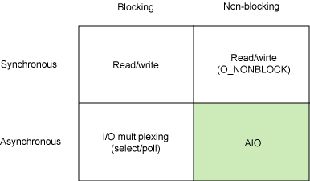

# ibm [Boost application performance using asynchronous I/O](https://developer.ibm.com/technologies/linux/articles/l-async/)

## Introduction to AIO

Linux asynchronous I/O is a relatively recent addition to the Linux kernel. It's a standard feature of the 2.6 kernel, but you can find patches for 2.4. The basic idea behind `AIO` is to allow a process to initiate(开始，启动) a number of I/O operations without having to block or wait for any to complete. At some later time, or after being notified of **I/O completion**, the process can retrieve the results of the I/O.


## I/O models

Before digging into the AIO API, let's explore the different I/O models that are available under Linux. This isn't intended as an exhaustive review, but rather aims to cover the most common models to illustrate their differences from asynchronous I/O. Figure 1 shows synchronous and asynchronous models, as well as blocking and non-blocking models.

**Figure 1. Simplified matrix of basic Linux I/O models**




Each of these I/O models has usage patterns that are advantageous for particular applications. This section briefly explores each one.


## Synchronous blocking I/O

>#### I/O-bound versus CPU-bound processes
>
>A process that is I/O bound is one that performs more I/O than processing. A CPU-bound process does more processing than I/O. The Linux 2.6 scheduler(调度程序) actually favors I/O-bound processes because they commonly initiate an I/O and then block, which means other work can be efficiently interlaced(交错) between them.

One of the most common models is the **synchronous blocking I/O model**. In this model, the **user-space application** performs a system call that results in the application blocking. This means that the application blocks until the system call is complete (data transferred or error). The calling application is in a state where it consumes no CPU and simply awaits the response, so it is efficient from a processing perspective.

Figure 2 illustrates the traditional blocking I/O model, which is also the most common model used in applications today. Its behaviors are well understood, and its usage is efficient for typical applications. When the `read` system call is invoked, the application blocks and the **context** switches to the **kernel**. The read is then initiated, and when the response returns (from the device from which you're reading), the data is moved to the user-space buffer. Then the application is unblocked (and the `read` call returns).

**Figure 2. Typical flow of the synchronous blocking I/O model**


From the application's perspective, the `read` call spans a long duration. But, in fact, the application is actually blocked while the read is multiplexed(多路复用) with other work in the kernel.


## Synchronous non-blocking I/O

A less efficient variant of **synchronous blocking** is **synchronous non-blocking I/O**. In this model, a device is opened as **non-blocking**. This means that instead of completing an I/O immediately, a `read` may return an error code indicating that the command could not be immediately satisfied (`EAGAIN` or `EWOULDBLOCK`), as shown in Figure 3.

**Figure 3. Typical flow of the synchronous non-blocking I/O model**


The implication(影响) of **non-blocking** is that an I/O command may not be satisfied immediately, requiring that the application make numerous calls to **await** completion. This can be extremely inefficient because in many cases the application must **busy-wait** until the data is available or attempt to do other work while the command is performed in the kernel. As also shown in Figure 3, this method can introduce latency in the I/O because any gap between the data becoming available in the kernel and the user calling `read` to return it can reduce the overall data throughput.


## Asynchronous blocking I/O

Another **blocking paradigm** is **non-blocking I/O** with **blocking notifications**. In this model, non-blocking I/O is configured, and then the blocking `select` system call is used to determine when there's any activity for an **I/O descriptor**. What makes the `select` call interesting is that it can be used to provide notification for not just one descriptor, but many. For each descriptor, you can request notification of the descriptor's ability to write data, availability of read data, and also whether an error has occurred.

**Figure 4. Typical flow of the asynchronous blocking I/O model (select)**


The primary issue with the `select` call is that it's not very efficient. While it's a convenient model for **asynchronous notification**, its use for high-performance I/O is not advised.


## Asynchronous non-blocking I/O (AIO)

Finally, the asynchronous non-blocking I/O model is one of overlapping(重叠；覆盖) processing with I/O. The read request returns immediately, indicating that the `read` was successfully initiated. The application can then perform other processing while the background read operation completes. When the `read` response arrives, a **signal** or a **thread-based callback** can be generated to complete the I/O transaction.

**Figure 5. Typical flow of the asynchronous non-blocking I/O model**


The ability to overlap computation and I/O processing in a single process for potentially multiple I/O requests exploits the gap（差距） between **processing speed** and **I/O speed**. While one or more slow I/O requests are pending, the CPU can perform other tasks or, more commonly, operate on already completed I/Os while other I/Os are initiated.

> NOTE:I feel that the idea in the above paragraph can also be implemented using threads as describe in [this article](http://docs.libuv.org/en/v1.x/guide/basics.html#event-loops)

> NOTE:Asynchronous  IO has the mechanism of notification.Blocked IO mean that the application would be blocked;


The next section examines this model further, explores the API, and then demonstrates a number of the commands.


## Motivation for asynchronous I/O

From the previous taxonomy(分类型) of I/O models, you can see the motivation for AIO. The **blocking models** require the initiating application to block when the I/O has started. This means that it isn't possible to overlap（重叠） processing and I/O at the same time. The **synchronous non-blocking** model allows overlap of processing and I/O, but it requires that the application check the status of the I/O on a recurring basis. This leaves asynchronous non-blocking I/O, which permits overlap of processing and I/O, including notification of I/O completion.

The functionality provided by the `select` function (asynchronous blocking I/O) is similar to AIO, except that it still blocks. However, it blocks on **notifications** instead of the I/O call.

## Introduction to AIO for Linux

>AIO for Linux
>
>AIO first entered the Linux kernel in 2.5 and is now a standard feature of 2.6 production kernels.

This section explores the asynchronous I/O model for Linux to help you understand how to apply it in your applications.

In a traditional I/O model, there is an **I/O channel** that is identified by a unique handle. In UNIX®, these are **file descriptors** (which are the same for files, pipes, sockets, and so on). In blocking I/O, you initiate a **transfer** and the system call returns when it's complete or an error has occurred.


In **asynchronous non-blocking I/O**, you have the ability to initiate **multiple** transfers at the same time. This requires a **unique context** for each transfer so you can identify it when it completes. In AIO, this is an `aiocb` (AIO I/O Control Block) structure. This structure contains all of the information about a transfer, including a **user buffer** for data. When notification for an I/O occurs (called a completion), the `aiocb` structure is provided to uniquely identify the completed I/O. The API demonstration shows how to do this.

## AIO API

The AIO interface API is quite simple, but it provides the necessary functions for data transfer with a couple of different **notification models**. Table 1 shows the AIO interface functions, which are further explained later in this section.

**Table 1. AIO interface APIs**

| API function  | Description                                                  |
| ------------- | ------------------------------------------------------------ |
| `aio_read`    | Request an asynchronous read operation                       |
| `aio_error`   | Check the status of an asynchronous request                  |
| `aio_return`  | Get the return status of a completed asynchronous request    |
| `aio_write`   | Request an asynchronous operation                            |
| `aio_suspend` | Suspend the calling process until one or more asynchronous requests have completed (or failed) |
| `aio_cancel`  | Cancel an asynchronous I/O request                           |
| `lio_listio`  | Initiate a list of I/O operations                            |


Each of these API functions uses the `aiocb` structure for initiating or checking. This structure has a number of elements, but Listing 1 shows only the ones that you'll need to (or can) use.


**Listing 1. The `aiocb` structure showing the relevant fields**

```c
struct aiocb {

  int aio_fildes;               // File Descriptor
  int aio_lio_opcode;           // Valid only for lio_listio (r/w/nop)
  volatile void *aio_buf;       // Data Buffer
  size_t aio_nbytes;            // Number of Bytes in Data Buffer
  struct sigevent aio_sigevent; // Notification Structure

  /* Internal fields */
  ...

};

```

The `sigevent` structure tells AIO what to do when the I/O completes. You'll explore this structure in the AIO demonstration. Now I'll show you how the individual API functions for AIO work and how you can use them.


### aio_read

The `aio_read` function requests an asynchronous read operation for a valid file descriptor. The **file descriptor** can represent a file, a socket, or even a pipe. The `aio_read` function has the following prototype:

```c
int aio_read( struct aiocb *aiocbp );
```

The `aio_read` function returns immediately after the request has been **queued**. The return value is zero on success or -1 on error, where `errno` is defined.

> NOTE:也是通过queue机制来实现的；

To perform a read, the application must initialize the `aiocb` structure. The following short example illustrates filling in the`aiocb` request structure and using `aio_read` to perform an asynchronous read request (ignore notification for now). It also shows use of the `aio_error` function, but I'll explain that later.

**Listing 2. Sample code for an asynchronous read with aio_read**

```c
#include <aio.h>
  
  int fd, ret;
  struct aiocb my_aiocb;
 
  fd = open( "file.txt", O_RDONLY );
  if (fd < 0) perror("open");
 
  /* Zero out the aiocb structure (recommended) */
  bzero( (char *)&my_aiocb, sizeof(struct aiocb) );
 
  /* Allocate a data buffer for the aiocb request */
  my_aiocb.aio_buf = malloc(BUFSIZE+1);
  if (!my_aiocb.aio_buf) perror("malloc");
 
  /* Initialize the necessary fields in the aiocb */
  my_aiocb.aio_fildes = fd;
  my_aiocb.aio_nbytes = BUFSIZE;
  my_aiocb.aio_offset = 0;
 
  ret = aio_read( &my_aiocb );
  if (ret < 0) perror("aio_read");
 
  while ( aio_error( &my_aiocb ) == EINPROGRESS ) ;
 
  if ((ret = aio_return( &my_iocb )) > 0) {
    /* got ret bytes on the read */
  } else {
    /* read failed, consult errno */
  }
```

In Listing 2, after the file from which you're reading data is opened, you zero out your `aiocb` structure, and then allocate a data buffer. The reference to the data buffer is placed into `aio_buf`. Subsequently, you initialize the size of the buffer into `aio_nbytes`. The `aio_offset` is set to zero (the first offset in the file). You set the file descriptor from which you're reading into `aio_fildes`. After these fields are set, you call `aio_read` to request the read. You can then make a call to `aio_error` to determine the status of the `aio_read`. As long as the status is `EINPROGRESS`, you **busy-wait** until the status changes. At this point, your request has either succeeded or failed.

Note the similarities to reading from the file with the standard library functions. In addition to the asynchronous nature of `aio_read`, another difference is setting the offset for the read. In a typical `read` call, the offset is maintained for you in the file descriptor context. For each read, the offset is updated so that subsequent reads address the next block of data. This isn't possible with asynchronous I/O because you can perform many read requests simultaneously, so you must specify the offset for each particular read request.

>Building with the AIO interface
>
>You can find the function prototypes and other necessary symbolics in the `aio.h` header file. When building an application that uses this interface, you must use the POSIX real-time extensions library (`librt`).


### aio_error

The `aio_error` function is used to determine the status of a request. Its prototype is:

```c
int aio_error( struct aiocb *aiocbp );
```

This function can return the following:

- `EINPROGRESS`, indicating the request has not yet completed
- `ECANCELLED`, indicating the request was cancelled by the application
- `-1`, indicating that an error occurred for which you can consult `errno`

### aio_return

Another difference between asynchronous I/O and standard blocking I/O is that you don't have immediate access to the return status of your function because you're not blocking on the `read` call. In a standard `read` call, the return status is provided upon return of the function. With asynchronous I/O, you use the `aio_return` function. This function has the following prototype:

```c
ssize_t aio_return( struct aiocb *aiocbp );
```

### aio_write

The `aio_write` function is used to request an asynchronous write. Its function prototype is:

```c
int aio_write( struct aiocb *aiocbp );
```

The `aio_write` function returns immediately, indicating that the request has been enqueued (with a return of `0` on success and `-1` on failure, with `errno` properly set).

This is similar to the `read` system call, but one behavior difference is worth noting. Recall that the offset to be used is important with the `read` call. However, with `write`, the offset is important only if used in a file context where the `O_APPEND`option is not set. If `O_APPEND` is set, then the offset is ignored and the data is appended to the end of the file. Otherwise, the `aio_offset` field determines the offset at which the data is written to the file.


### aio_suspend

TODO

### aio_cancel

TODO

### lio_listio

TODO


## AIO notifications

Now that you've seen the AIO functions that are available, this section digs into the methods that you can use for **asynchronous notification**. I'll explore asynchronous notification through signals and function callbacks.


### Asynchronous notification with signals


The use of signals for interprocess communication (IPC) is a traditional mechanism in UNIX and is also supported by AIO. In this paradigm, the application defines a **signal handler** that is invoked when a specified signal occurs. The application then specifies that an **asynchronous request** will raise a signal when the request has completed. As part of the signal context, the particular `aiocb` request is provided to keep track of multiple potentially outstanding requests. Listing 5 demonstrates this **notification** method.


**Listing 5. Using signals as notification for AIO requests**

```c
void setup_io( ... )
{
  int fd;
  struct sigaction sig_act;
  struct aiocb my_aiocb;
 
  ...
 
  /* Set up the signal handler */
  sigemptyset(&sig_act.sa_mask);
  sig_act.sa_flags = SA_SIGINFO;
  sig_act.sa_sigaction = aio_completion_handler;
 
 
  /* Set up the AIO request */
  bzero( (char *)&my_aiocb, sizeof(struct aiocb) );
  my_aiocb.aio_fildes = fd;
  my_aiocb.aio_buf = malloc(BUF_SIZE+1);
  my_aiocb.aio_nbytes = BUF_SIZE;
  my_aiocb.aio_offset = next_offset;
 
  /* Link the AIO request with the Signal Handler */
  my_aiocb.aio_sigevent.sigev_notify = SIGEV_SIGNAL;
  my_aiocb.aio_sigevent.sigev_signo = SIGIO;
  my_aiocb.aio_sigevent.sigev_value.sival_ptr = &my_aiocb;
 
  /* Map the Signal to the Signal Handler */
  ret = sigaction( SIGIO, &sig_act, NULL );
 
  ...
 
  ret = aio_read( &my_aiocb );
 
}
 
 
void aio_completion_handler( int signo, siginfo_t *info, void *context )
{
  struct aiocb *req;
 
 
  /* Ensure it's our signal */
  if (info->si_signo == SIGIO) {
 
    req = (struct aiocb *)info->si_value.sival_ptr;
 
    /* Did the request complete? */
    if (aio_error( req ) == 0) {
 
      /* Request completed successfully, get the return status */
      ret = aio_return( req );
 
    }
 
  }
 
  return;
}
```


In Listing 5, you set up your signal handler to catch the `SIGIO` signal in the `aio_completion_handler` function. You then initialize the `aio_sigevent` structure to raise `SIGIO` for notification (which is specified via the `SIGEV_SIGNAL` definition in`sigev_notify`). When your read completes, your signal handler extracts the particular `aiocb` from the signal's `si_value`structure and checks the error status and return status to determine I/O completion.

For performance, the completion handler is an ideal spot to continue the I/O by requesting the next asynchronous transfer. In this way, when completion of one transfer has completed, you immediately start the next.


### Asynchronous notification with callbacks

An alternative notification mechanism is the system callback. Instead of raising a signal for notification, this mechanism calls a function in user-space for notification. You initialize the `aiocb` reference into the `sigevent` structure to uniquely identify the particular request being completed; see Listing 6.

**Listing 6. Using thread callback notification for AIO requests**

```c
void setup_io( ... )
{
  int fd;
  struct aiocb my_aiocb;
 
  ...
 
  /* Set up the AIO request */
  bzero( (char *)&my_aiocb, sizeof(struct aiocb) );
  my_aiocb.aio_fildes = fd;
  my_aiocb.aio_buf = malloc(BUF_SIZE+1);
  my_aiocb.aio_nbytes = BUF_SIZE;
  my_aiocb.aio_offset = next_offset;
 
  /* Link the AIO request with a thread callback */
  my_aiocb.aio_sigevent.sigev_notify = SIGEV_THREAD;
  my_aiocb.aio_sigevent.notify_function = aio_completion_handler;
  my_aiocb.aio_sigevent.notify_attributes = NULL;
  my_aiocb.aio_sigevent.sigev_value.sival_ptr = &my_aiocb;
 
  ...
 
  ret = aio_read( &my_aiocb );
 
}
 
 
void aio_completion_handler( sigval_t sigval )
{
  struct aiocb *req;
 
  req = (struct aiocb *)sigval.sival_ptr;
 
  /* Did the request complete? */
  if (aio_error( req ) == 0) {
 
    /* Request completed successfully, get the return status */
    ret = aio_return( req );
 
  }
 
  return;
}
```


In Listing 6, after creating your `aiocb` request, you request a thread callback using `SIGEV_THREAD` for the notification method. You then specify the particular notification handler and load the context to be passed to the handler (in this case, a reference to the `aiocb` request itself). In the handler, you simply cast the incoming `sigval` pointer and use the AIO functions to validate the completion of the request.


## System tuning for AIO

The proc file system contains two virtual files that can be tuned for asynchronous I/O performance:

- The /proc/sys/fs/aio-nr file provides the current number of system-wide asynchronous I/O requests.
- The /proc/sys/fs/aio-max-nr file is the maximum number of allowable concurrent requests. The maximum is commonly 64KB, which is adequate for most applications.

## Summary

Using asynchronous I/O can help you build faster and more efficient I/O applications. If your application can overlap processing and I/O, then AIO can help you build an application that more efficiently uses the CPU resources available to you. While this I/O model differs from the traditional blocking patterns found in most Linux applications, the asynchronous notification model is conceptually simple and can simplify your design.
