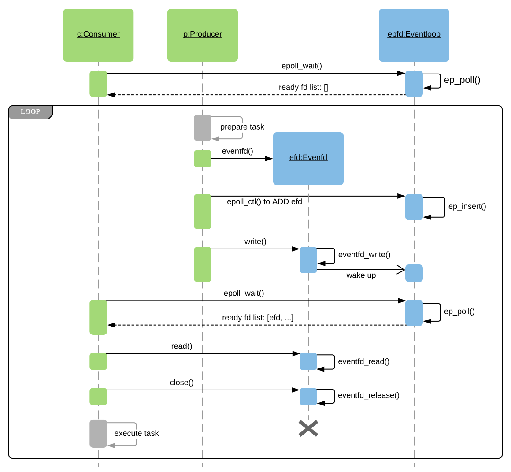

# `EVENTFD(2)` 

Linux中遵循everything is a file，因此，很多event都可以以`fd`(file descriptor)的方式来进行通知。

在阅读[folly-io-async: An object-oriented wrapper around libevent](https://github.com/facebook/folly/blob/master/folly/io/async/README.md)时，其中有关于`eventfd`的介绍，引发了我对它的学习。

## man 2 [`EVENTFD(2)`](http://man7.org/linux/man-pages/man2/eventfd.2.html) 


## yangyang [Worker Pool With Eventfd](https://www.yangyang.cloud/blog/2018/11/09/worker-pool-with-eventfd/)

```
#include <sys/eventfd.h> int eventfd(unsigned int initval, int flags); 
```

That’s all we need to create one eventfd file, after that, we can perform normal file operations (like `read`/`write`, `poll` and `close`) with it.

Once some **user-space thread** write it with value greater than `0`(zero), it will instantly be notified to **user-space** by kernel. Then, the first thread which `read` it, will **reset** it (zero its counter), i.e. consume the event. And all the later `read` will get Error (Resource Temporarily Unavailable), until it is written again (event triggered). Briefly, it transforms an event to a **file descriptor** that can be effectively monitored.

### `eventfd` VS `pipe`

There’re several notes of which we should take special account:

> *Applications can use an eventfd file descriptor instead of a pipe **in all cases where a pipe is used simply to signal events**. The kernel overhead of an eventfd file descriptor is much lower than that of a pipe, and only one file descriptor is required (versus the two required for a pipe).*

As with signal events, `eventfd` is much more light-weight (thus fast) compared to the pipes, it’s just a counter in kernel after all.

> *A key point about an eventfd file descriptor is that it can be monitored just like any other file descriptor using `select`(2), `poll`(2), or `epoll`(7). This means that an application can simultaneously monitor the readiness of “traditional” files and the readiness of other kernel mechanisms that support the eventfd interface.*


You won’t wield the true power of `eventfd`, unless you monitor them with `epoll` (especially `EPOLLET`).

So, let’s get our hands dirty with an simple worker thread pool!

### Worker Pool Design

We adopt **Producer/Consumer pattern** for our **worker thread pool**, as it’s the most common style of decoupling, achieving the best scalability. By leveraging the asynchronous notification feature from the eventfd, our inter-thread communication sequence could be described as following:



### Implementation

Our per-thread data structure is fairly simple, only contains 3 fields: `thread_id`, `rank` (thread index) and `epfd` which is the epoll file descriptor created by `main` function.

```C
typedef struct thread_info {
    pthread_t thread_id;
    int rank; // thread index
    int epfd; // epoll file descriptor 
} thread_info_t;
```

#### Consumer thread routine

```C++
// 线程执行函数
static void *consumer_routine(void *data) {
    struct thread_info *c = (struct thread_info *)data;
    struct epoll_event *events;
    int epfd = c->epfd;
    int nfds = -1;
    int i = -1;
    int ret = -1;
    uint64_t v;
    int num_done = 0;

    events = calloc(MAX_EVENTS_SIZE, sizeof(struct epoll_event));
    if (events == NULL) exit_error("calloc epoll events\n");

    for (;;) {
        nfds = epoll_wait(epfd, events, MAX_EVENTS_SIZE, 1000);
        for (i = 0; i < nfds; i++) {
            if (events[i].events & EPOLLIN) {
                log_debug("[consumer-%d] got event from fd-%d",
                        c->rank, events[i].data.fd);
                ret = read(events[i].data.fd, &v, sizeof(v));
                if (ret < 0) {
                    log_error("[consumer-%d] failed to read eventfd", c->rank);
                    continue;
                }
                close(events[i].data.fd);
                do_task();
                log_debug("[consumer-%d] tasks done: %d", c->rank, ++num_done);
            }
        }
    }
}
```

As we can see, the worker thread get the notification by simply polling `epoll_wait()` the epoll-added fd list, and `read()` the eventfd to consume it, then `close()` to clean it. And we can do anything sequential within the `do_task`, although it now does nothing.

In short: poll -> read -> close.

#### Producer thread routine

```C++
static void *producer_routine(void *data) {
    struct thread_info *p = (struct thread_info *)data;
    struct epoll_event event;
    int epfd = p->epfd;
    int efd = -1;
    int ret = -1;
    int interval = 1;

    log_debug("[producer-%d] issues 1 task per %d second", p->rank, interval);
    while (1) {
        efd = eventfd(0, EFD_CLOEXEC | EFD_NONBLOCK); // 非阻塞IO
        if (efd == -1) exit_error("eventfd create: %s", strerror(errno));
        event.data.fd = efd;
        event.events = EPOLLIN | EPOLLET;
        ret = epoll_ctl(epfd, EPOLL_CTL_ADD, efd, &event);
        if (ret != 0) exit_error("epoll_ctl");
        ret = write(efd, &(uint64_t){1}, sizeof(uint64_t));
        if (ret != 8) log_error("[producer-%d] failed to write eventfd", p->rank);
        sleep(interval);
    }
}
```

In producer routine, after creating `eventfd`, we register the event with epoll object by `epoll_ctl()`. Note that the event is set for write (EPOLLIN) and Edge-Triggered (EPOLLET). For notification, what we need to do is just write `0x1` (any value you want) to eventfd.

In short: create -> register -> write.

#### *Source code repository*: 

[eventfd_examples](https://github.com/Pro-YY/eventfd_examples/)

#### Try something hard

But now, let’s try something hard. We’ll `smoke test` our worker by generate a heavy instant load, instead of the former regular one. And we tweak the producer/consumer thread to 1, and watching the performance.

```C++
static void *producer_routine_spike(void *data) {
    struct thread_info *p = (struct thread_info *)data;
    struct epoll_event event;
    int epfd = p->epfd;
    int efd = -1;
    int ret = -1;
    int num_task = 1000000;

    log_debug("[producer-%d] will issue %d tasks", p->rank, num_task);
    for (int i = 0; i < num_task; i++) {
        efd = eventfd(0, EFD_CLOEXEC | EFD_NONBLOCK);
        if (efd == -1) exit_error("eventfd create: %s", strerror(errno));
        event.data.fd = efd;
        event.events = EPOLLIN | EPOLLET;
        ret = epoll_ctl(epfd, EPOLL_CTL_ADD, efd, &event);
        if (ret != 0) exit_error("epoll_ctl");
        ret = write(efd, &(uint64_t){1}, sizeof(uint64_t));
        if (ret != 8) log_error("[producer-%d] failed to write eventfd", p->rank);
    }
    return (void *)0;
}
```

**Over 1 million?** Indeed! By using the `ulimit` command below, we can increase the `open files` limit of the current shell, which is usually 1024 by default. Note that you need to be root.

```SHELL
ulimit -n 1048576

# 1048576 is the default maximum for open files, as `/proc/sys/fs/nr_open` shows.
# To make it larger, you need to tweak kernel settings like this (which is beyond our scope)
# sysctl -w fs.nr_open=10485760
```


With my test VM (S2.Medium4 type on [TencentCloud](https://cloud.tencent.com/), which has only 2 vCPU and 4G memory, it takes less than 6.5 seconds to deal with 1 million concurrent (almost) events. And we’ve seen the kernel-implemented counters and wait queue are quite efficient.

### Conclusions

Multi-threaded programming model is prevailing(流行的) now, while the best way of scheduling (event trigger and dispatching method) is still under discussion and sometimes even opinionated(自以为是的). In this post, we’ve implemented general-purposed worker thread pool based on an advanced message mechanism, which includes:

1. message notification: asynchronous delivering, extremely low overhead, high performance
2. message dispatching: as a load balancer, highly scalable
3. message buffering: as message queue, with robustness

All the above are fulfilled by using basic Linux kernel feature/syscall, like `epoll` and `eventfd`. Everyone may refers to this approach when he/she designs a single-process performant (especially IO-bound) background service.

To sum up, taking advantage of Linux kernel capability, we are now managed to implement our high-performance message-based worker pool, which is able to deal with large throughput and of high scalability.

### References

- [eventfd(2) - Linux Man Page](https://linux.die.net/man/2/eventfd)
- [eventpoll - Linux Source Code](https://elixir.bootlin.com/linux/latest/source/fs/eventpoll.c)
- [eventfd - Linux Source Code](https://elixir.bootlin.com/linux/latest/source/fs/eventfd.c)


## stackoverflow [Writing to eventfd from kernel module](https://stackoverflow.com/questions/13607730/writing-to-eventfd-from-kernel-module)

