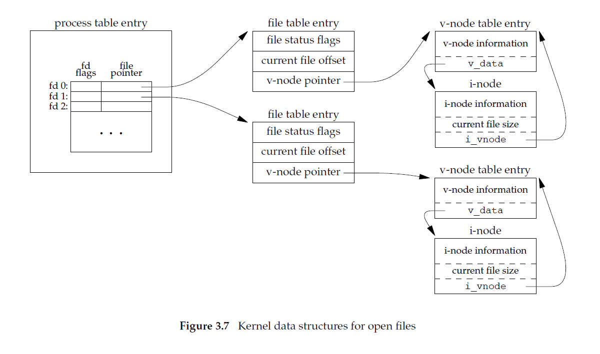

# Linux IO data structure

## Linux IO data structure: three tables

它非常重要，它是理解Linux IO的重要基础。

### File descriptor table

Scope:

1、per-process

#### File descriptor 

Attribute: 

1、File Descriptor Flags

2、File pointer

### File table

Scope:

1、OS wide

#### File table entry

Attribute: 

1、file mode/file status flag

2、current file offset

### inode table

### 参考素材

#### APUE 3.10 File Sharing

we’ll examine **data structures** used by the kernel for all I/O, The following description is conceptual; it may or may not match a particular implementation.

The kernel uses **three data structures** to represent an open file, and the relationships among them determine the effect one process has on another with regard to file sharing.

> NOTE: 
>
> 其中对上述三个table进行了非常详细的说明

#### wikipedia [File descriptor](https://en.wikipedia.org/wiki/File_descriptor) 

In the traditional implementation of Unix, **file descriptors** index into a per-process **file descriptor table** maintained by the kernel, that in turn indexes into a system-wide table of files opened by all processes, called the **file table**. This table records the *mode* with which the file (or other resource) has been opened: for reading, writing, appending, and possibly other modes. It also indexes into a third table called the [inode table](https://en.wikipedia.org/wiki/Inode) that describes the actual underlying files. 

> NOTE: 
>
> table 1: **file descriptors** index into a per-process **file descriptor table** 
>
> table 2: system-wide table of files opened by all processes, called the **file table**
>
> table 3: [inode table](https://en.wikipedia.org/wiki/Inode) that describes the actual underlying file

#### wikipedia [Process control block](https://en.wikipedia.org/wiki/Process_control_block)

## 可能的组合情况

1、三级结构存在着多种可能的组合情况，下面罗列了典型的组合

2、下面的图是参考"APUE3.10 File Sharing"绘制的

### 一个进程打开多个不同的文件

源自: APUE Figure 3.7 Kernel data structures for open files；

file descriptor 1 和 file descriptor 2分别对应不同的file

### 一个进程以不同的**模式**打开同一个文件多次

### 不同进程打开同一个文件

源自: APUE Figure 3.8 Two independent processes with the same file open

### 父子进程的每一个打开的文件描述符共享同一个文件表项

源自: APUE Figure 8.2 Sharing of open files between parent and child after fork

### 进程执行`dup`系列函数来clone a file descriptor

.png)

源自: Figure 3.9 Kernel data structures after dup(1)

可以看到，其实`dup`系列函数类似于浅拷贝；

### Pass file descriptor

## Race condition

在下面章节中，对race condition进行了讨论:

一、`Book-APUE/3-File-IO/3.10-File-Sharing`

### 总结

通过 `Book-APUE/3-File-IO/3.10-File-Sharing` 中的内容可知:

一、对于"不同进程打开同一个文件"的情况是存在race condition的:

由于current file offset是在file table entry上的，这就可能导致overwrite。

二、对于共用file table entry的情况，是不存在race condition的。

### stackoverflow [two file descriptors to same file](https://stackoverflow.com/questions/5284062/two-file-descriptors-to-same-file)

**A**

It depends on where you got the two **file descriptors**. If they come from a `dup(2)` call, then they share **file offset** and **status**, so doing a `write(2)` on one will affect the position on the other. If, on the other hand, they come from two separate `open(2)` calls, each will have their own file offset and status.

> NOTE: 
>
> 上面描述的第二种情况，就会产生race condition

A **file descriptor** is mostly just a reference to a **kernel file structure**, and it is that kernel structure that contains most of the state. When you `open(2)` a file, you get a new **kernel file structure** and a new **file descriptor** that refers to it. When you `dup(2)` a file descriptor (or pass a file descriptor through `sendmsg`), you get a new reference to the same kernel file struct.

> NOTE: 
>
> 关于 "pass a file descriptor"，参见 `Pass-file-descriptor` 章节
>
> 

## TODO

system call 和 IO data structure之间的关联，需要进行总结。
