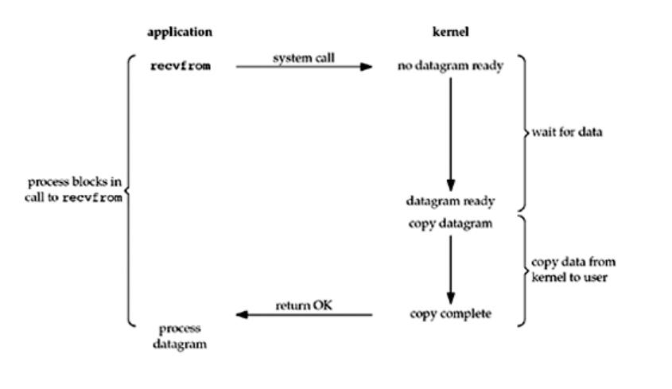
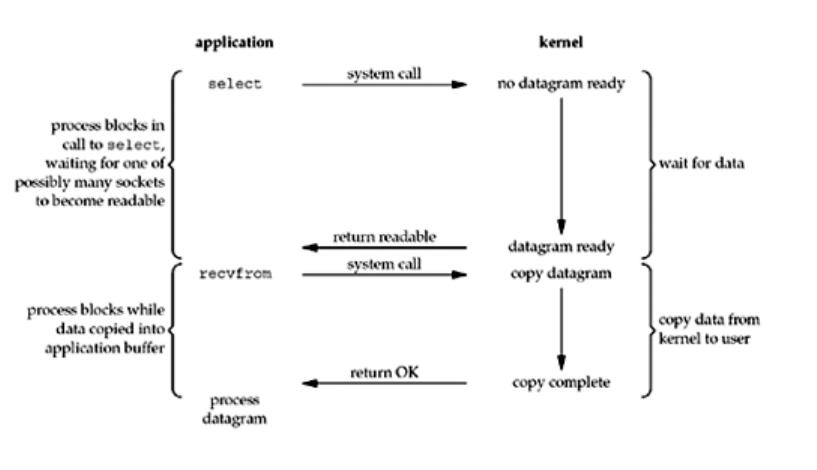
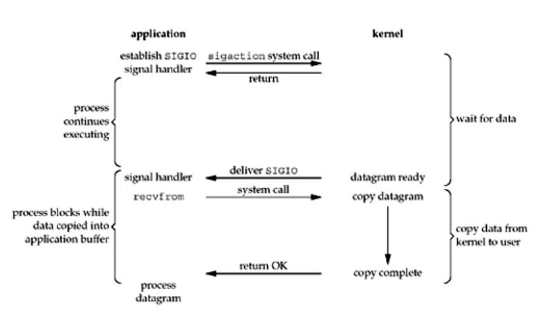
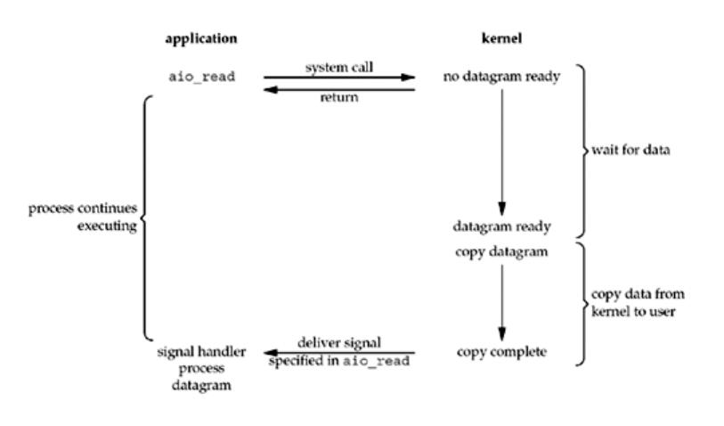
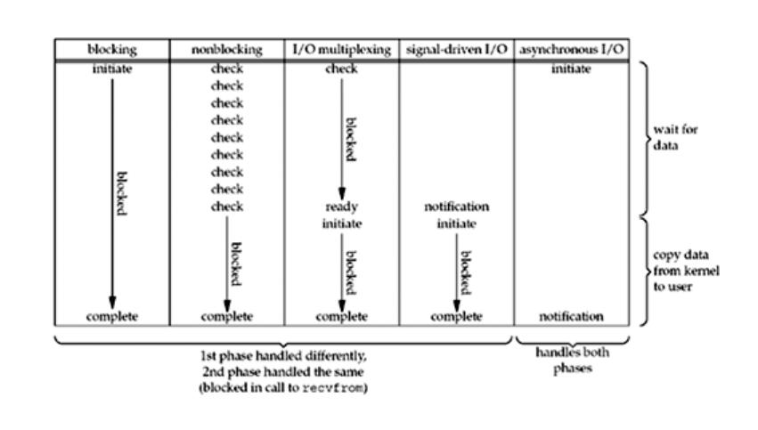

# I/O Models

## UNP 6.1 I/O Multiplexing: The `select` and `poll` Functions[¶](https://notes.shichao.io/unp/ch6/#chapter-6-io-multiplexing-the-select-and-poll-functions)

> NOTE: 本节以UNP的chapter 6.2 I/O Models基准来描述Unix-like OS中的**I/O models**。网络资源链接：https://notes.shichao.io/unp/ch6/#io-models 。正文如下：

In Section 5.12, we saw our TCP client handling two inputs at the same time: **standard input** and a **TCP  socket**. We encountered a problem when the client was blocked in a call to `fgets` (on standard input) and the server process was killed. The server TCP correctly sent a `FIN` to the client TCP, but since the client process was blocked reading from **standard input**, it never saw the `EOF` until it read from the socket (possibly much later). What we need is the capability to tell the kernel  that we want to be notified if one or more I/O conditions are ready (i.e., input is ready to be read, or the descriptor is capable of taking more output). This capability is called **I/O multiplexing** and is provided by the `select` and `poll` functions. We will also cover a newer POSIX variation of the former, called `pselect`.

Some systems provide more advanced ways for processes to **wait** for a list of events. A **poll device** is one mechanism provided in different forms by different vendors. This mechanism will be described in Chapter  14.

**I/O multiplexing** is typically used in networking applications in the following scenarios:

- When a client is handling **multiple descriptors** (normally interactive input and a network socket), I/O multiplexing should be used. This is the scenario we described previously.

- It is possible, but rare, for a client to handle multiple sockets at the same time. We will show an example of this using `select` in Section  16.5 in the context of a Web client.

- If a TCP server handles both a listening socket and its connected sockets, **I/O multiplexing** is normally used, as we will show in Section  6.8.

- If a server handles both TCP and `UDP`, **I/O multiplexing** is 
  normally used. We will show an example of this in Section 8.15.

- If a server handles multiple services and perhaps multiple 
  protocols (e.g., the `inetd` daemon that we will describe in Section  13.5), I/O multiplexing is normally used.

**I/O multiplexing** is not limited to network programming. Many nontrivial applications find a need for these techniques.

Before describing `select` and `poll`, we need to  step back and look at the bigger picture, examining the basic differences in the  five **I/O models** that are available to us under Unix:

- blocking I/O

- nonblocking I/O

- I/O multiplexing (`select` and `poll`)

- signal driven I/O (`SIGIO`)

- asynchronous I/O (the POSIX `aio_`functions)

You may want to skim this section on your first reading and  then refer back to it as you encounter the different I/O models described in  more detail in later chapters.

As we show in all the examples in this section, there are normally two distinct phases for an input operation:

- Waiting for the data to be ready

- Copying the data from the kernel to the process

For an input operation on a **socket**, the first step normally  involves waiting for data to arrive on the network. When the packet arrives, it is copied into a **buffer** within the **kernel**. The second step is copying this data from the kernel's buffer into our application buffer.

### Blocking I/O Model

The most prevalent(流行) model for I/O is the **blocking I/O model**, which we have used for all our examples so far in the text. By default, all sockets are **blocking**. Using a **datagram socket** for our examples, we have the scenario shown in Figure 6.1.

Figure 6.1. Blocking I/O model.

We use `UDP` for this example instead of TCP because with `UDP`, the concept of data being "ready" to read is simple: either an entire datagram(数据报) has been received or it has not. With TCP it gets more complicated, as additional variables such as the socket's low-water mark **come into play**（产生作用）.

In the examples in this section, we also refer to `recvfrom` as a **system call** because we are differentiating（区分） between our application and the kernel. Regardless of how `recvfrom` is implemented (as a system call on a Berkeley-derived kernel or as a function that invokes the `getmsg` system call on a System V kernel), there is normally a switch from running in the application to running in the kernel, followed at some time later by a return to the application.

In [Figure 6.1](#ch06fig01), the process calls `recvfrom` and the **system call** does not return until the datagram arrives and is copied into our application buffer, or an error occurs. The most common error is the **system call** being interrupted by a **signal**, as we described in Section 5.9. We say that our process is blocked the entire time from when it calls `recvfrom` until it returns. When `recvfrom` returns successfully, our application processes the datagram.

### Nonblocking I/O Model

When we set a **socket** to be **nonblocking**, we are telling the kernel "when an I/O operation that I request cannot be completed without putting the process to sleep, do not put the process to **sleep**, but return an error instead." We will describe nonblocking I/O in Chapter 16, but Figure 6.2 shows a summary of the example we are considering.

Figure 6.2. Nonblocking I/O model.

The first three times that we call `recvfrom`, there is no data to return, so the kernel immediately returns an error of `EWOULDBLOCK` instead. The fourth time we call `recvfrom`, a datagram is ready, it is copied into our application buffer, and `recvfrom` returns successfully. We then process the data.

When an application sits in a loop calling `recvfrom` on a **nonblocking descriptor** like this, it is called **polling**. The application is continually polling the kernel to see if some operation is ready. This is often a waste of CPU time, but this model is occasionally encountered, normally on systems dedicated to one function.

### I/O Multiplexing Model

With **I/O multiplexing**, we call `select` or `poll` and block(阻塞) in one of these two **system calls**, instead of blocking in the actual **I/O system call**. Figure 6.3 is a summary of the I/O multiplexing model.

> NOTE: 阻塞在`select`或`poll`中；
>
> OS kernel所通知的是IO readiness；

Figure 6.3. I/O multiplexing model.

We block in a call to `select`, waiting for the **datagram socket** to be readable. When `select` returns that the socket is readable, we then call `recvfrom` to copy the datagram into our application buffer.

Comparing Figure 6.3 to Figure 6.1, there does not appear to be any advantage, and in fact, there is a slight disadvantage because using `select` requires two system calls instead of one. But the advantage in using `select`, which we will see later in this chapter, is that we can wait for more than one descriptor to be ready.

Another closely related I/O model is to use multithreading with blocking I/O. That model very closely resembles the model described above, except that instead of using `select` to block on multiple file descriptors, the program uses multiple threads (one per file descriptor), and each thread is then free to call blocking system calls like `recvfrom`.

### Signal-Driven I/O Model

We can also use **signals**, telling the kernel to notify us with the `SIGIO` signal when the descriptor is ready. We call this **signal-driven I/O** and show a summary of it in Figure 6.4.

> NOTE: OS kernel所通知的是IO readiness；

Figure 6.4. Signal-Driven I/O model.

We first enable the **socket** for **signal-driven I/O** (as we will describe in Section 25.2) and install a **signal handler** using the `sigaction` system call. The return from this system call is immediate and our process continues; it is not blocked. When the datagram is ready to be read, the `SIGIO` signal is generated for our process. We can either read the datagram from the signal handler by calling `recvfrom` and then notify the main loop that the data is ready to be processed (this is what we will do in Section 25.3), or we can notify the main loop and let it read the datagram.

Regardless of how we handle the signal, the advantage to this model is that we are not blocked while waiting for the datagram to arrive. The **main loop** can continue executing and just wait to be notified by the **signal handler** that either the data is ready to process or the datagram is ready to be read.

### Asynchronous I/O Model

*Asynchronous I/O* is defined by the **POSIX specification**, and various differences in the real-time functions that appeared in the various standards which came together to form the current POSIX specification have been reconciled(和解了）. In general, these functions work by telling the kernel to start the operation and to **notify** us when the entire operation (including the copy of the data from the kernel to our buffer) is complete. The main difference between this model and the **signal-driven I/O model** in the previous section is that with **signal-driven I/O**, the kernel tells us when an I/O operation can be initiated(开始), but with synchronous I/O, the kernel tells us when an I/O operation is **complete**. We show an example in Figure 6.5.

> NOTE: 
>
> 1、OS kernel所通知的是IO completion；
>
> 2、Proactor pattern就是典型的Asynchronous I/O Model，关于此，参见zhihu [如何深刻理解reactor和proactor？](https://www.zhihu.com/question/26943938) # [A](https://www.zhihu.com/question/26943938/answer/68773398)
>
> 

Figure 6.5. Asynchronous I/O model.

We call `aio_read` (the POSIX asynchronous I/O functions begin with `aio_` or `lio_`) and pass the kernel the descriptor, buffer pointer, buffer size (the same three arguments for `read`), file offset (similar to `lseek`), and how to notify us when the entire operation is complete. This **system call** returns immediately and our process is not blocked while waiting for the I/O to complete. We assume in this example that we ask the kernel to generate some signal when the operation is complete. This signal is not generated until the data has been copied into our application buffer, which is different from the signal-driven I/O model.

As of this writing, few systems support POSIX asynchronous I/O. We are not certain, for example, if systems will support it for sockets. Our use of it here is as an example to compare against the signal-driven I/O model.

### Comparison of the I/O Models

[Figure 6.6](#ch06fig06) is a comparison of the five different I/O models. It shows that the main difference between the first four models is the **first phase**, as the second phase in the first four models is the same: the process is blocked in a call to `recvfrom` while the data is copied from the kernel to the caller's buffer. Asynchronous I/O, however, handles both phases and is different from the first four.

Figure 6.6. Comparison of the five I/O models.

### POSIX: Synchronous I/O versus Asynchronous I/O

> NOTE: 不同的标准有着不同的定义POSIX的Synchronous I/O 、Asynchronous I/O定义是根据具体的IO操作(copy data from kernel to user )是否阻塞主调线程。

POSIX defines these two terms as follows:

- A **synchronous I/O** operation causes the requesting process to be **blocked** until that I/O operation 
  completes.

- An **asynchronous I/O** operation does **not** cause the requesting process to be **blocked**.

  > NOTE: 它的"copy data from kernel to user"是由kernel执行的，不会阻塞调用线程，它被通知的是IO completion，而不是IO readiness。

Using these definitions, the first four I/O models—blocking,   nonblocking, I/O multiplexing, and signal-riven I/O—are all **synchronous** because  the actual I/O operation (`recvfrom`) blocks the process. Only the asynchronous I/O model matches the asynchronous I/O definition.

> NOTE: 下图是对上面IO model的总结: 

| classification       |                                                              |
| -------------------- | ------------------------------------------------------------ |
| **Synchronous I/O**  | - blocking  - nonblocking  - I/O multiplexing  - signal-riven I/O |
| **Asynchronous I/O** | asynchronous I/O                                             |

> NOTE: 
>
> signal-driven IO VS asynchronous IO
>
> signal-driven 所通知的是: IO readiness;
>
> asynchronous IO 所通知的是: IO completion;

## ibm [Boost application performance using asynchronous I/O](https://www.ibm.com/developerworks/linux/library/l-async/)

### Introduction to AIO

Linux asynchronous I/O is a relatively recent addition to the Linux kernel. It's a standard feature of the 2.6 kernel, but you can find patches for 2.4. The basic idea behind `AIO` is to allow a process to initiate(开始，启动) a number of I/O operations without having to block or wait for any to complete. At some later time, or after being notified of **I/O completion**, the process can retrieve the results of the I/O.

### I/O models

Before digging into the AIO API, let's explore the different I/O models that are available under Linux. This isn't intended as an exhaustive review, but rather aims to cover the most common models to illustrate their differences from asynchronous I/O. Figure 1 shows synchronous and asynchronous models, as well as blocking and non-blocking models.

**Figure 1. Simplified matrix of basic Linux I/O models**

Each of these I/O models has usage patterns that are advantageous for particular applications. This section briefly explores each one.

### Synchronous blocking I/O

>##### I/O-bound versus CPU-bound processes
>A process that is I/O bound is one that performs more I/O than processing. A CPU-bound process does more processing than I/O. The Linux 2.6 scheduler(调度程序) actually favors I/O-bound processes because they commonly initiate an I/O and then block, which means other work can be efficiently interlaced(交错) between them.

One of the most common models is the **synchronous blocking I/O model**. In this model, the **user-space application** performs a system call that results in the application blocking. This means that the application blocks until the system call is complete (data transferred or error). The calling application is in a state where it consumes no CPU and simply awaits the response, so it is efficient from a processing perspective.

Figure 2 illustrates the traditional blocking I/O model, which is also the most common model used in applications today. Its behaviors are well understood, and its usage is efficient for typical applications. When the `read` system call is invoked, the application blocks and the **context** switches to the **kernel**. The read is then initiated, and when the response returns (from the device from which you're reading), the data is moved to the user-space buffer. Then the application is unblocked (and the `read` call returns).

**Figure 2. Typical flow of the synchronous blocking I/O model**

From the application's perspective, the `read` call spans a long duration. But, in fact, the application is actually blocked while the read is multiplexed(多路复用) with other work in the kernel.

### Synchronous non-blocking I/O

A less efficient variant of **synchronous blocking** is **synchronous non-blocking I/O**. In this model, a device is opened as **non-blocking**. This means that instead of completing an I/O immediately, a `read` may return an error code indicating that the command could not be immediately satisfied (`EAGAIN` or `EWOULDBLOCK`), as shown in Figure 3.

**Figure 3. Typical flow of the synchronous non-blocking I/O model**

The implication(影响) of **non-blocking** is that an I/O command may not be satisfied immediately, requiring that the application make numerous calls to **await** completion. This can be extremely inefficient because in many cases the application must **busy-wait** until the data is available or attempt to do other work while the command is performed in the kernel. As also shown in Figure 3, this method can introduce latency in the I/O because any gap between the data becoming available in the kernel and the user calling `read` to return it can reduce the overall data throughput.

### Asynchronous blocking I/O

Another **blocking paradigm** is **non-blocking I/O** with **blocking notifications**. In this model, non-blocking I/O is configured, and then the blocking `select` system call is used to determine when there's any activity for an **I/O descriptor**. What makes the `select` call interesting is that it can be used to provide notification for not just one descriptor, but many. For each descriptor, you can request notification of the descriptor's ability to write data, availability of read data, and also whether an error has occurred.

**Figure 4. Typical flow of the asynchronous blocking I/O model (select)**

The primary issue with the `select` call is that it's not very efficient. While it's a convenient model for **asynchronous notification**, its use for high-performance I/O is not advised.

### Asynchronous non-blocking I/O (AIO)

Finally, the asynchronous non-blocking I/O model is one of overlapping(重叠；覆盖) processing with I/O. The read request returns immediately, indicating that the `read` was successfully initiated. The application can then perform other processing while the background read operation completes. When the `read` response arrives, a **signal** or a **thread-based callback** can be generated to complete the I/O transaction.

**Figure 5. Typical flow of the asynchronous non-blocking I/O model**

The ability to overlap computation and I/O processing in a single process for potentially multiple I/O requests exploits the gap（差距） between **processing speed** and **I/O speed**. While one or more slow I/O requests are pending, the CPU can perform other tasks or, more commonly, operate on already completed I/Os while other I/Os are initiated.

> NOTE:I feel that the idea in the above paragraph can also be implemented using threads as describe in [this article](http://docs.libuv.org/en/v1.x/guide/basics.html#event-loops)

> NOTE:Asynchronous  IO has the mechanism of notification.Blocked IO mean that the application would be blocked;

## 维基百科 [Asynchronous I/O](https://en.wikipedia.org/wiki/Asynchronous_I/O)

维基百科[Asynchronous I/O](https://en.wikipedia.org/wiki/Asynchronous_I/O)的[Forms](https://en.wikipedia.org/wiki/Asynchronous_I/O#Forms)章节对IO form的分类和本节前面所描述的POSIX 的IO 分类是一致的。

> |      |  Blocking   |        Non-blocking         |    Asynchronous     |
> | :--: | :---------: | :-------------------------: | :-----------------: |
> | API  | write, read | write, read + poll / select | aio_write, aio_read |

维基百科[Asynchronous I/O](https://en.wikipedia.org/wiki/Asynchronous_I/O)的[Examples](https://en.wikipedia.org/wiki/Asynchronous_I/O#Examples)章节给出的例子值的一读。

## Summary

从上面三篇文章:

1) UNP 6.1 I/O Multiplexing: The `select` and `poll` Functions[¶](https://notes.shichao.io/unp/ch6/#chapter-6-io-multiplexing-the-select-and-poll-functions)

2) ibm [Boost application performance using asynchronous I/O](https://www.ibm.com/developerworks/linux/library/l-async/)

3) wikipedia [Asynchronous I/O](https://en.wikipedia.org/wiki/Asynchronous_I/O)

可以看出，它们对IO model的分类是不同的，需要注意的是，它们的分类都没有错误，对blocking、non-blocking 和 sync、async 的用法也没有错误，它们都是在IO的某个角度来进行描述、分类的。