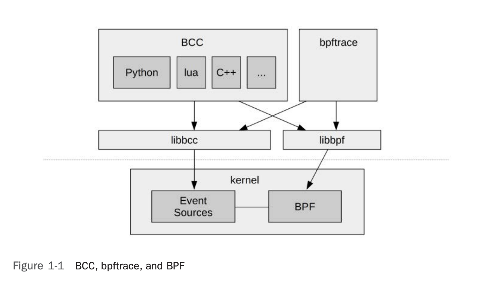

# 1 Introduction

This chapter introduces some key terminology, summarizes technologies, and demonstrates some BPF performance tools. These technologies will be explained in more detail in the following chapters.

## 1.1 What Are BPF and eBPF?

BPF stands for [Berkeley Packet Filter](https://en.wikipedia.org/wiki/Berkeley_Packet_Filter), an obscure(冷门的) technology first developed in 1992 that improved the performance of packet capture tools [McCanne 92]. In 2013, Alexei Starovoitov proposed a major rewrite of BPF [2], which was further developed by Alexei and Daniel Borkmann and included in the **Linux kernel** in 2014 [3]. This turned BPF into a **general-purpose execution engine** that can be used for a variety of things, including the creation of advanced performance analysis tools.

BPF can be difficult to explain precisely because it can do so much. It provides a way to run mini programs on a wide variety of **kernel and application events**. If you are familiar with JavaScript, you may see some similarities: JavaScript allows a website to run mini programs on browser events such as mouse clicks, enabling a wide variety of web-based applications. BPF allows the **kernel** to run mini programs on system and application events, such as disk I/O, thereby enabling new system technologies. It makes the kernel fully programmable, empowering users (including non-kernel developers) to customize and control their systems in order to solve real-world problems.

BPF is a flexible and efficient technology composed of an **instruction set**, **storage objects**, and **helper functions**. It can be considered a **virtual machine** due to its virtual instruction set specification. These instructions are executed by a **Linux kernel BPF runtime**, which includes an interpreter and a **JIT compiler** for turning BPF instructions into native instructions for execution. BPF instructions must first pass through a verifier that checks for safety, ensuring that the BPF program will not crash or corrupt the kernel (it doesn’t, however, prevent the end user from writing illogical programs that may execute but not make sense). The components of BPF are explained in detail in Chapter 2.

So far, the three main uses of BPF are networking, observability, and security. This book focuses on **observability** (tracing).

Extended BPF is often abbreviated as eBPF, but the official abbreviation is still BPF, without the “e,” so throughout this book I use BPF to refer to extended BPF. The kernel contains only one **execution engine**, BPF (extended BPF), which runs both extended BPF and “classic” BPF programs.1

## 1.2 What Are Tracing(追踪), Snooping(窥探), Sampling(采样), Profiling(性能剖析), and Observability(可观测性)?

These are all terms used to classify analysis techniques and tools.

### Tracing

**Tracing** is event-based recording—the type of instrumentation(插桩方式) that these BPF tools use. You may have already used some special-purpose tracing tools. Linux [strace(1)](https://man7.org/linux/man-pages/man1/strace.1.html), for example, records and prints system call events. There are many tools that do not trace events, but instead measure events using fixed **statistical counters** and then print summaries; Linux [top(1)](https://man7.org/linux/man-pages/man1/top.1.html) is an example. A hallmark(特征) of a tracer is its ability to record **raw events** and **event metadata**. Such data can be voluminous(大量的), and it may need to be post-processed into summaries. Programmatic tracers, which BPF makes possible, can run small programs on the events to do custom on-the-fly statistical summaries or other actions, to avoid costly post-processing.

> 注：“instrumenting events” 在计算机领域特指 “对事件进行插桩”，即通过插入监测代码来捕获或分析事件；

While strace(1) has “trace” in its name, not all tracers do. [tcpdump(8)](https://man7.org/linux/man-pages/man8/tcpdump.8.html), for example, is another specialized tracer for network packets. (Perhaps it should have been named tcptrace?) The Solaris operating system had its own version of tcpdump called snoop(1M)², so named because it was used to snoop network packets. I was first to develop and publish many tracing tools, and did so on Solaris, where I (perhaps regrettably) used the “snooping” terminology for my earlier tools. This is why we now have execsnoop(8), opensnoop(8), biosnoop(8), etc. **Snooping, event dumping, and tracing usually refer to the same thing**. These tools are covered in later chapters.
Apart from tool names, the term *tracing* is also used, especially by kernel developers, to describe BPF when used for observability.

### Sampling

**Sampling** tools take a subset of measurements to paint a coarse picture of the target(采样工具通过选取一部分测量数据，来描绘出目标对象的大致情况); this is also known as creating a profile or profiling. There is a BPF tool called [profile(8)](https://man7.org/linux/man-pages/man8/readprofile.8.html) that takes timer-based samples of running code. For example, it can sample every 10 milliseconds, or put differently, it can take 100 samples per second (on every CPU). An advantage of samplers is that their performance overhead can be lower than that of tracers, since they only measure one out of a much larger set of events. A disadvantage is that sampling provides only a rough picture and can miss events.

### Observability

**Observability** refers to understanding a system through observation, and classifies the tools that accomplish this. These tools includes tracing tools, sampling tools, and tools based on fixed counters. It does not include benchmark tools, which modify the state of the system by performing a workload experiment. The BPF tools in this book are observability tools, and they use BPF for programmatic tracing.

## 1.3 What Are BCC, bpftrace, and IO Visor?

It is extremely tedious to code BPF instructions directly, so **front ends** have been developed that provide higher-level languages; the main ones for tracing are **BCC** and **bpftrace**.

### BCC

[**BCC** (BPF Compiler Collection)](https://github.com/iovisor/bcc) was the first higher-level tracing framework developed for BPF. It provides a C programming environment for writing **kernel BPF code** and other languages for the user-level interface: Python, Lua, and C++. It is also the origin of the libbcc and current libbpf libraries,³ which provide functions for instrumenting(插桩) events with BPF programs. The BCC repository also contains more than 70 BPF tools for performance analysis and troubleshooting. You can install BCC on your system and then run the tools provided, without needing to write any BCC code yourself. This book will give you a tour of many of these tools.

> 翻译: BCC（BPF 编译器集合）是首个为 BPF 开发的高级追踪框架。它提供了 C 语言编程环境用于编写**内核 BPF 代码**，并支持其他语言（Python、Lua 和 C++）用于用户态接口开发。它也是 libbcc 库和当前 libbpf 库的起源，这两个库提供了用 BPF 程序对事件进行插桩的函数。³ BCC 代码仓库中还包含 70 多个用于性能分析和故障排查的 BPF 工具。你可以在系统上安装 BCC，然后直接运行其提供的工具，无需自己编写任何 BCC 代码。本书将带你了解其中的许多工具。

### bpftrace

[**bpftrace**](https://github.com/bpftrace/bpftrace) is a newer front end that provides a special-purpose, high-level language for developing BPF tools. bpftrace code is so concise that tool source code is usually included in this book, to show what the tool is instrumenting and how it is processed. bpftrace is built upon the libbcc and libbpf libraries.

### BCC and bpftrace

BCC and bpftrace are pictured in Figure 1-1. They are complementary: Whereas bpftrace is ideal for powerful one-liners and custom short scripts, BCC is better suited for complex scripts and daemons, and can make use of other libraries. For example, many of the Python BCC tools use the Python argparse library to provide complex and fine control of tool command line arguments.

> 翻译: BCC 和 bpftrace 如图 1-1 所示。它们具有互补性：bpftrace 非常适合编写功能强大的单行程序和自定义短脚本，而 BCC 则更适合复杂脚本和守护进程，并且能够利用其他库。例如，许多基于 Python 的 BCC 工具会使用 Python 的 argparse 库，以提供对工具命令行参数的复杂且精细的控制。

### ply

Another BPF front end, called ply, is in development [5]; it is designed to be lightweight and require minimal dependencies, which makes it a good fit for embedded Linux environments. If ply is better suited to your environment than bpftrace, you will nonetheless find this book useful as a guide for what you can analyze with BPF. Dozens of the bpftrace tools in this book can be executed using ply after switching to ply’s syntax. (A future version of ply may support the bpftrace syntax directly.) This book focuses on bpftrace because it has had more development and has all the features needed to analyze all targets.

BCC and bpftrace do not live in the kernel code base but in a Linux Foundation project on github called IO Visor. Their repositories are:

- https://github.com/iovisor/bcc
- https://github.com/iovisor/bpftrace

Throughout this book I use the term *BPF tracing* to refer to both BCC and bpftrace tools.

