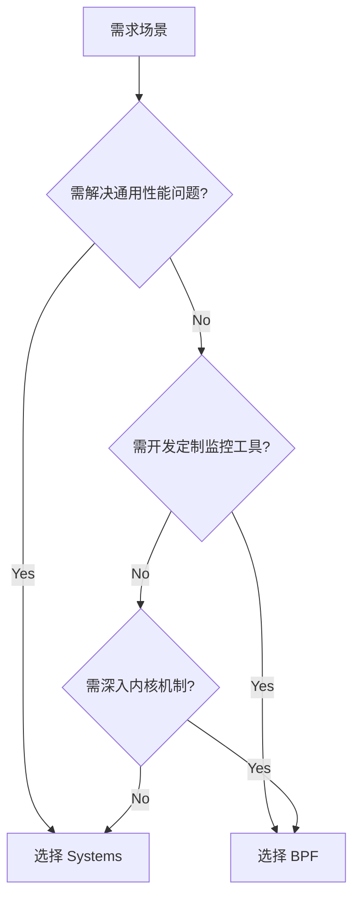

# Books

## DeepSeekR1: BPF Performance Tools (book) vs Systems Performance: Enterprise and the Cloud, 2nd Edition (2020)


### 思考过程

好的，用户现在在问关于两本书的比较：“BPF Performance Tools (book)”和“Systems Performance: Enterprise and the Cloud, 2nd Edition (2020)”。首先，我需要确认用户的需求是什么。他们可能是想了解这两本书的区别，或者在选择哪一本更适合他们的学习或工作需求。接下来，我需要先了解这两本书的内容、作者、侧重点以及适用场景。

首先，回忆一下这两本书的信息。Brendan Gregg是性能分析领域的权威，他写了多本相关的书籍。Systems Performance: Enterprise and the Cloud这本书应该是更全面的**系统性能分析指南**，涵盖各种工具和方法，而BPF Performance Tools可能更专注于使用**BPF（Berkeley Packet Filter）技术**进行**性能分析**和**工具开发**。用户可能是在考虑学习系统性能分析，或者是想深入BPF工具的使用，所以需要比较这两本书的异同。

接下来，需要确定这两本书的目标读者。Systems Performance可能更适合系统管理员、运维工程师以及需要全面了解性能分析的人；而BPF Performance Tools则更适合那些已经有一定基础，想深入使用BPF进行高级性能分析和开发自定义工具的人。用户可能想知道哪本书更适合他们当前的水平或需求。

还需要考虑出版时间和内容更新情况。Systems Performance的第二版是2020年出版的，可能包含了最新的技术和方法，而BPF Performance Tools可能更早或更晚？需要核实出版时间。BPF技术近年来发展很快，所以如果BPF Performance Tools较新的话，可能包含了最新的BPF功能和应用案例。

另外，用户可能没有明确说出他们的具体背景，比如是否是初学者，还是有一定经验的专业人士。需要根据一般情况来推测，或者提醒用户根据自身情况选择。例如，如果用户是初学者，可能更适合先阅读Systems Performance，掌握基础知识，再深入BPF工具；如果已经熟悉性能分析，想专攻BPF技术，那么后者更适合。

同时，可能存在的深层需求是用户希望提升在系统性能优化方面的技能，或者解决实际工作中的性能问题。他们可能想了解哪本书能更快应用到工作中，或者哪本有更多的实用案例。例如，Systems Performance可能提供更多的案例分析和方法论，而BPF Performance Tools可能提供具体的工具使用和代码示例。

还需要考虑书籍的结构和内容深度。**Systems Performance**可能从理论到实践都有涉及，包括**性能指标**、**监控方法**、各种工具的使用等，而BPF Performance Tools可能更侧重于如何利用BPF来构建和扩展性能分析工具，可能有更多的技术细节和实践指导。

另外，可能需要比较两本书的工具覆盖范围。比如，Systems Performance是否会涵盖传统的性能工具（如top、vmstat、iostat等），而BPF Performance Tools则聚焦于基于BPF的新工具（如BCC、bpftrace等）。用户可能想了解哪种工具集更适合他们的环境，比如是否已经在使用BPF相关的工具，或者是否需要从传统工具过渡到更现代的解决方案。

最后，可能需要总结两本书的互补性。虽然它们侧重点不同，但结合起来可能更全面。用户可能想知道是否需要两本都阅读，或者根据当前需求选择其中之一。例如，先通过Systems Performance建立全面的知识体系，再通过BPF Performance Tools深入技术细节，提升分析能力。

现在需要将这些思考整理成一个结构化的回答，比较两本书的各个方面，帮助用户做出选择。同时需要注意用词准确，避免错误信息，比如确认作者、出版时间等细节。如果有不确定的地方，应该查阅可靠来源或指出可能的差异，确保回答的准确性。

回答：
以下是两本书的对比分析，帮助您根据需求选择合适的学习资源：

---

### **1. 核心定位对比**

| **维度**     | **Systems Performance** | **BPF Performance Tools** |
| ---------- | ----------------------- | ------------------------- |
| **核心目标**   | 构建全面的系统性能分析知识体系         | 深入 BPF 技术及其性能工具实践         |
| **适用读者**   | 全栈工程师、架构师、SRE           | 性能优化专家、内核开发者              |
| **技术深度**   | 广度优先（70% 通用 + 30% 深入）   | 深度优先（20% 理论 + 80% BPF 实践） |
| **典型应用场景** | 企业级系统性能问题综合诊断           | 低开销定制化性能监控工具开发            |

---

### **2. 内容特色详解**

#### **《Systems Performance: Enterprise and the Cloud》**

- **方法论体系**：
  - **USE 方法**（Utilization-Saturation-Errors）
  - **RED 方法**（Rate-Errors-Duration）
  - 性能分析的科学工作流（假设 -> 观测 -> 验证）
- **覆盖层级**：
  

  - 包含 CPU/内存/存储/网络的全栈分析
- **工具全景**：
  - 传统工具：`top`/`vmstat`/`iostat`/`perf`
  - 现代扩展：`ftrace`/`eBPF` 基础用法
- **案例分析**：
  - 云原生环境性能瓶颈（K8s 调度问题）
  - 数据库锁竞争优化（MySQL InnoDB）
  - 大规模分布式系统延迟根因分析

#### **《BPF Performance Tools》**

- **核心技术栈**：
  - **BPF 虚拟机原理**：指令集、映射（map）、验证机制
  - **工具链深度**：
    
    ```bash
    # BCC 工具示例
    /usr/share/bcc/tools/offcputime -p PID
    # bpftrace 脚本示例
    bpftrace -e 'tracepoint:syscalls:sys_enter_* { @[probe] = count(); }'
    ```
  - 100+ 预置工具详解：`execsnoop`/`biolatency`/`tcplife`
- **定制开发指南**：
  - 内核态探针编写（kprobe/uprobe）
  - 用户态事件追踪（USDT）
  - 火焰图生成与解读（Flame Graphs）
- **性能领域专项**：
  - 低开销网络流量分析（XDP 加速）
  - 安全监控（检测特权提升）
  - 容器环境追踪（cgroup 集成）

---

### **3. 知识互补性分析**

| **学习路径**    | **推荐组合方式**                          |
| ----------- | ----------------------------------- |
| **新手入门**    | 先《Systems》建立体系，再《BPF》深入工具开发         |
| **问题诊断工程师** | 《Systems》为主（70%），《BPF》工具章节为辅（30%）   |
| **内核开发者**   | 《BPF》代码实践为主（60%），《Systems》理论为辅（40%） |
| **云平台架构师**  | 两书并重：性能设计（Systems）+ 监控实现（BPF）       |

---

### **4. 版本时效性验证**

- **《Systems Performance》2nd Ed (2020)**：
  - 覆盖 Linux 5.x 内核特性
  - 包含 eBPF 基础应用场景
  - 更新云原生监控案例（Prometheus 集成）
- **《BPF Performance Tools》 (2019)**：
  - 基于 Linux 4.x/5.x 内核
  - BCC/bpftrace 全工具链解析
  - 2023 年可通过作者博客获取更新内容

---

### **5. 选择决策树**



---

### **总结建议**

- **运维工程师/SRE**：优先《Systems Performance》，掌握全链路分析能力
- **性能工具开发者**：必备《BPF Performance Tools》，深入内核级观测技术
- **技术管理者**：两书结合，构建从理论到实践的完整性能优化体系

两本书均出自 Brendan Gregg，建议通过[作者官网](http://www.brendangregg.com/)获取最新技术动态和案例更新。
