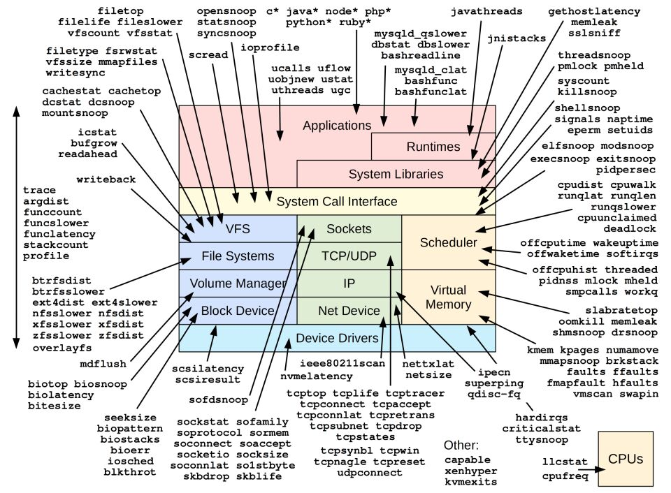

# [Netflix End of Series 1](https://www.brendangregg.com/blog/2022-04-15/netflix-farewell-1.html)

A large and unexpected opportunity has come my way outside of Netflix that I've decided to try(在Netflix之外，我有了一个意想不到的大机会，我决定尝试一下). Netflix has been the best job of my career so far, and I'll miss my colleagues and the culture.

I joined Netflix in 2014, a company at the **forefront**(最前沿) of cloud computing with an attractive [work culture](https://www.brendangregg.com/blog/2017-11-13/brilliant-jerks.html). It was the most challenging job among those I interviewed for. On the Netflix Java/Linux/EC2 stack there were no working **mixed-mode flame graphs**, no **production safe dynamic tracer**, and no PMCs(performance monitoring counters(指标)): All tools I used extensively for advanced performance analysis. How would I do my job? I realized that this was a challenge I was best suited to fix. I could help not only Netflix but all customers of the cloud.

Since then I've done just that. I developed the original JVM changes to allow [mixed-mode flame graphs](http://techblog.netflix.com/2015/07/java-in-flames.html), I pioneered using [eBPF for observability](https://www.brendangregg.com/blog/2015-05-15/ebpf-one-small-step.html) and helped develop the [front-ends and tools](https://www.brendangregg.com/Perf/bcc_tracing_tools.png), and I worked with Amazon to get [PMCs enabled](https://www.brendangregg.com/blog/2017-05-04/the-pmcs-of-ec2.html) and developed tools to use them. **Low-level performance analysis** is now possible in the cloud, and with it I've helped Netflix save a very large amount of money, mostly from service teams using **flame graphs**. There is also now a flourishing(繁荣的) industry of observability products based on my work.

 

*eBPF tools (2014-2019)*

Apart from developing tools, much of my time has been spent helping teams with performance issues and evaluations. The Netflix stack is more diverse than I was expecting, and is explained in detail in the [Netflix tech blog](https://netflixtechblog.com/): The production cloud is AWS EC2, Ubuntu Linux, Intel x86, mostly Java with some Node.js (and other languages), microservices, Cassandra (storage), EVCache (caching), Spinnaker (deployment), Titus (containers), Apache Spark (analytics), Atlas (monitoring), FlameCommander (profiling), and at least a dozen more applications and workloads (but no 3rd party agents in the BaseAMI). The Netflix CDN runs FreeBSD and NGINX (not Linux: I published a Netflix-approved [footnote](https://www.brendangregg.com/blog/images/2022/netflixcdn.png) in my last book to explain why). This diverse environment has always provided me with interesting things to explore, to understand, analyze, debug, and improve.

I've also used and helped develop many other technologies for debugging, primarily perf, Ftrace, eBPF (bcc and bpftrace), PMCs, MSRs, Intel vTune, and of course, [flame graphs](https://www.brendangregg.com/flamegraphs.html) and [heat maps](https://www.brendangregg.com/heatmaps.html). Martin Spier and I also created [Flame Scope](https://netflixtechblog.com/netflix-flamescope-a57ca19d47bb) while at Netflix, to analyze perturbations(扰动) and variation(变化) in profiles.

I've also had the chance to do other types of work. For 18 months I joined the [CORE SRE team](https://www.brendangregg.com/blog/2016-05-04/srecon2016-perf-checklists-for-sres.html) rotation, and was the primary contact for Netflix outages. It was difficult and fascinating work. I've also created internal training materials and classes, apart from my books. I've worked with awesome colleagues not just in cloud engineering, but also in open connect, studio, DVD, NTech, talent, immigration, HR, PR/comms, legal, and most recently ANZ content.

> NOTE: SRE指的是 [Site reliability engineering](https://en.wikipedia.org/wiki/Site_reliability_engineering) 
> 
> 翻译: 在18个月的时间里，我加入了 CORE SRE 团队轮换，并且是 Netflix 服务中断故障的主要联系人。

Last time I quit a job, I wanted to share publicly the reasons why I left, but I ultimately did not. I've since been asked many times why I resigned that job (not unlike [The Prisoner](https://en.wikipedia.org/wiki/The_Prisoner)) along with much speculation(猜测) (none true, 都不是真的). I wouldn't want the same thing happening here, and having people wondering if something bad happened at Netflix that caused me to leave: I had a great time and It's a great company!

I'm thankful for the opportunities and support I've had, especially from my former managers [Coburn](https://www.linkedin.com/in/coburnw/) and [Ed](https://www.linkedin.com/in/edwhunter/). I'm also grateful for the support for my work by other companies, technical communities, social communities (Twitter, HackerNews), conference organizers, and all who have liked my work, developed it further, and shared it with others. Thank you. I hope my last two books, [Systems Performance 2nd Ed](https://www.brendangregg.com/systems-performance-2nd-edition-book.html) and [BPF Performance Tools](https://www.brendangregg.com/bpf-performance-tools-book.html) serve Netflix well in my absence and everyone else who reads them.

I'll still be posting here in my next job. More on that soon...
