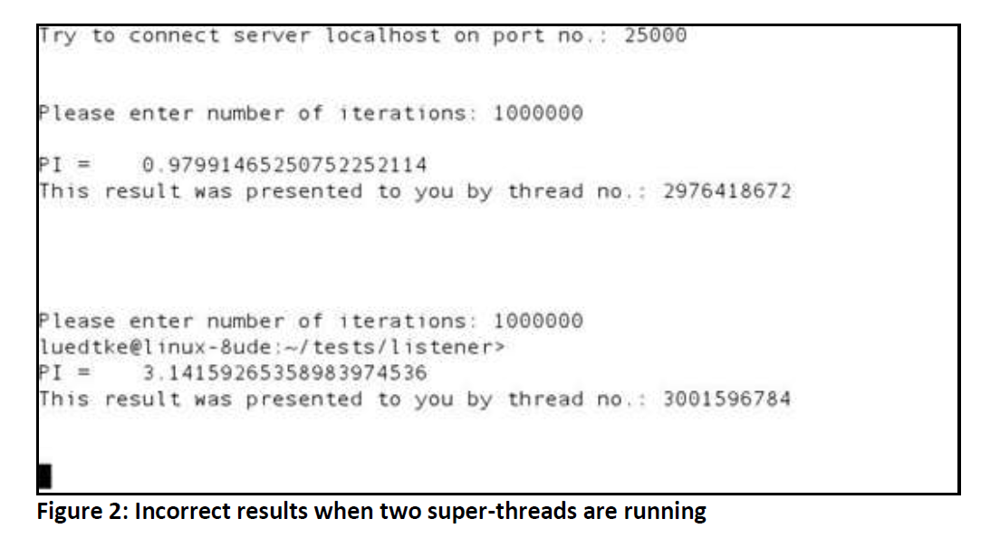
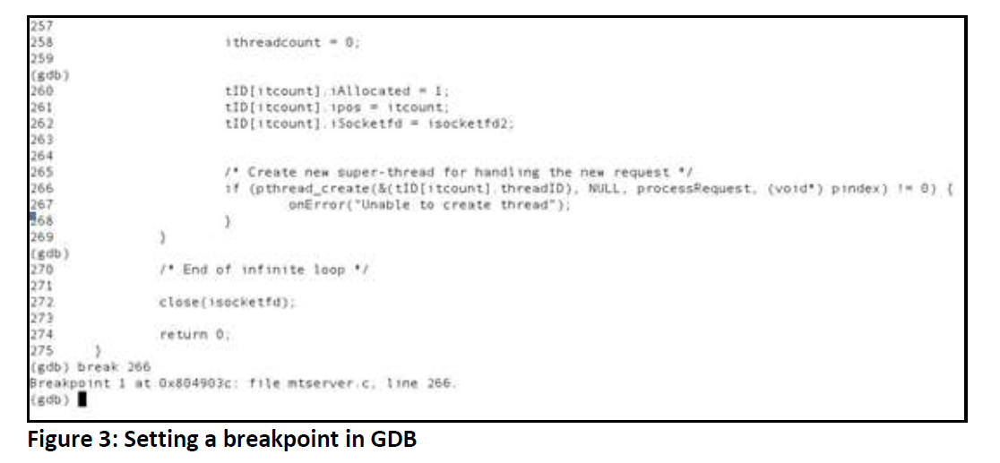

# Race condition

## [Debugging Common Issues in Multithreaded Applications](https://totalview.io/sites/totalview/files/pdfs/white-paper-totalview-debugging-multithreaded-apps.pdf)

The application is a simple tcp-server that creates a new thread (**super-thread**) for processing each incoming client request. Each **super-thread** spawns a set of **sub-threads** which approximate the value of `pi` using the trapezoidal rule. The server allows one to define the maximum number of **super-threads** and the number of **sub-threads**. Three implemented bugs can be switched on and off for demonstration purposes. This could be done through the use of global variables, or the use of `ifdef`s in the code and
rebuilding the application for each scenario.

```C++
int main( int argc, char* argv[]) /* All super-threads are created here */
    
void *processRequest( void *sfd ) /* The sub-threads will be spawned in this function */
    
void *iterate( void *ind ) /* Sub-threads are calculating PI */
    
void onError( const char *errorMsg) /* Error handling */
```

> NOTE: 
>
> - supreme-thread的线程执行函数是`processRequest`
>
> - sub-thread线程执行函数是`iterate`

Properties referring to each **super-thread** are stored in an array of structures which is globally visible. Whether a thread is still alive or has already been terminated, these structures will hold the **thread id**, the **session id**, and the results calculated by the super-thread’s sub-threads.

Introducing such an array (`threadInfo tID[MAXTHREADS];`) allows one to provide thread functions with a pointer to an index of this array while creating a thread in order to hand over all relevant super-thread related properties.

The following variables, which are used to store the index’s integer value, will be mentioned in this document:

```c++
int *pindex; /* Pointer to an index of type integer, used in function main() as argument in pthread_create() */
void *sfd; /* Void pointer to an index of type integer, used in function processRequest() */

int index; /* Local integer variable used in function processRequest() */

void *ind; /* Void pointer to an index of type integer, used in function iterate() */

int index; /* Local integer variable used in function iterate() */
```

> NOTE: 需要结合前面的函数原型来理解这些variable的用途

### Debugging a Simple, Multithreaded Application

The first bug should be easy to find. The server calculates reasonable results when only one superthread is running, as seen in Figure 1. However, when additional super-threads are created the results become incorrect, as shown in Figure 2.



It seems that there is a conflict between threads that occurs in cases where more than one super-thread is running. The popular (some would say ubiquitous) GDB debugger1 will be used to demonstrate this issue. We will also show how that same issue can be addressed using TotalView2.

### Debugging a Multithreaded Application with GDB

The following steps outline a debug session using GDB:

1.) Start the server within GDB: `gdb ./server`.

2.) Set the breakpoints:

As shown in Figure 3, it makes sense to place the first breakpoint in `main()`, in front of the function `pthread_create()`, where the super-threads are created. 

The GDB command `list main <return>` lists the source code with line numbers. The first breakpoint is set at line 266 by typing `break 266 <return>`.



Additional breakpoints are placed at line 132 in the function `processRequest()` where the subthreads will be spawned, and before the calculation starts at line 34 in the function `iterate()`. These breakpoints will stop the process when they are encountered by the debugger.

While GDB allows you to create thread-specific breakpoints, it does not prevent you from setting breakpoints on lines that are normally considered invalid, such as in front of comments or on blank lines. These incorrectly placed breakpoints will be recorded by the debugger but will not have the intended effect of stopping the program.

