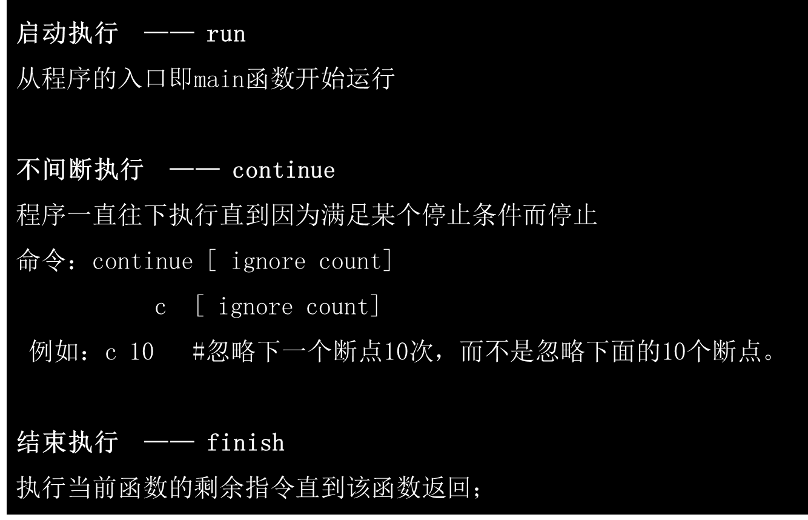

# gdb primer


## 预备知识

### GDB工作示意图


### GDB 工作原理

GDB 作为**父进程**，被调试程序为**子进程**，通过**ptrace系统调用**和一系列的**信号**交互来观察和控制被调试进程的执行，检查和修改其**寄存器**和**内存环境**。

- 运行程序，设置所有的能影响程序运行的东西；

- 保证你的程序在指定的条件下停止；

- 当你程序停止时，让你检查发生了什么；

- 改变你的程序运行行为；

> 上述四点正是GDB官方文档的“Summary of gdb”章节所总结的。

### 编译程序

​							预处理器							编译器							汇编器							链接器


预处理：`g++ –E hello.cpp –o hello.i`

编  译：`g++ -S hello.cpp –o hello.s`

汇  编：`g++ -c hello.s –o hello.o`

链  接：`g++ hello.c –o hello` 

编译调试版：`g++ -g hello.c –o hello`

### 可执行程序格式(ELF)


### 进程地址空间布局

#### 经典32位


#### AMD64


### 常用寄存器

寄存器命名：32位:`%EAX`, 64位:`%RAX`

通用寄存器：`%EAX` %`EBX` `%ECX` `%EDX`

- `%EAX` 函数返回值

- `%ECX` VC（visual c++） 用来存放 `this` 指针

特殊寄存器： 

- `%ESI` 通常在内存操作指令中作为“源地址指针”使用。

- `%EDI` 通常在内存操作指令中作为“目的地址指针”使用。

堆栈寄存器：

- `%EBP` 栈基址寄存器

- `%ESP` 栈顶寄存器

指令寄存器：`%EIP` 指向即将执行的那条指令的地址

标志寄存器：`%EFR` [CF/AF/PF/ZF/SF/OF]


### 常用汇编指令

```assembly
push   %rbp                        - 把%rbp压入栈
mov    %rsp,%rbp                   - 把%rsp赋值给%rbp
sub    $0x30,%rsp                  - 移动栈顶指针，分配栈内存

lea    0x26e43(%rip),%rsi      	   - 装入有效地址
callq  *0x30(%rax)                 - 调用虚函数
cmp    %rax,%r15                   - 比较
je     0x7f982e65ce62              - 等于跳转

```


### 函数调用约定

- `__stdcall`：参数采用从右到左的压栈方式，自己在退出时清空堆栈

- `__cdecl`：c调用约定, 按从右至左的顺序压参数入栈，由调用者把参数弹出栈。对于传送参数的内存栈是由调用者来维护的（正因为如此，实现可变参数的函数只能使用该调用约定，如`printf`）

- `thiscall`：仅仅应用于"C++"成员函数。this指针存放于CX寄存器，参数从右到左压。thiscall不是关键词，因此不能被程序员指定

### `C++` 对象内存模型

注意：

1，虚函数表。避免多继承，各平台编译器行为不一致。

2，内存对齐。


### glibc 内存管理


用户接口：`malloc`/`free`

系统调用：`brk`/`mmap`/`munmap`

大内存(>128k): 直接调用 `mmap`

小内存: `sbrk`，链表管理


### 函数调用过程（32位）


### 函数调用过程（64位）

`%rax` 作为函数返回值使用；

`%rsp` 栈指针寄存器，指向栈顶；

`%rdi`，`%rsi`，`%rdx`，`%rcx`，`%r8`，`%r9` 用作函数前6个参数，多余的参数依次保存在栈上;

`%rbx`，`%rbp`，`%r12`，`%r13`，`%r14`，`%r15` 用作数据存储，遵循被调用者使用规则，简单说就是随便用，调用子函数之前要备份它，以防被修改；

`%r10`，`%r11` 用作数据存储，遵循调用者使用规则，简单说就是使用之前要先保存原值；


## GDB命令

### 帮助命令（help）


### GDB 启动


### GDB 执行




### GDB 基本命令


### 断点


### 信号


### 自定义命令


## GDB实战

### 前提

1，程序编译：

 加上`-g`，去掉优化`-O2`

2，生成core大小设置：

 `ulimit –c unlimited`

3，设置coredump 生成路径

`echo '/tmp/cores/core.%e.%p.%t' > /proc/sys/kernel/core_pattern` 

### 分析coredump步骤

1，`gdb hsserver core.1234`，查看core文件

2，查看gdb输出，确认程序和so库匹配。

3，首先根据frame 0信息，确认程序崩溃的直接原因。

4，`bt`查看堆栈和前后代码

5，查看线程信息

### 进程内存布局

根据程序打印，判断进程内存布局。

参见[address.cpp](./address.cpp)。

### 函数调用过程跟踪

通过函数调用，跟踪堆栈变化。

查看入参信息和本地变量信息等。

参见[func.cpp](./func.cpp)

### coredump 定位

调试实际的coredump 定位程序崩溃原因

## GDB 文档

[http://www.gnu.org/software/gdb/](http://gitlore.com/gitlore-git/gdb_tips)