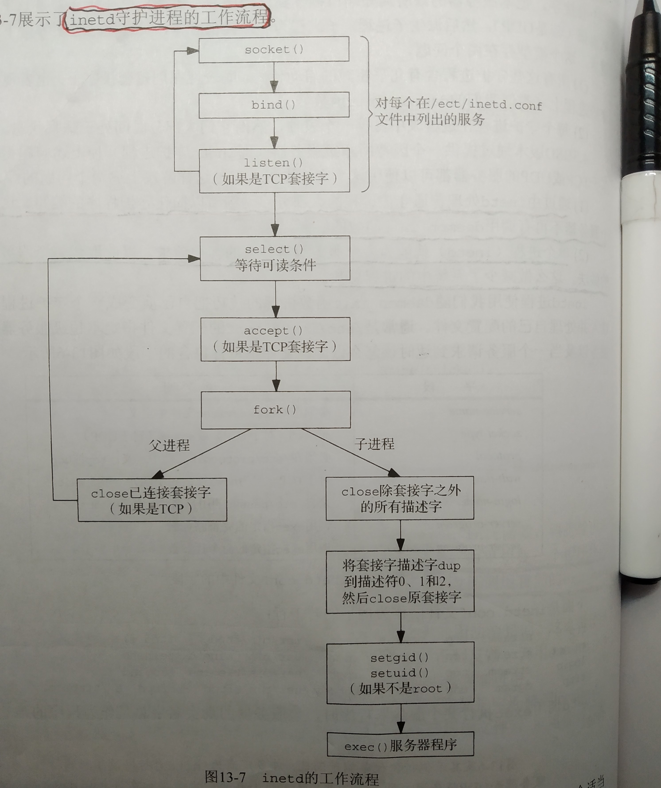

# `inetd`

## 实现分析

在 cnblogs [inetd的工作流程](https://www.cnblogs.com/soldierback/p/10755656.html) 中，对此进行了展示:



一、bind single process to multiple port and select IO-multiplexing

二、concurrent server multiple process

三、"将套接字描述符`dup`到描述符0、1和2，然后close原套接字"对应的source code，参见 `Book-APUE\3-File-IO\3.12-dup-and-dup2-Functions`，它的目的是IO重定向。


## wikipedia [inetd](https://en.wikipedia.org/wiki/Inetd)

**inetd** (**i**nter**net** service **d**aemon) is a [super-server](https://en.wikipedia.org/wiki/Super-server) [daemon](https://en.wikipedia.org/wiki/Daemon_(computer_software)) on many [Unix](https://en.wikipedia.org/wiki/Unix) systems that provides [Internet](https://en.wikipedia.org/wiki/Internet) services. For each configured service, it listens for requests from connecting clients. Requests are served by spawning a process which runs the appropriate executable, but simple services such as *echo* are served by `inetd` itself. External executables, which are run on request, can be single- or multi-threaded. First appearing in [4.3BSD](https://en.wikipedia.org/wiki/BSD),[[1\]](https://en.wikipedia.org/wiki/Inetd#cite_note-1) it is generally located at `/usr/sbin/inetd`.


### Function

Often called a [super-server](https://en.wikipedia.org/wiki/Super-server), inetd `listens` on designated [ports](https://en.wikipedia.org/wiki/TCP_and_UDP_port) used by Internet services such as [FTP](https://en.wikipedia.org/wiki/File_Transfer_Protocol), [POP3](https://en.wikipedia.org/wiki/POP3), and [telnet](https://en.wikipedia.org/wiki/Telnet). When a [TCP](https://en.wikipedia.org/wiki/Transmission_Control_Protocol) packet or [UDP](https://en.wikipedia.org/wiki/User_Datagram_Protocol) packet arrives with a particular destination port number, `inetd` launches the appropriate server program to handle the connection. For services that are not expected to run with high loads, this method uses memory more efficiently, since the specific servers run only when needed. Furthermore, no network code is required in the service-specific programs, as `inetd` hooks the sockets directly to [stdin](https://en.wikipedia.org/wiki/Stdin), [stdout](https://en.wikipedia.org/wiki/Stdout) and [stderr](https://en.wikipedia.org/wiki/Stderr) of the spawned process. For protocols that have frequent traffic, such as [HTTP](https://en.wikipedia.org/wiki/HTTP) and POP3, a dedicated server that intercepts the traffic directly may be preferable.

> NOTE: 
>
> 翻译如下:
>
> "通常称为超级服务器，inetd侦听Internet服务（如FTP，POP3和telnet）使用的指定端口。 当TCP数据包或UDP数据包到达时具有特定目标端口号时，inetd会启动相应的服务器程序来处理连接。 对于预计不会以高负载运行的服务，此方法更有效地使用内存，因为特定服务器仅在需要时运行。 此外，特定于服务的程序中不需要网络代码，因为inetd将套接字直接挂钩到生成进程的stdin，stdout和stderr。 对于具有频繁流量的协议（例如HTTP和POP3），可以优选直接拦截流量的专用服务器。"

### Setup

The list of services that will be serviced is given in a configuration file, usually `/etc/inetd.conf`. A [GUI](https://en.wikipedia.org/wiki/GUI) for managing the configuration file is an optional accessory. The daemon may need a signal in order to re-read its configuration. 

For an example, [telnet](https://en.wikipedia.org/wiki/Telnet) can be configured as follows (line taken from a machine running [AIX](https://en.wikipedia.org/wiki/AIX_operating_system) version 5.1):

```shell
telnet  stream  tcp6    nowait  root    /usr/sbin/telnetd      telnetd -a
```

The first word, `telnet`, is the official name of the service. It is resolved using the system database to map port numbers and protocols to service names. In this case, `/etc/services` should contain:

```shell
telnet          23/tcp
```

The second and third words describe the type of socket and underlying protocol respectively. The `/etc/protocols` database is consulted.

The fourth word is the wait/nowait switch. A single-threaded server expects inetd to wait until it finishes reading all the data. Otherwise inetd lets the server run and spawns new, concurrent processes for new requests.

The fifth word is the user name, from the `/etc/passwd` database, that the service program should run as.

Finally, the path and the arguments of an external program are given. As usual, the first argument is the program name. In the example, inetd is told to launch the program `/usr/sbin/telnetd` with the command line arguments `telnetd -a`. inetd automatically hooks the socket to stdin, stdout, and stderr of the server program.

Generally **TCP sockets** are handled by spawning a separate server to handle each connection concurrently. UDP sockets are generally handled by a single server instance that handles all packets on that port.

Some simple services, such as [echo](https://en.wikipedia.org/wiki/Echo_protocol), are handled directly by inetd, without spawning an external server.


### inetd replacements

In recent years, because of the security limitations in the original design of inetd, it has been replaced by [xinetd](https://en.wikipedia.org/wiki/Xinetd), rlinetd, [ucspi-tcp](https://en.wikipedia.org/wiki/Ucspi-tcp), and others in many systems. Distributions of [Linux](https://en.wikipedia.org/wiki/Linux) especially have many options and [Mac OS X](https://en.wikipedia.org/wiki/Mac_OS_X) (beginning with [Mac OS X v10.2](https://en.wikipedia.org/wiki/Mac_OS_X_v10.2)) uses [xinetd](https://en.wikipedia.org/wiki/Xinetd). As of version [Mac OS X v10.4](https://en.wikipedia.org/wiki/Mac_OS_X_v10.4), Apple has merged the functionality of inetd into [launchd](https://en.wikipedia.org/wiki/Launchd).

The services provided by inetd can be omitted entirely. This is becoming more common where machines are dedicated to a single function. For example, an HTTP server could be configured to just run [httpd](https://en.wikipedia.org/wiki/Httpd) and have no other ports open. A dedicated firewall could have no services started.

[systemd](https://en.wikipedia.org/wiki/Systemd) supports inetd services, and expands socket activation beyond IP messaging ([AF INET](https://en.wikipedia.org/wiki/AF_INET)+6) to include [AF UNIX](https://en.wikipedia.org/w/index.php?title=AF_UNIX&action=edit&redlink=1), [AF NETLINK](https://en.wikipedia.org/w/index.php?title=AF_NETLINK&action=edit&redlink=1) and more.[[2\]](https://en.wikipedia.org/wiki/Inetd#cite_note-2)[[3\]](https://en.wikipedia.org/wiki/Inetd#cite_note-3)


## TODO

chinaunix [linux超级服务器inetd详解](http://blog.chinaunix.net/uid-21411227-id-1826876.html)